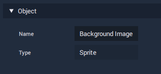

# Object

All **Scene Objects** and **Project Objects** share the same two **Attributes**, with only one of them being editable.

## Name

This is a user-defined name, which should be both descriptive and succinct, and is used to easily differentiate between all the various **Objects** in the **Project Outliner**.

## Type

This **Attribute** isn't editable, and merely displays what **Type** of **Object** it is.