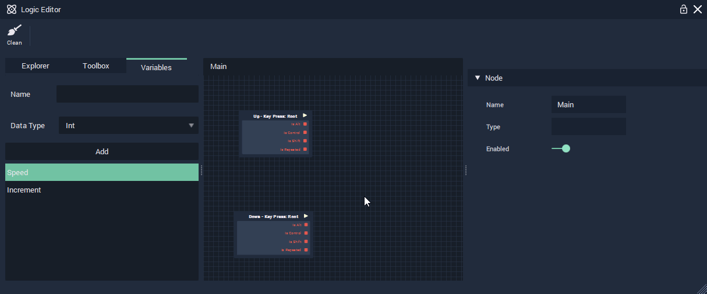

# Accessing Variables and Navigation

To use our newly created variables, simply drag and drop them from the Variables tab into the Logic Editor's graph.

We can then drag nodes around by clicking and holding the left mouse button.

We can also zoom in and out by scrolling the mouse wheel or clicking and holding the middle mouse button to pan the view of the graph.

* Add our two variables and position them as shown below.

