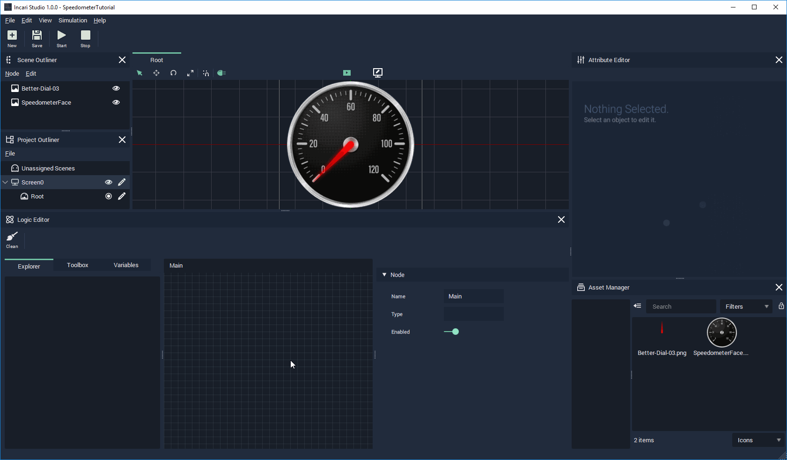

# Adding a Node to the Logic Editor


In INCARI, most nodes are only executed by having a white connection called a **Pulse** going into the white triangle on their left side. Nodes connected together by these pulses, define a sequence of instructions to be performed in order. For these sets of instructions to be initiated, they need to be _triggered_ by whats called Event.


In a real car, information would come from your CAN bus system, however during development we often want to simulate this information to test and debug functionality. Using [events ](../../logic-editor/toolbox/events/)is a good way to do this and [KeyPress ](../../logic-editor/toolbox/events/keypress.md)nodes are particularly useful for this purpose.

In our tutorial we are going to simulate the increasing/decreasing speed of our vehicle by using the arrow keys.

We need to drag the [KeyPress ](../../logic-editor/toolbox/events/keypress.md)nodes from the Toolbox, assign the correct scene and select the relevant key from the nodes's dropdown menu.

* Add a [KeyPress ](../../logic-editor/toolbox/events/keypress.md)node for the `Up` key.
* Add a [KeyPress ](../../logic-editor/toolbox/events/keypress.md)node for the `Down` key.

