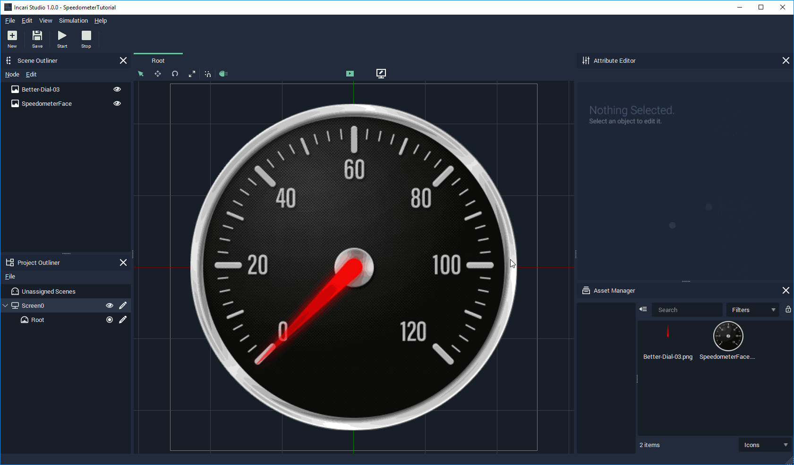
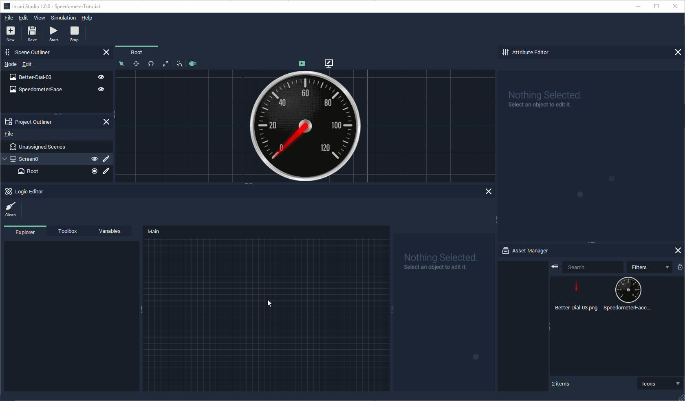

# Modifying the Workspace

In INCARI, it is possible to customise/personalise your workspace, to streamline whatever task you are currently focusing on within the project.

If a window is not visible, you can click View from the toolbar and select the window you would like.

From there you have 3 options:

1. You can drag it away from the main window entirely, which is useful for multi-monitor setups.
2. You can drag somewhere within the interface to add a new panel.
3. You can drag it on top of an existing window to create tabbed-panel setup.
4. For this tutorial we will be doing most of our work in the Logic Editor. If it isn't already visible, open it now and either dock it to the main window, or put it on a separate monitor.

