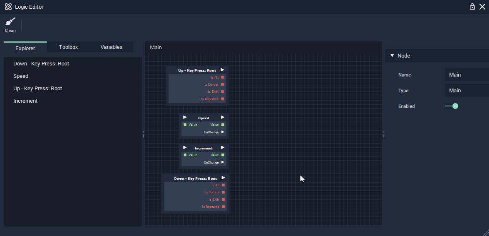

# Pulse Flow and Basic Math Nodes

Pulse Flow in INCARI defines the order in which logic is evaluated. Many nodes have a white arrow on the left and/or right, which means pulses can be attached to them.

In the case of a [KeyPress ](../../logic-editor/toolbox/events/keypress.md)node, the white arrow represents the start of a block of logic, triggered by the pressing of a specified key. All logic which succeeds the key press should be connected, directly or indirectly, via the pulse flow, represented by white lines linking nodes to one another.

When an arrow key is pressed, we want to adjust the value of our speed by the amount defined in our "Increment" variable. We do this by adding two [basic math operation nodes](../../logic-editor/toolbox/math/basic-math-operation-nodes.md): Add and Subtract.

We can then add/subtract our increment value from our speed variable by dragging connections between the variables' outputs and our [math nodes](../../logic-editor/toolbox/math/basic-math-operation-nodes.md)' inputs, as shown below.

* Add the Add and Subtract nodes to the graph.
* Link the nodes to our [KeyPress ](../../logic-editor/toolbox/events/keypress.md)events and variables as shown.

