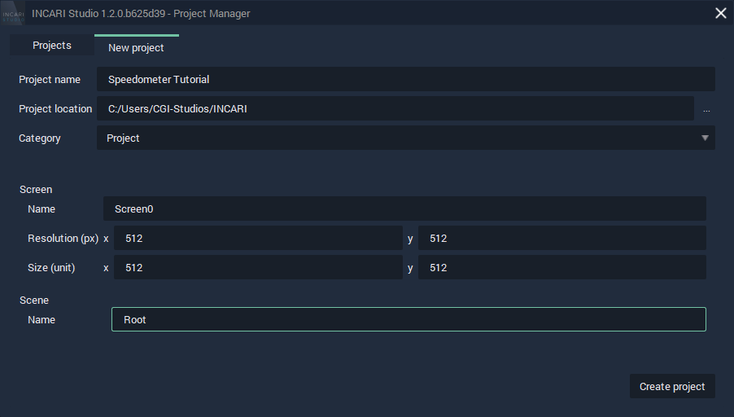
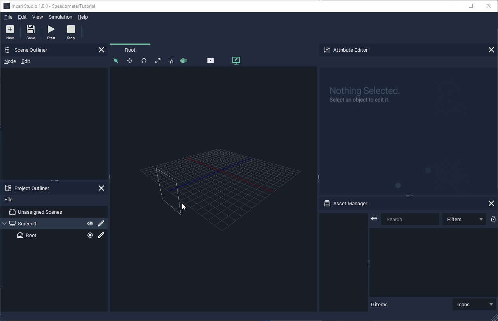

# Setting Up Our Project

The first thing we see when opening **INCARI** is the [**Project Manager**](../../getting-started/creating-a-project.md) screen. Here, we can open an existing **Project** or start a new one.

To create a new **Project** select the `New project` tab, where you will see several settings for your **Project**.


Open **INCARI** and create a new **Project** with the following settings.



[Read more about creating a new **Project** here.](../../getting-started/creating-a-project.md)


Because we want our 2D graphics to be their real size in pixels, we should adjust the screen position, so that it is in the centre of the 3D environment.

We can manually set transformation attributes of all objects in Incari by first selecting the object in the Scene/Project Outliner and then editing its values in the Attribute Editor.

* Select your screen \(Screen0\) in the Project Outliner.
* Adjust the screen's Z position so that it is at 0.
* Click the "Player View" icon, to switch to the screen's viewpoint.

