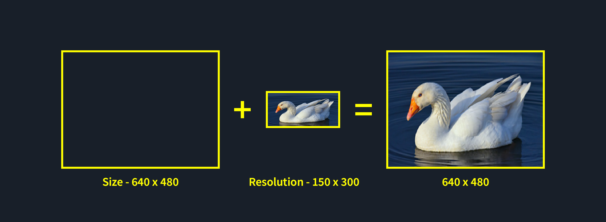
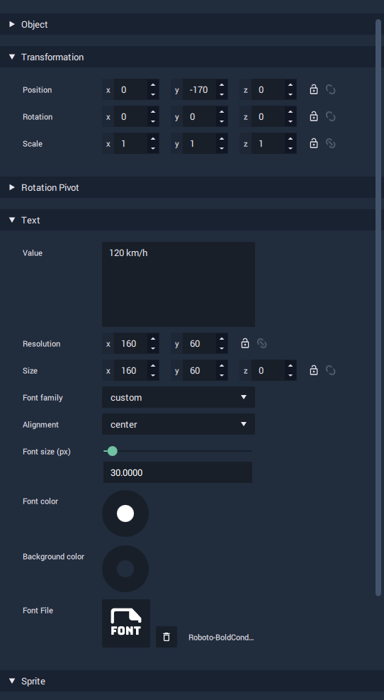

# Text Object Attributes

The default style, position, size etc. of our **Text Object** isn't of much use to us, currently. We need to make some adjustments, so that it looks like it is actually part of the speedometer.

## Sort Order

Remember that for graphics to be shown above other graphics, they need to have a higher **Sort Index**.


* Set the **Text Object's Sort Index Attribute** to 1.


## Value

The first **Attribute** we need to edit is `Value`. This defines the **String** that will appear in the **Text Object**. This will actually just be a placeholder, until we assign the value dynamically, but while we are experimenting with the look-and-feel of the text, it would be good to have something which closely resembles the final product.


* Set the `Value` **Attribute** to be something like "120 km/h".


## _Size / Resolution_

_The relationship between `Size` **and `Resolution`** can be thought of as being like the relationship between your monitor's display resolution \(the physical pixel dimensions available\) and the resolution setting in your OS's display settings. You could have a 4K monitor, with a display resolution of 3840 x 2160 pixels, but have your OS's display resolution set to 800 x 600. This would stretch the much smaller display resolution to fit your display. Similarly the `Size` **Attribute** represents the dimensions of the area to be filled and `Resolution` defines the size of the content which will be stretched to fill that area._

It is therefore recommended that you start by adjusting `Size` first, before adjusting the `Resolution`. In the majority of cases you will want to have the `Resolution` **\*\*be the exact same value as the `Size`** Attribute\*\*, or at least, the same _ratio_.


* Set `Size` **and `Resolution`** to be 160 x 60. This will fit nicely at the bottom of our speedometer.


## Font Family

Font Family allows you to select a basic font category \(`monospace`, `serif`, `sans-serif`\) or add your own custom font.

To add a custom font, simply drag it into the **Asset Manager** from your OS' file explorer. To use that font, drag it from the **Asset Manager** to the `Font File` **Attribute** of a **Text Object** in the **Attribute Editor**.


* [Download Roboto Bold Condensed from Google Fonts](https://fonts.google.com/specimen/Roboto).
* Add it to your **Project**.
* Set the **Text Object**'s `Font Family` **Attribute** to `custom`.
* Set `Font File` to be the font you just imported.


## Alignment

Alignment works like any other word processor. You can align your text to be left-aligned, centre-aligned or right-aligned, using the `left`, `center`and `right`options respectively.


* Set the `Alignment` to `center`.


## Font Size

Assuming that the `Size` and `Resolution` **Attributes** are the same value, `Font Size` defines the approximate height in pixels, from the _lowest descent_ to the _highest descent_ of a font.


* Set`Font size` to 30 px.


## Font Color / Background Color

**Colors** can be set in various ways in INCARI and work very much like they do in other software. You can manually adjust the the **HSB** / **RGBA** values or input a **Hex Code**.


* Set `Font color` to be white \(RGBA 255, 255, 255, 255\).


## Position

In most 2D graphics applications, you will typically see a coordinate system with the origin \(0,0\) at the top-left corner of a document, and the X value increasing from left-to-right and the Y value increasing from top-to-bottom.

In INCARI, coordinates are in 3D space, with the origin \(0, 0, 0\) at the centre, and the X value increasing from centre-to-right, the Y value increasing from centre-to-top and the Z value increasing from centre-to-front.


* Adjust `Position` to be 0, -170, 0. This should place it at the bottom-centre of our speedometer.


## Summary

If you followed along correctly, your **Text Object**'s **Attributes** should look like they do below.

