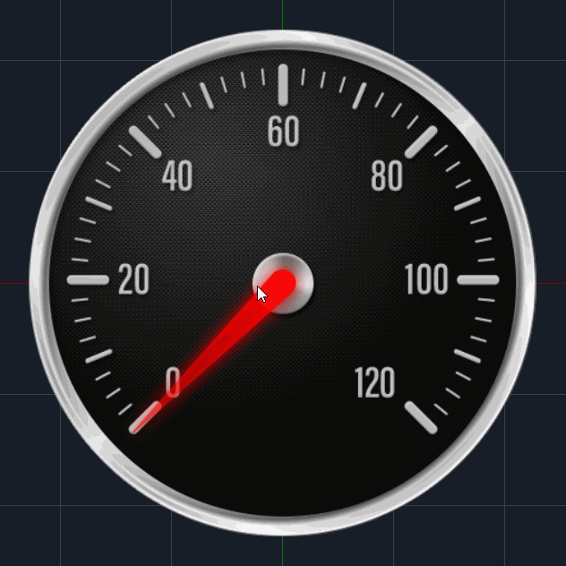

# Text Objects

## Objects

Now that we have our **Function** ready to output the correct speed, we need to make that information visible in our speedometer.

In INCARI we have a number of different **Object Types**, which can be used in our **Scene**. When we added our graphics to the **Scene** in [**Part One**](https://docs.cgi-studio.com/incari-studio/~/edit/drafts/-LZnrfkxkk58a2cYMMOl/beginner-tutorial-creating-a-speedometer/part-one/importing-assets), we were actually creating two **Sprite Objects**. If you click on one of these graphics in the **Scene Outliner**, and take a look at its **Attributes** in the **Attribute Editor**, you will see under `Object > Type` it says "Sprite" and under `Sprite > File` there is an image linked to that **Sprite Object**. We won't be covering all of the **Object Types** here, but we _will_ be introducing a new one called **Text**.

## Adding a New Object

To add a new **Object**, we need to right-click in the **Scene Outliner** or the **Scene** itself and select `New Node`. We will then be presented with a dialog box with two options:

1. **Name** - A short , descriptive name for the new object.
2. **Type** - The **Object Type**.

In our case we want a **Text Object** to represent the speed of a vehicle, so let's add that now:


* Add a new **Text Object**, with the name "SpeedText". 


