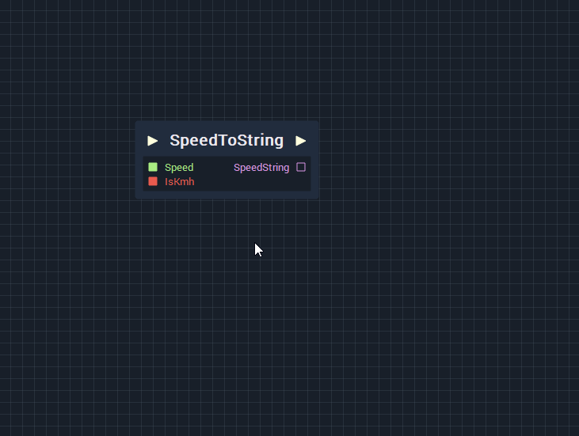
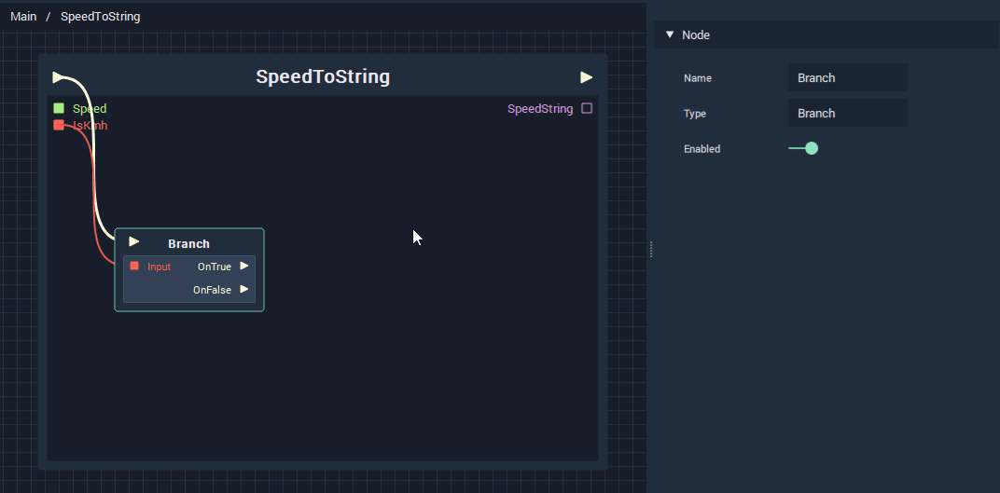
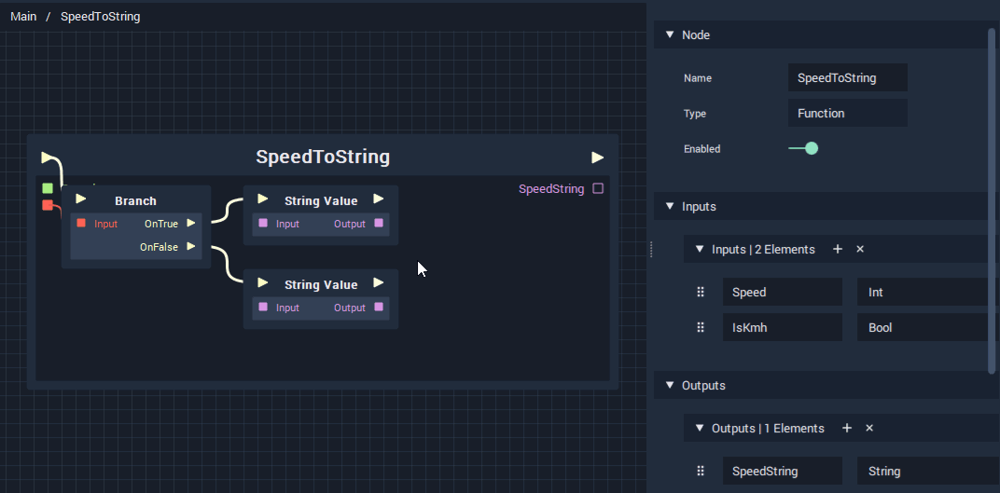

# Diverging and Converging Logic

## Unit of Speed

First of all let's focus on determining whether or not our **Output** should be in _km/h_ or _mph_. We have an **Input** to represent that information, but we need some logic to do something with it.

### Diverging Logic

A very important part of building interactive systems is something called **Branching**. It allows a developer to define different courses of _action_ based on different _conditions_. If you have ever encountered a flow-chart, then you are already familiar with this principle; At its most basic level, it is the concept of "_If this is true, do this; if not, do this._"

In INCARI we define this kind of logic by using the [**Branch Node**](../../logic-editor/toolbox/flow-control/branch/branch.md). If you want to learn more about the concept of **Branching** and the function of the[ **Branch Node**](../../logic-editor/toolbox/flow-control/branch/branch.md), you should visit [**Branch**](../../logic-editor/toolbox/flow-control/branch/branch.md)'s dedicated page in the documentation.

The **Branch Node** always takes a **Boolean Input**, which represents a _condition_. If the condition is _true_, the **OnTrue Output Pulse** is executed, and if the condition is _false_, **OnFalse** is executed.


* Add a **Branch Node** and plug our **IsKmh Input** into the **Input Bool** of the **Node**.


Because we want to use our **IsKmh Input** to determine the unit of speed, we should also create two **String Value Nodes**: One for _km/h_ and one for _mph_.


* Create a **String Value Node** with the value "km/h".
* Create a **String Value Node** with the value "mph".


### Converging Logic

As you may remember [from earlier](../part-one/setting-variable-values-and-section-end.md), we often need to get a a _single_ **Data Value** and **Pulse** from _multiple_ **Values** and **Pulses**. This is essential when creating **Functions** with branching, because we can only plug one **Data Output Connection** into a **Data Input Socket**., and although our **SpeedString** is an **Output**, we are _inputting_ a **Value** into its **Socket**.


* Add a **SelectData Node** and change the **Data Type Attribute** to be **String**.
* Plug the **Pulse** and **Value Outputs** of the **String Value Nodes** into the **SelectData Node**.


