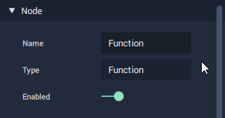
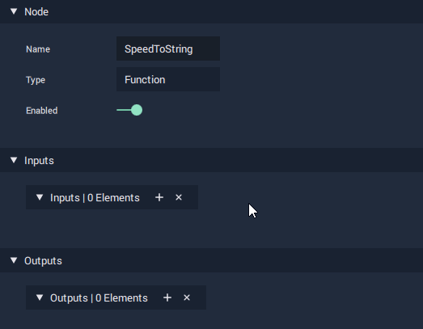
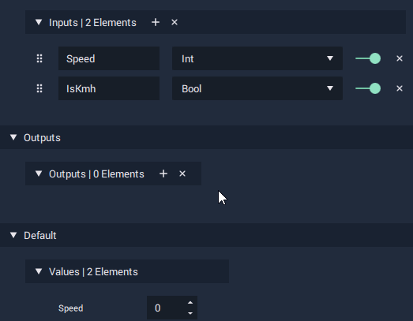

# Defining the Purpose of the Function

We are going to create a **Function** which takes our **Speed Variable** and turns it into something that can be displayed as an overlay on our speedometer. We therefore need to define the inputs and outputs of our **Function** and make sure that the names we give them, as well as the name of the **Function** itself, is clear and descriptive.

## Naming our Function

**Function** is the only **Node** whose name can be edited in the [**Node Attribute Editor**](../../getting-started/interface/managers-editors-and-outliners/logic-editor.md#6-node-attribute-editor). We do this by clicking the input field of the **Name Attribute** and typing in a more succinct name.


* Edit the name of the **Function** to be "**SpeedToString**".


## Input

We already know that our **Function** will be taking our **Speed Variable** as an **Input**, which is an **Integer Type**. We also need to know whether or not the **Output** should be given in _mph_ or _km/h_ format. Because there are only two options here, we can use a **Bool Data Type**, which can either be _true_ or _false_.

We add **Inputs** and **Outputs** to our **Function** by clicking the plus button \(+\) in the **Node Attribute Editor** while we are inside our **Function**'s **Logic Graph**. We can then define the name and type from the newly added **Attributes**.


* Add an **Int Type** **Input** called "**Speed**".
* Add a **Bool Type** **Input** called "**IsKmh**". Prefixing a **Bool** with the word "**Is**" is a common convention, as it clearly defines the contextual implication of _true_ and _false_.


## Output

Because we want to create something which can be displayed our speedometer, we will create a **String** as an **Output**.


* Add a **String Type Output** called "**SpeedString**".


