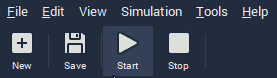
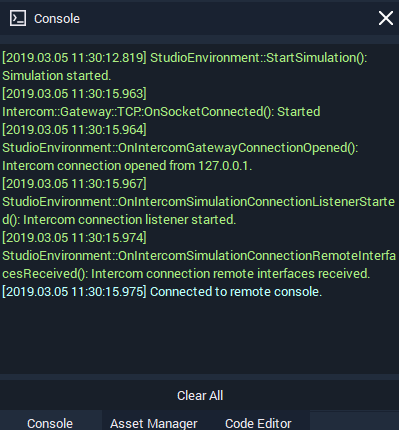

# Previewing Console Output

We now want to preview our project using INCARI Player so that we can see our feedback in the Console Window. INCARI Studio has a set of controls in the top-left of the application's window. They allow us to **Start** \(▶\), **Update** \(**↻\)** and **Stop** \(◼\) _\*\*_our simulation.


* Press **Start** \(▶\) to begin previewing our **Project**.
* Press the **Up**/**Down Arrows** \(↑ /↓\) to adjust the **Speed** value.
* You should now see the value in the **Console Panel**.


