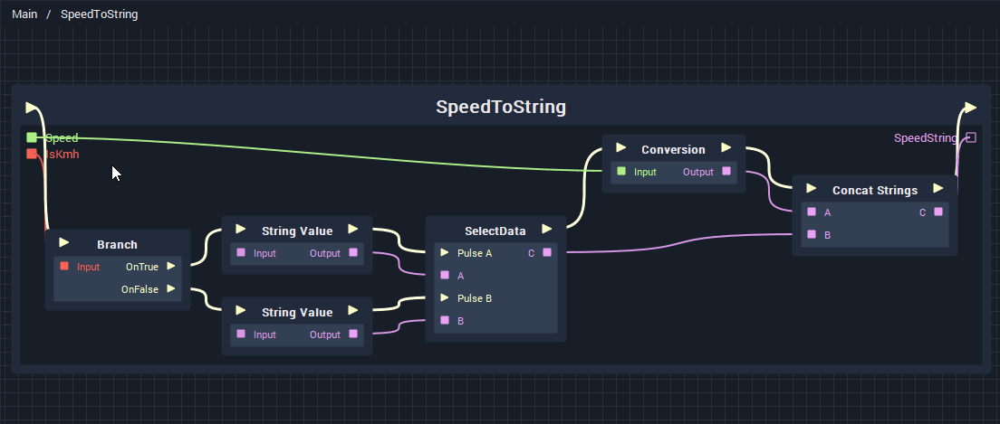
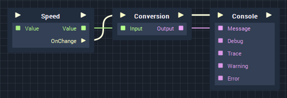
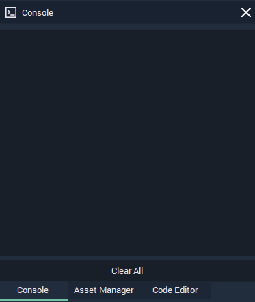

# Previewing the Function

Earlier, we used the **Console Node** to preview the value of our **Speed**. We are now going to modify that existing logic, to preview the **Output** of our **Function**.


If you are inside a **Function**'s **Logic Graph**, you can click `Main` in the top-left of the **Graph** to get back to the main logic.


Currently, we have a bit of logic to recognise when there is a change to our **Speed** value, convert its value to a **String** and display its value in the **Console**. With the **Function** we just created, we simply need to swap the **Conversion Node** with our **Function**.

First, we need to delete the **Conversion Node**. You can delete **Nodes** by clicking **Delete** on your keyboard, followed by **Return** \(**↵**\).

Then we need to reconnect our **Pulse** and **Data** Connections.


* Delete the existing **Conversion Node** and drag and drop our **SpeedToString Function** in its place.
* Add the following **Pulse Connections**:
  * **Speed.OnChange** &gt; **SpeedToString**.
  * **SpeedToString** &gt; **Console**.
* Add the following **Data Connections:**
  * **Speed.Value** &gt; **Conversion.Speed**
  * **SpeedToString.SpeedString** &gt; **Console.Message**.


Note, that by clicking on a **Function Node**, you will be able to see its **Inputs** as **Attributes** in the **Node Attribute Editor**. This way you can assign **Input Values** without creating additional **Nodes**. You can try this out with our **Function** by setting **IsKmh** _\*\*\_to be \_true_ or _false_.


* Press **Start** \(▶\) and use the **Up**/**Down Arrows** \(↑ /↓\) to adjust the **Speed** value.
* Try this with **IsKmh** set to both _true_ and false, to ensure that our **Function** works as designed.


