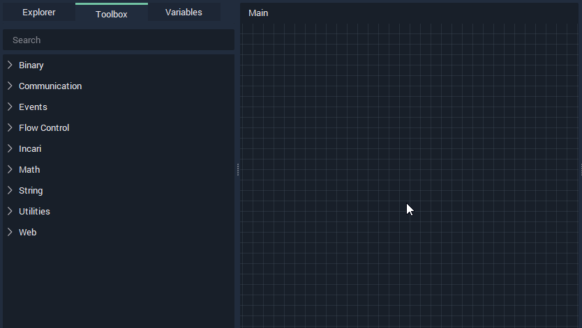

# The Console Node


If you don't have it open already, open the **Console Window** and dock it to your interface.


In [Part One](../part-one/) we created our **Variable** to represent speed, and created some interaction to increase/decrease its value. Currently we have no way to see this information. It is being evaluated and stored in the background, but we need to access that information in a way that is readable to us humans. Eventually, this information will be translated into a graphical representation, but while we are building our projects, we need to be able to check and test our logic to make sure that things are working as expected. This is where the **Console Node** comes in.

**Console** allows us to print messages to our **Console Panel**. Each of its **Inputs** are of the **String Data Type**, and each will be displayed in a different colour in the console panel. This is so that we can differentiate between errors, messages, warnings etc.


Add a **Console Node** to the **Node Graph**.


