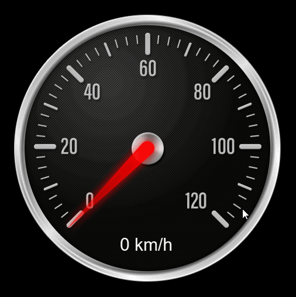

# Tutorial Overview

## Introduction

The following series of pages are designed, not to only guide you through your first INCARI project, but to give you a detailed background on a lot of key-concepts and functionality. We will be be working predominantly using INCARI's intuitive visual scripting tools to build real user interaction from the ground up, and gradually introducing new information as we go.

## Who is it For?

These lessons are designed _specifically_ with absolute beginners in mind. We know that people may have varied programming experience, or experience using node-based software, but none of that is required to begin working through this tutorial. INCARI was created as a way of massively simplifying the process of transforming UI designs into fully-functioning, interactive systems and through this project-based learning path, we aim to provide you with enough of an understanding of how the software works, that you can begin creating your own projects.

That being said, people with experience with programming concepts and/or the node-based workflow will probably find a lot of familiar ideas in the pages ahead, and may prefer to skim through some of the detailed descriptions and simply follow along with the instructions.

## Format and Styling

If you wish to follow along with the project from start to finish, you should look out for instructions on each page, which always look like the one below. 


* Instructions in this tutorial look like this!


Occasionally, you may also see optional suggestions and instructions, which will look slightly different.


* Optional instructions look like this!


Because there are a lot of references to **Terminology**, **Nodes**, **Attributes** etc. those words and phrases will always be in **Bold and Uppercase**, and will often link to separate, more detailed pages in the documentation \(where available\).

As well as detailed _textual_ descriptions, we wanted to provide you with a lot of _visual_  information, so that you can see all of the individual steps in action. Because of this, you will also see _a lot_ of images and animated GIFs.

## The Final Product

In the project, we will be creating a working speedometer instrument, with a rotating needle and text display, which is all controlled using keys on your keyboard.

## Requirements

As stated above, the tutorial shouldn't require any prior experience, however, it is recommended that you refer to the [**Logic Editor**](../getting-started/interface/managers-editors-and-outliners/logic-editor.md) section for detailed information on how the [**Logic Editor**](../getting-started/interface/managers-editors-and-outliners/logic-editor.md) works, as well as some useful terminology, which you will encounter in the lessons ahead.

Additionally, if you want to find out more detailed information on specific **Nodes**, the [**Toolbox** ](../logic-editor/toolbox/)section should be your go-to reference point.

Finally, the only things you will need to follow along are the graphics used in the tutorial. It is recommend that you use the assets provided initially, and then once you have completed the tutorial, you should experiment with using your own assets and creating your own projects based on what you have learned.





