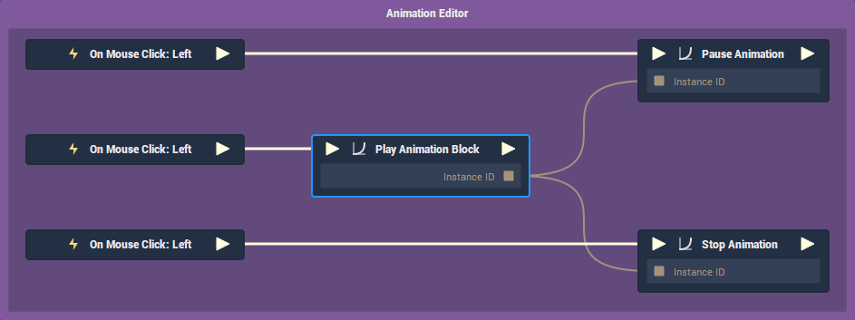
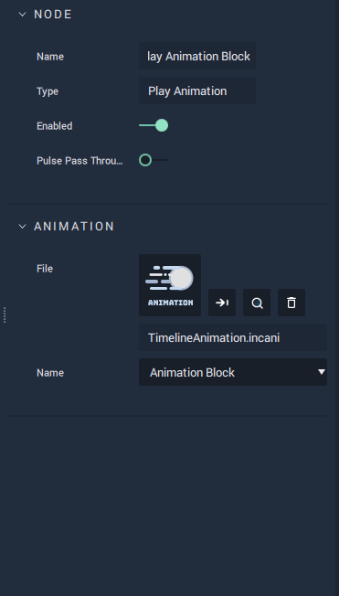
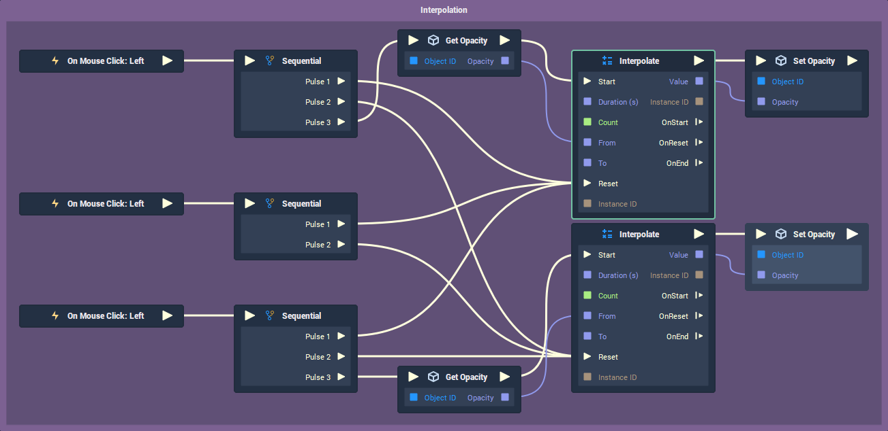
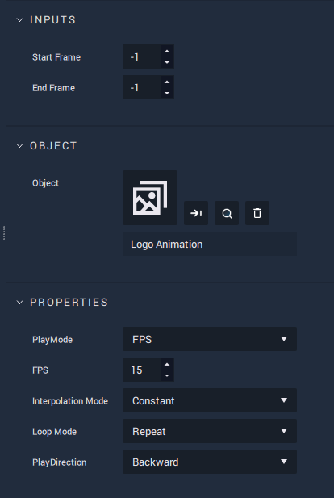
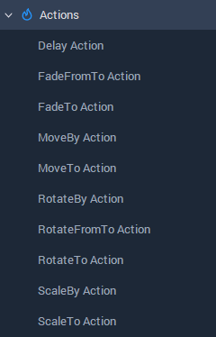

# 4 Methods of Animation

Animation is a key component of creating engaging UI experiences. Adding flare with motion and color can transform an HMI from something dull and lifeless into something polished and appealing. The term "animation" covers an extremely broad spectrum of disciplines and mediums. Not only that but the way that two animators approach a task may be very different while yielding similar results. In developing **Incari**, we have been very mindful of this fact and have supplied a variety of different methods for breathing life and character into static assets.

## See For Yourself

Using the new _Remote Projects_ section of **Incari Hub**, we can now provide downloadable projects, which you can play around with to see how certain functionality is implemented in **Incari Studio**. The first of these mini-projects focuses on the 4 different approaches to animation, which can all be combined together based on the project requirements.

To download the project now, open **Incari Hub** and download the "Animations" **Project** from the _Remote Projects_ section.

If you go back to the _My Projects_ section, you will see that the **Project** was added to your local files. If you _hover_ over the project thumbnail and _press_ the ▶ \(play\) icon, you can preview the **Project**.

Now you will see a variety of controls for each of the 4 animation methods.

1. **Animation Editor** - Spins the **Incari** __logo 360°. Note that this kind of animation in **Incari** is _relative,_ meaning that if you hit the X \(stop\) button while the **Sprite** is partially rotated, then hit play again, the logo will rotate to the same rotation as it was when you hit the button. These animations are achieved using a **Keyframe**-based approach. 
2. **Interpolation** - This fades the opacity of the graphic. **Interpolation** is without a doubt the most programmatic way of approaching animation. It is an entirely **Node**-based method which naturally favors a more parametric way of thinking.
3. **Image Sequence** - This animates the logo itself using a pre-rendered sequence of .png files. This allows you to use any 3rd-party animation tool to create animations and then bring them into **Incari Studio** where you can attach functionality.
4. **Actions** - This simply moves the logo from left to right with an easing effect. **Actions** are **Node**-based. However, unlike the **Interpolation** approach, these are specifically for animation and are much more akin to tween libraries like [TweenLite by GreenSock](https://greensock.com/tweenlite).

If you open the project from **Incari Hub** by _double-clicking_ it, we can begin to break down each animation method one by one.

## 1. Animation Editor

Within the **Asset Manager** there is a file called "TimelineAnimation.incani". Files with the `.incani` file type are **Keyframe**-based timeline animations, created using the **Animation Editor**, which should open automatically when _double-clicking_ on the **Asset**.

If you expand the **Animation Block** called "Logo Animation" and its **Transformation Attributes,** you will see that both the **Z Position** and **Z Rotation** are highlighted in blue. This indicates that these **Attributes** have some **Keyframes** saved on this **Animation Block**.

By selecting these **Attributes** using `Ctrl` + `LMB` and then _clicking_ the "focus" icon highlighted above, we can see the animation, represented as Bezier curves.

A **Keyframe** consists of two parts:

1. The **Keyframe** itself, which holds a value at a specific time.
2. The curve handles, which control the easing and interpolation between frames.

To add a **Keyframe**, simply _right click_ an **Attribute** and select "Add Keyframe" from the context menu. This will create a **Keyframe** at whatever time the playhead is currently on. You can then adjust the curve handles to fine-tune the intermediate frames.

If we take a look into the **Logic Editor**, you will see that controlling animations is fairly simple. When you play an animation using the **Play Animation Block Node**, an **Instance ID** is generated. This is a unique id number which **Incari** uses to identify which animation you want to _stop_ or _pause_. If this sounds confusing, don't worry. Just be aware that in order to use the **Stop Animation** and **Pause Animation Nodes** you must tell these **Nodes** which animation should be affected.

Another last point to note is that the **Play Animation Block Node** has an **Attribute** for both the **Asset** \(`File`\) and the **Animation Block** \(`Name`\) which will be played. You can drag the `.incani` file from the **Asset Manager** directly to the **Node** to assign it to the `File` **Attribute** and select the desired **Animation Block** from the dropdown menu.

## 2. Interpolation

**Interpolation** is a slightly more complex approach to animation. Unlike some of the other options, it is achieved with the **Logic Editor** alone, using the **Interpolate Node**. What this does is calculates the intermediate values between an initial and target value over a set amount of time.

In the example provided in the demo, you will see that each button graphic's **On Mouse Click** event triggers a sequence of **Logic**. On all three of the buttons, both of the **Interpolate Nodes** are reset, to make sure that we don't trigger an interpolation, while one is already in progress.

The _play forward_ and _play backward_ buttons have a third **Pulse** that calculates the interpolation between the _current_ and _target_ opacity values of the logo. Here is a brief overview of the **Attributes** of the **Interpolation Node:**

`Data Type` - The numerical data type which will be interpolated.

`Duration` - The length of time between the start and end of the interpolation.

`Interval Time` - This governs how frequently, in seconds, the interpolated value is calculated and the output **Pulse** is triggered. In our example, this is set at 0.0167, which is approximately 60 fps \(`1 / 60 = ~0.0167`\).

`From` - This is the value at the start of interpolation. In our example, we are using the current opacity value of our logo as a starting point.

`To` - This is the value at the end of the interpolation, which in our example, is either 1 or 0.25, depending on which button was pressed.

`Type` - This is the method that the **Interpolate Node** uses to calculate the intermediate values. These are similar to those found in many other software and programming languages. A good reference for interpolation types is [easings.net](https://easings.net/).

`Mode` - Whether the interpolation will be performed once, repeated, or alternated.

## 3. Image Sequence

Although **Incari's** built-in tools are powerful, there are many use cases where the desired effect can't be achieved using **Incari** alone. In this case, it often makes more sense to create animations in dedicated animation software. Most tools, such as _Adobe After Effects_, provide an easy way of exporting an animation as an image sequence, most commonly in the .png file format. By using **Incari's** **Image Sequence Object** and **Nodes**, we can take these frames and combine them with **Incari's** **Logic** system.

In the **Asset Manager** of our demo file, you will see a file called "Logo Animation.incseq". Files of the`.incseq`type are **Image Sequences**. To open the file, simply _double-click_ it and the **Image Sequence Editor** will open. Here you can see all of the images of the sequence arranged in order.

To create this type of file, simply _right-click_ in the **Asset Manager** and select "Create Asset &gt; Image Sequence". Then _double-click_ it to open the **Image Sequence Editor,** drag the images into it directly from the **Asset Manager**, and then _click_ the save icon to save it.

Controlling **Image Sequences** from the **Logic** is fairly straightforward. If you take a look in the **Logic Editor** of the demo scene, you will see that there are three main **Nodes** for playing, pausing, and stopping the playback of the **Image Sequence**.

While the **Pause ImageSequence** and **Stop ImageSequence** are quite self-explanatory, the **Play ImageSequence Node** has quite a few **Attributes**, which we will go through now:

* `Start Frame` / `End Frame` - This is the frame index that the animation will start and finish on. Setting these to -1 will tell **Incari** to start at the first frame and end at the last frame.
* `Object` - The **Image Sequence Sprite Object**, which can be dragged from the **Scene Outliner** onto the **Node**.
* `Play Mode` - Whether the animation will be played based on frames-per-second \(`FPS`\) or a duration \(`Time`\). The value of this **Attribute** will determine which of the following **Attributes** will be visible:
  * `FPS` - The framerate of the animation. This may be preferable if the animation was exported at a specific framerate that you want to reflect in **Incari**.
  * `Time` - The amount of time the animation will take from start to finish. This is useful for tweaking the duration of the animation and can incorporate frame blending using the `Interpolation Mode` **Attribute**.
* `Interpolation Mode` - This determines whether the animation should fade between one frame and the next. `Constant` means that frames aren't blended, while `Linear` means that they are. This **Attribute** only has an effect when the `Play Mode` is set to `Time`.
* `Loop Mode` - Whether the **Image Sequence** plays once \(`none`\), plays repeatedly \(`repeat`\), or ping-pongs backwards and forwards \(`alternate`\).
* `Play Direction` - If the animation plays forwards or backwards.

## 4. Actions

**Actions** are a set of **Nodes** designed specifically for animation. In the **Toolbox** you will see a number of different actions which affect the transformation properties and opacity of **Objects**.

The names of these **Nodes** offers insight into what the **Node** actually does and which **Attribute** is affected:

`Fade` = Opacity.

`Move` = Position.

`Rotate` = Rotation.

`Scale` = Scale.

Additionally, you will notice three types of actions:

`FromTo` = Both the start and end values are set manually.

`To` = Only the target value is provided.

`By` = The amount to be animated relative to the **Attribute's** current value.

Looking at our example **Logic**, you will see that the logo graphic is moved to a different position depending on which button is pressed. There are also four easing types, defined in the `Interpolation` **Attribute** for sine-based and linear interpolation.

