# An Analog Clock

Clocks show up everywhere in HMIs, and happen to be simple to create in **Incari**.

Load up the '**AnalogClock**' project file from **Incari Hub**. The included [**Scenes**](../objects-and-types/project-objects/scene.md) are a version with a ticking animation and a basic one.

|                      Basic Version                     |                      Ticking Version                     |
| :----------------------------------------------------: | :------------------------------------------------------: |
|  |  |

## 1. The Basic Version

Open the '**AnalogClock**' project from the **Incari Hub** _Remote Projects_ tab. In the [**Project Outliner**](../modules/project-outliner.md) look for '**Basic**' and make sure its visibility toggle is active. You can press **Run** (`Ctrl+R`) to preview how the [**Scene**](../objects-and-types/project-objects/scene.md) looks.

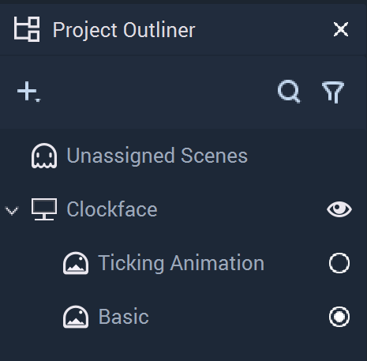

Now we can dive into how it works. In the top menu bar, go to **View** -> [**Logic Editor**](../modules/logic-editor.md) if it isn't already visible. Double-click '**Basic**' in the [**Project Outliner**](../modules/project-outliner.md) to load up the [**Scene**](../objects-and-types/project-objects/scene.md) **Logic**. Make sure the '**Basic**' tab is selected in the [**Logic Editor**](../modules/logic-editor.md) module; the **Project** **Logic** is explained later.

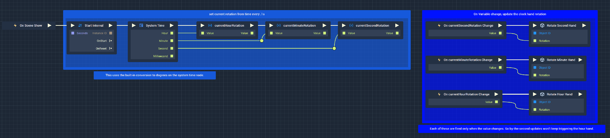

You'll see two major groups of [**Nodes**](../modules/logic-editor.md#nodes), which don't appear to be connected. The left side handles the _data_ gathering part of our [**Scene**](../objects-and-types/project-objects/scene.md). The right side takes this _data_ and updates the _User Interface_ (the clock face).

It's always a good practice to try and separate the view **Logic** (changing the _interface_) from the model **Logic** (changing the _data_) as much as possible. This makes it easier to work with larger **Pfojects**.

Let's look a bit closer at how we've done this.

### Model Logic

When the [**Scene**](../objects-and-types/project-objects/scene.md) is displayed, we trigger a [**Start Interval**](../toolbox/utilities/interval/startinterva.md) **Node**. This takes a single [**Pulse**](../modules/logic-editor.md#pulse) **(►) Input** and creates a recurring [**Pulse**](../modules/logic-editor.md#pulse) **Output** triggering the next **Node** at a set time interval. This will let us get the current time on an ongoing basis.

In this case, we have set [**Start Interval**](../toolbox/utilities/interval/startinterva.md) to retrigger _System Time_ every `0.1` seconds (see the `Timeout` **Attribute**).

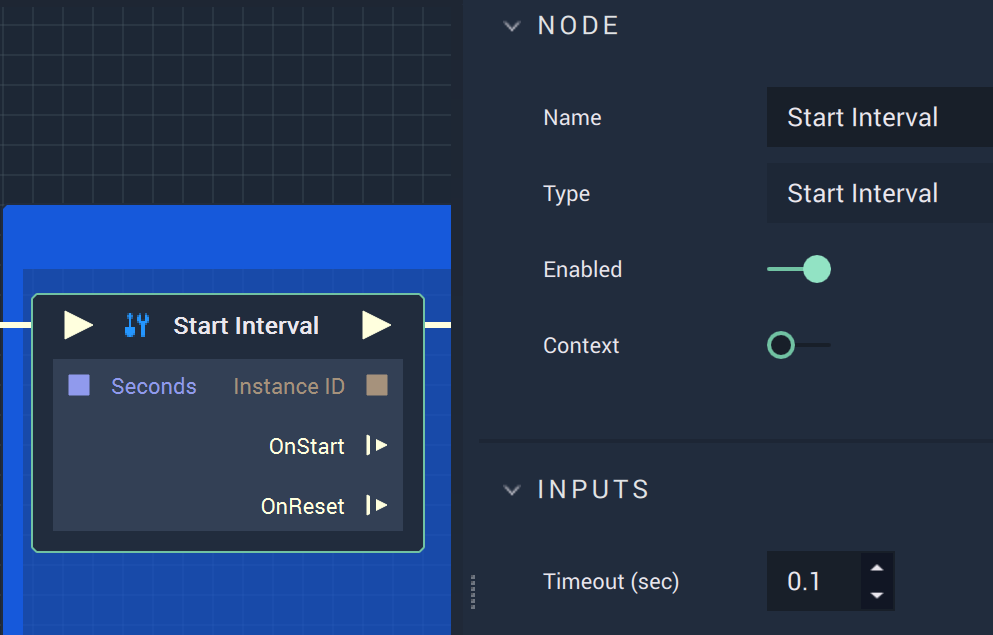

The [**System Time**](../toolbox/datetime/system-time.md) **Node** outputs hour, minute, second, and millisecond values separately in a variety of formats. By default, it will just give the current time in whole-number values. We have chosen the built-in _degree_ values in this case, which will handily convert the time value to a _rotation_ value that we can use to drive the _interface_.

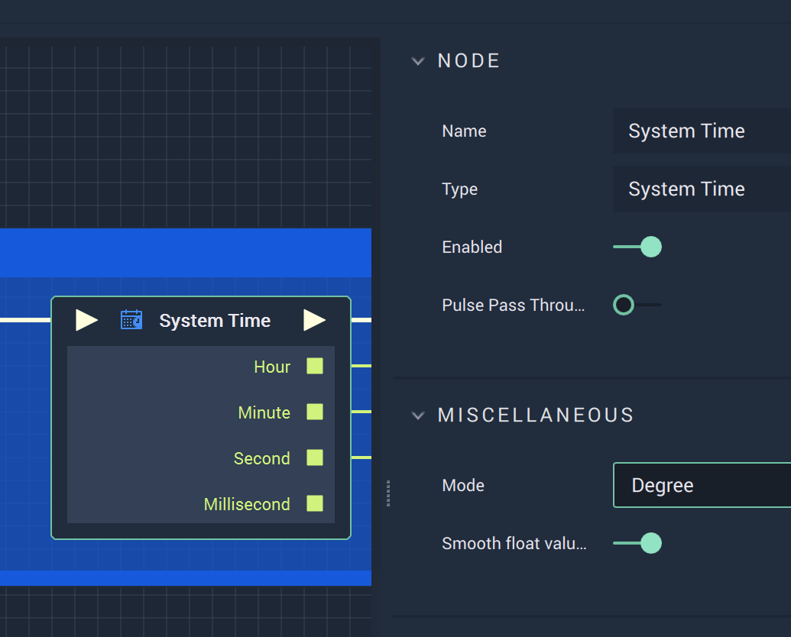

Every time it is triggered, it will update the values stored in its **Outputs** (square green Sockets). We read these values sequentially and store them in separate **Variables** using three [**Variable Setter**](../toolbox/variables/variable-setter.md) **Nodes**, one for each clock hand.

By storing into these **Variables**, we can achieve the decoupling between _data_ and _interface_ mentioned earlier.

### View Logic

Using an [**On Change Event**](../toolbox/events/variables/on-variable-change.md) **Node** for each **Variable** will allow us to trigger an update on each clock hand only when needed.

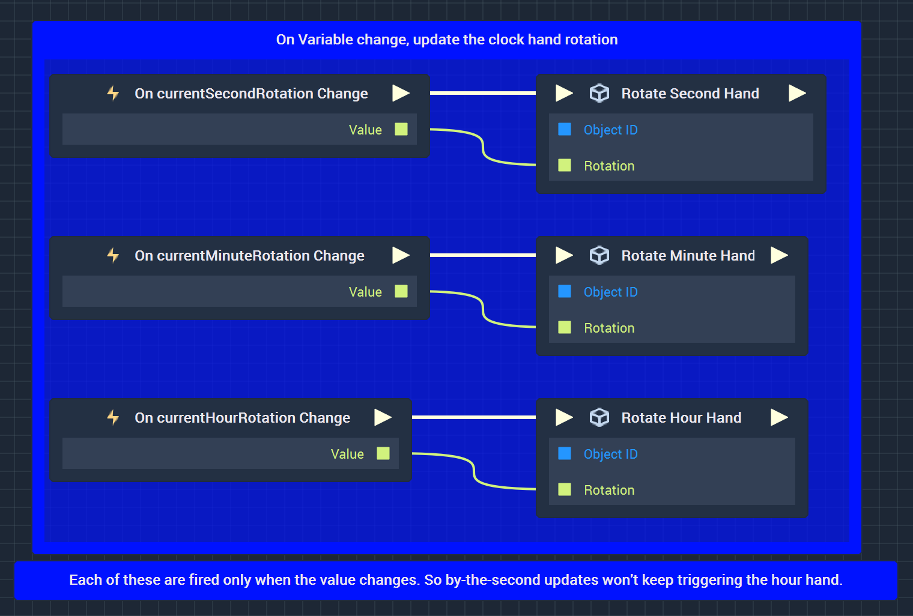

Finally, we pass the **Variable** value and the trigger from the [**On Change**](../toolbox/events/variables/on-variable-change.md) **Nodes** to three [**Set Rotation**](../toolbox/incari/object/set-rotation.md) **Nodes** configured to point to each clock hand image layer.

Save and run the project to see the basic clock!

## 2. The Ticking Version

But what if we want our second hand to “tick” like an analog clock? By adding a little more complexity, we can allow for the visual look to be adjusted to our needs. In order to manage this complexity, we'll also introduce the concept of [**Functions**](../toolbox/functions/) in **Incari**.

From the [**Project Outliner**](../modules/project-outliner.md), double-click the [**Scene**](../objects-and-types/project-objects/scene.md) named ‘**Ticking Animation**'.

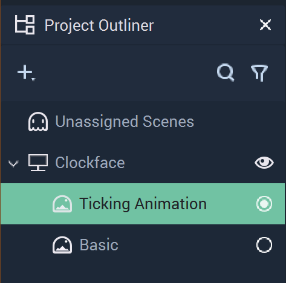

This [**Scene**](../objects-and-types/project-objects/scene.md) is split across two tabs on the [**Logic Editor**](../modules/logic-editor.md): The ‘**Project**’ tab and the ‘**Ticking Animation**’ tab.

### 'Project' tab Logic

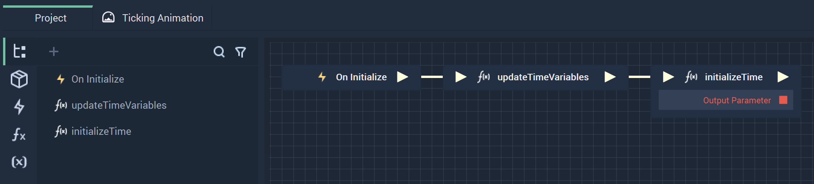

The **Logic** in here is shared across the whole **Project**, as you might expect from the name. We didn't use anything here in the basic example. But in a real app, here is where you would set **Variables** like the current time, as you would expect to need to tell the time across many different Scenes.

The chain starts with the **On Initialize** **Event** which fires when the **Incari** **Project** is run. Two functions are pulsed here: '**updateTimeVariables**' and '**initializeTime**'.

'**updateTimeVariables**' **Function**

This [**Function**](../toolbox/functions/) gets the current time and sets the time **Variables** to the current _system time_. The seconds are saved as [**Integer**](../objects-and-types/data-types/int.md) values, while the minutes and hours are saved as [**Float**](../objects-and-types/data-types/float.md) values.

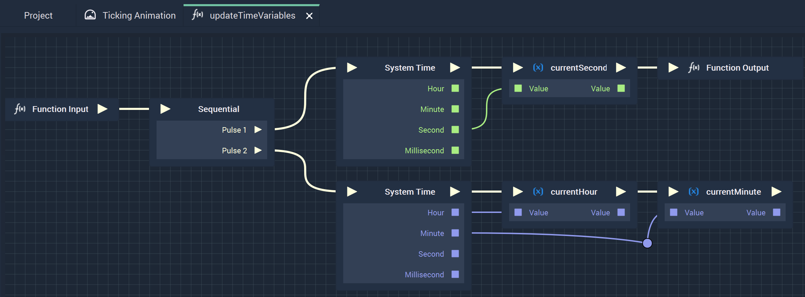

We also check the option to output the values for the hours and minutes as smooth [**Float**](../objects-and-types/data-types/float.md) values. This is because the hours and minutes will be positioned in between the positions on the clockface, as they do on a real clock.

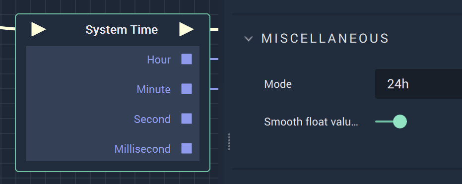

'**initializeTime**' **Function**

The '**initializeTime**' **Function** checks to see if the time has been initialized and sets the '**timeInitialized**' [**Boolean**](../objects-and-types/data-types/bool.md) value to _true_.

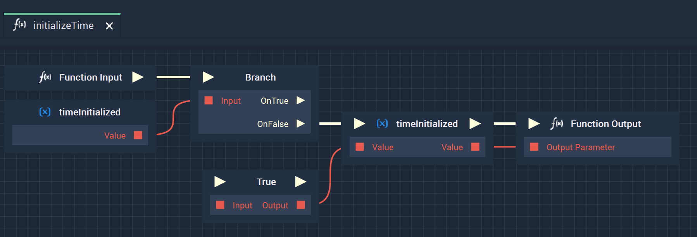

### 'Ticking Animation' Logic

The '**Ticking Animation**' Logic is divided into several parts. The **Logic** updates the time **Variables** every 1 second, creates the second hand ticking movement, converts time value to a _rotation_ value for all hands, and then finally rotates the clock hand images. We will go into detail about how each of these parts works.

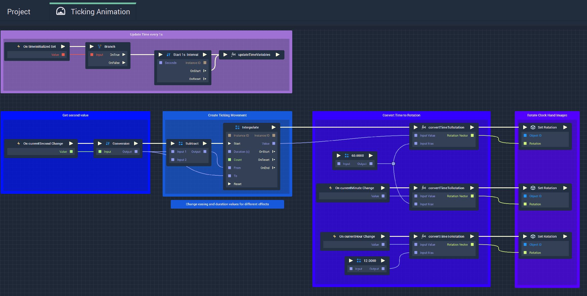

**Update Time Variables**

This part of the **Logic** runs only when the time has first been initialized. Then, a [**Start Interval**](../toolbox/utilities/interval/startinterval.md) **Node** is triggered. Every 1 second, the **Function** '**updateTimeVariables**' will run, which will update the current '**Second**', '**Minute**', and '**Hour**' **Variables**.

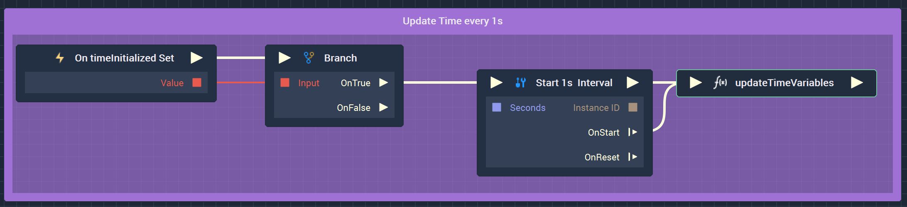

**Create Second Hand Ticking Movement**

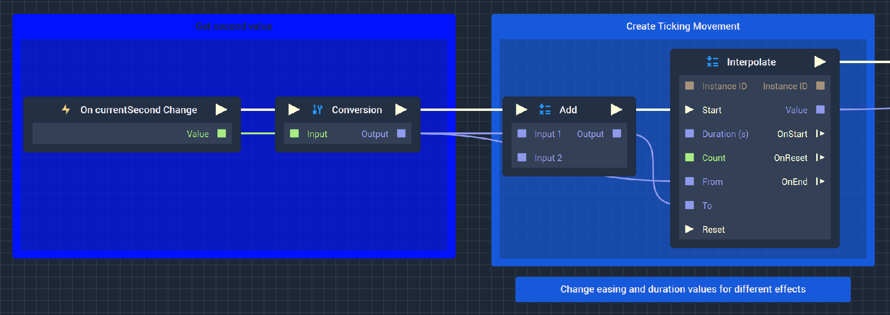

Whenever the '**currentSecond**' **Variable** changes, that new value is used to calculate the starting and ending position of the second hand when it ticks. The starting position of the hand is the current time, and the ending position is the current time `+ 1`. The [**Interpolate**](../toolbox/math/interpolate.md) **Node** is used to output a smooth transition from one number to the next across a period of time. This is what will animate the hand to make it “tick".

The [**Interpolate**](../toolbox/math/interpolate.md) **Node** has a few different **Attributes** that we can tweak to achieve a certain look:

* `Duration` - how long the interpolation takes.
*   `Interval Time` - how long each sub-unit of time is. For example, if we have a duration of 10 seconds and an interval time of 1 second, then **Interpolate** will output 10 values across 10 seconds:

    `1, 2, 3, 4, 5, 6, 7, 8, 9, 10.`

    Half the interval time outputs twice as many numbers in the same duration:

    `1.0, 1.5, 2.0, 2.5, 3.0, 3.5, 4.0, 4.5, 5.0, 5.5, 6.0, 6.5, 7.0, 7.5, 8.0, 8.5, 9.0, 9.5, 10.0.`
* `From` - the value we start from. In this case the current second - 1 (the previous second).
* `To` - the value we end at (the current time).
* There is also the `Interpolation Type`, which will give you the option for _non-linear easing_. For example you might want the hand to start slow and speed up. The best way to understand the difference is to experiment with the settings.

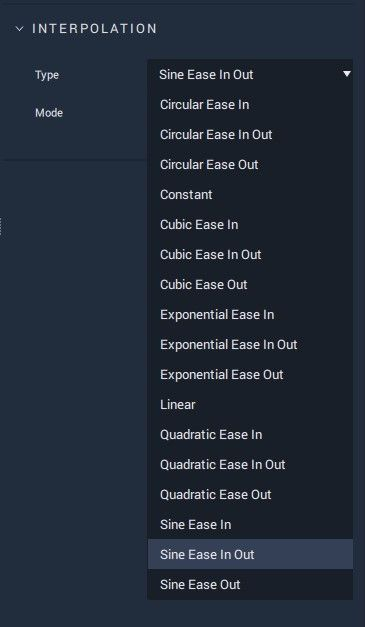

**Convert Time Value to a Rotation Value for all Hands**

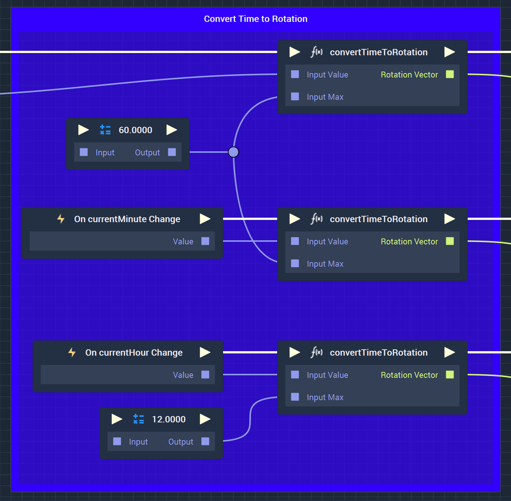

The time value is remapped to a _rotation_ value (_degrees_) using a custom '**convertTimeToRotation**' **Function**; this is done for seconds, minutes and hours. This [**Function**](../toolbox/functions/) takes the time value, remaps the value using a [**Range Mapper**](../toolbox/math/range-mapper.md) **Node**, and converts those values to a [**Vector3**](../objects-and-types/data-types/vector3.md) value.

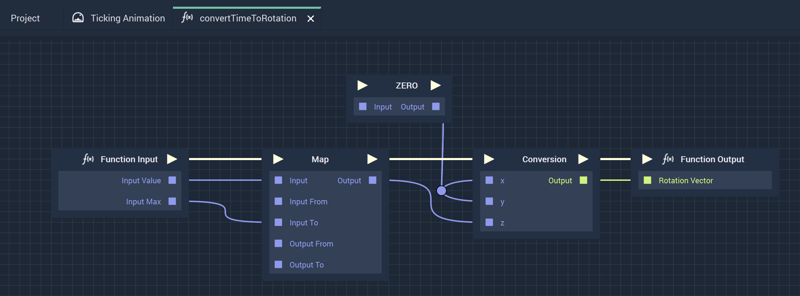

The [**Range Mapper**](../toolbox/math/range-mapper.md) **Node** needs a maximum value of the time, meaning the number that equals one full revolution around the clockface (seconds = 60; minutes = 60; hours = 12). It then uses that maximum and remaps the value to a new maximum of 360 (for 360 degrees in a circle). This gives the _degree of rotation_ for the current time.

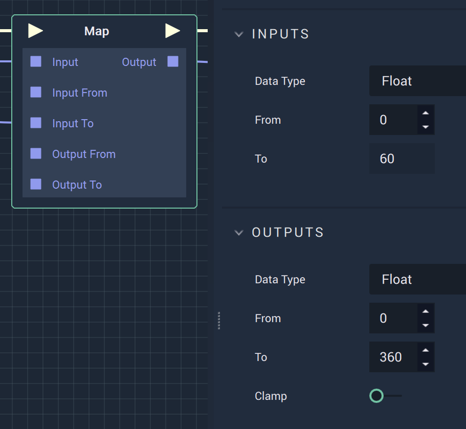

**Rotates the Clock Hand Images**

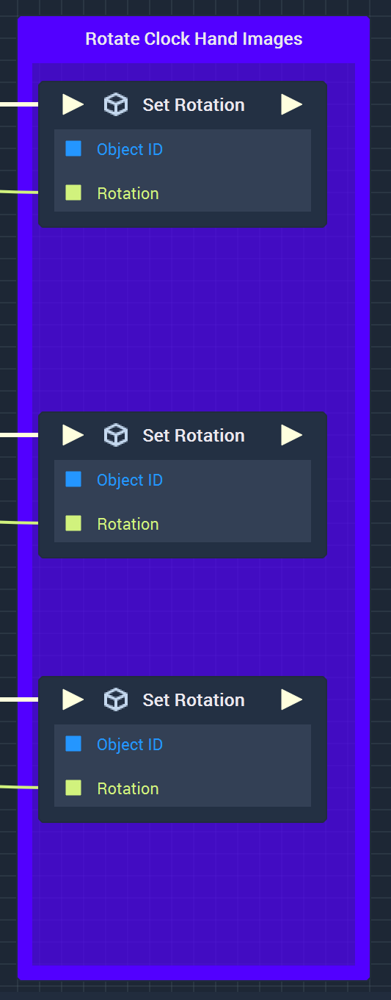

Now that the time values have been converted to _rotation_ values, we can use those values to set the _rotation_ of each clock hand image using a [**Set Rotation**](../toolbox/incari/object/set-rotation.md) **Node**.

Save and run the **Project** to see the ticking clock.

