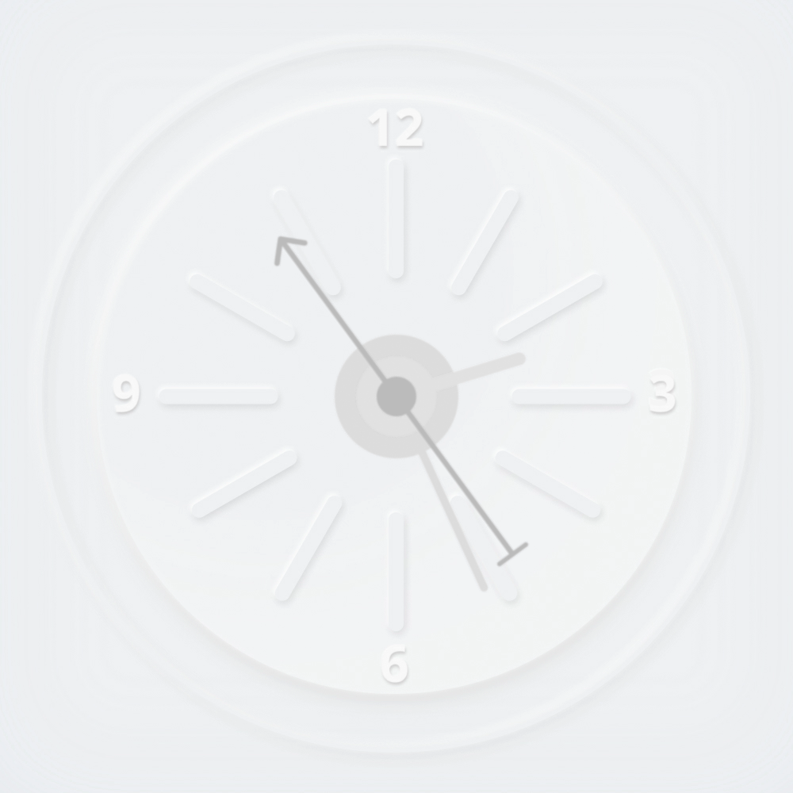
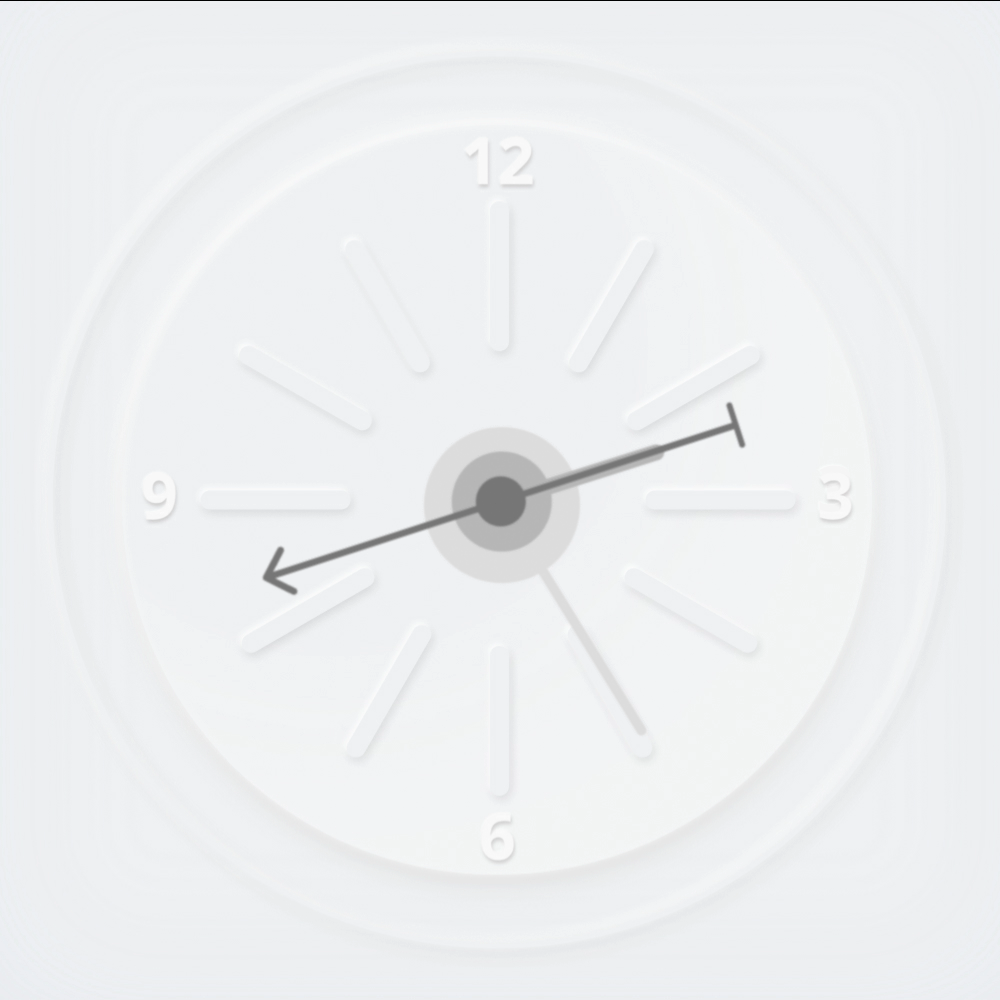

# An Analog Clock

Clocks show up everywhere in HMIs, and happen to be simple to create in **Incari**.

Load up the '**Analog Clock**' project file from **Incari Hub**. The included scenes are a version with a ticking animation and a basic one.

Basic Version           |  Ticking Version
:-------------------------:|:-------------------------:
  |  

## 1. The Basic Version

Open the '**AnalogueClock**' project from the **Incari Hub** _Remote Projects_ tab. In the **Project Outliner** look for '**Basic**' and make sure its visibility toggle is active. You can press **Run** (`Ctrl+R`) to preview how the **Scene** looks.

Now we can dive into how it works. In the top menu bar, go to **View** -> **Logic Editor** if it isn't already visible. Double click '**Basic**' in the **Project Outliner** to load up the **Scene** **Logic**. Make sure the '**Basic**' tab is selected in the **Logic Editor** module- the **Project** **Logic** is explained later.

You'll see two major groups of **Nodes**, which don't appear to be connected. The left side handles the _data_ gathering part of our **Scene**. The right side takes this _data_ and updates the _User Interface_ (the clock face).

It's always a good practice to try and separate the view **Logic** (changing the interface) from the model **Logic** (changing the data) as much as possible. It makes things much easier to reason about in the long run!

Let's look a bit closer at how we've done this.

### Model Logic

When the **Scene** is displayed, we trigger a **Start Interval** **Node**. This takes a single **Pulse (►) Input** and creates a recurring **Pulse Output** triggering the next **Node** at a set time interval. This will let us get the current time on an ongoing basis.

In this case, we have set the **Interval** to retrigger **System Time** every `0.1` seconds (see the `Timeout` **Attribute**).

The **System Time** **Node** outputs hour, minute, second, and millisecond values separately in a variety of formats. By default, it will just give the current time in whole-number values. We have chosen the built-in **Degree** values in this case, which will handily convert the time value to a rotation value that we can use to drive the interface.

Every time it is triggered, it will update the values stored in its **Outputs** (square green Sockets). We read these values sequentially and store them in separate **Variables** using three **Set Variable** **Nodes**, one for each clock hand.

By storing into these **Variables**, we can achieve the decoupling between _data_ and _interface_ mentioned earlier.

### View Logic

Using an **On Change Event** **Node** for each **Variable** will allow us to trigger an update on each clock hand only when needed. 

Finally, we pass the **Variable** value and the trigger from the **On Change** **Nodes** to three **Set Rotation** **Nodes** configured to point to each clock hand image layer.

That's it for how the basic example works under the hood.

Save and run the project to see the basic clock!

## 2. The Ticking Version

But what if we want our second hand to “tick” like an analog clock? By adding a little more complexity, we can allow for the visual look to be tweaked to our needs. In order to manage this complexity, we'll also introduce the concept of **Functions** in **Incari**.

From the **Project Outliner**, double click the **Scene** named ‘**Ticking Animation**'.

This **Scene** is split across two tabs on the **Logic Editor**: The ‘**Project**’ tab and the ‘**Ticking Animation**’ tab.

### 'Project' tab Logic

The **Logic** in here is shared across the whole **Project**, as you might expect from the name. We didn't use anything here in the basic example. But in a real app, here is where you would set **Variables** like the current time, as you would expect to need to tell the time across many different Scenes.

The chain starts with the **On Initialize** **Event** which fires when the **Incari** **Project** is run. Two functions are pulsed here: '**updateTimeVariables**' and '**initializeTime**'.

'**updateTimeVariables**' **Function**

This **Function** gets the current time and sets the time **Variables** to the current system time. The seconds are saved as **Integer** values, while the minutes and hours are saved as **Float** values.

We also check the option to output the values for the hours and minutes as smooth **Float** values. This is because the hours and minutes will be positioned in between the positions on the clockface, as they do on a real clock.

'**initializeTime**' **Function**

The '**initializeTime**' **Function** checks to see if the time has been initialized and sets the '**timeInitialized**' boolean value to _true_.  

### 'Ticking Animation' Logic

The '**Ticking Animation**' Logic is divided into several parts. The **Logic** updates the time **Variables** every 1s, creates the second hand ticking movement, converts time value to a _rotation_ value for all hands, and then finally rotates the clock hand images.  We will go into detail about how each of these parts works.  

**Update Time Variables**

This part of the **Logic** runs only when the time has first been initialized.  Then, an **Interval** **Node** is triggered.  Every 1 second, the function '**updateTimeVariables**' will run, which will update the current '**Second**', '**Minute**', and '**Hour**' **Variables**.

**Create Second Hand Ticking Movement**

