# Image Sequence Button Animation

## Overview

This simple button animation uses the [**Image Sequence**](4-methods-of-animation.md#3.-image-sequence) feature to create an interactive, animated button. When the mouse hovers over the button, the button animates to a half-pressed state.  When the mouse moves off of the button, the button returns to the original unpressed state.  When the mouse is pressed, the button animates to a fully pressed state and returns to the original unpressed state upon release.

## Image Sequences

Although **Incari's** built-in tools are powerful, there are many use cases where the desired effect can't be achieved using **Incari** alone. In this case, it often makes more sense to create animations in dedicated animation software. Most tools, such as _Adobe After Effects_, provide an easy way of exporting an animation as an **Image Sequence**, most commonly in the `.png` file format. By using **Incari's** **Image Sequence** **Object** and [**Nodes**](../toolbox/incari/imagesequence/README.md), we can take these frames and combine them with **Incari's** **Logic** system.

Files of the `.incseq` type are **Image Sequences**. To open the file, simply double-click it and the [**Image Sequence Editor**](../modules/image-sequence-editor.md) will open. Here you can see all of the images of the sequence arranged in order.

To create this type of file, simply right-click in the [**Asset Manager**](../modules/asset-manager.md) and select "Create Asset > Image Sequence". Then double-click it to open the [**Image Sequence Editor**](../modules/image-sequence-editor.md), drag the images into it directly from the [**Asset Manager**](../modules/asset-manager.md), and then click the save icon to save it.

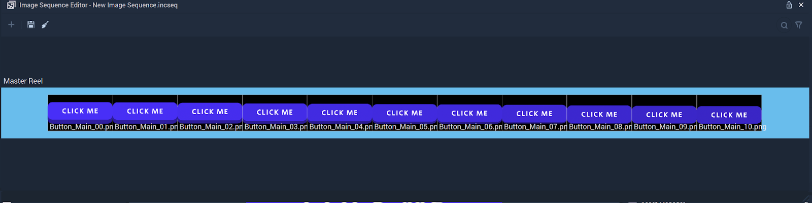

## Logic

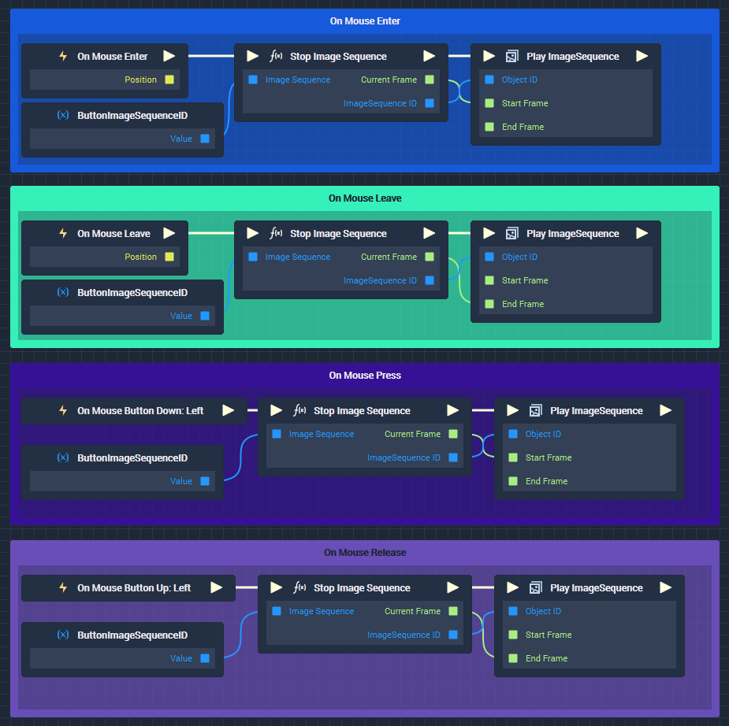

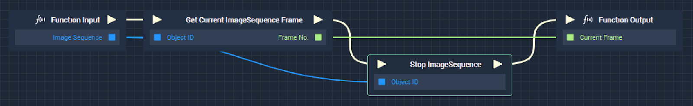

## All Nodes

This **Demo Project** uses a combination of [**Event Nodes**](../toolbox/events/README.md), an **Object Node**, [**ImageSequence Nodes**](../toolbox/incari/imagesequence/README.md), and a [**Custom Function Node**](../toolbox/functions/README.md) to make the button animation function as desired.

* [**Event Nodes**](../toolbox/events/README.md)
  * [**On Mouse Enter**](../toolbox/events/mouse/on-mouse-enter.md)
  * [**On Mouse Leave**](../toolbox/events/mouse/on-mouse-leave.md)
  * [**On Mouse Button Down**](../toolbox/events/mouse/on-mouse-button-down.md)
  * [**On Mouse Button Up**](../toolbox/events/mouse/on-mouse-button-up.md)
* **Object Node**
  * **ImageSequence Object Node 'Button'**
* [**Custom Function Node**](../toolbox/functions/README.md)
  * **'Stop Image Sequence'**
* [**ImageSequence Nodes**](../toolbox/incari/imagesequence/README.md)
  * [**Play ImageSequence**](../toolbox/incari/imagesequence/playimagesequence.md)
  * [**Stop ImageSequence**](../toolbox/incari/imagesequence/stopimagesequence.md)
  * [**Get Current ImageSequenceFrame**](../toolbox/incari/imagesequence/getcurrentimagesequenceframe.md)

## Logic Groups

There are four groups of **Logic** in the **Project**, each triggered by one of the four [**Event Nodes**](../toolbox/events/README.md) used: [**On Mouse Enter**](../toolbox/events/mouse/on-mouse-enter.md), [**On Mouse Leave**](../toolbox/events/mouse/on-mouse-leave.md), [**On Mouse Button Down**](../toolbox/events/mouse/on-mouse-button-down.md), and [**On Mouse Button Up**](../toolbox/events/mouse/on-mouse-button-up.md).

The only difference between the groups is the [**Event Node**](../toolbox/events/README.md) that triggers them and the [**Attributes**](../getting-started/attributes/README.md) of the [**Play ImageSequence Node**](../toolbox/incari/imagesequence/playimagesequence.md) at the end.

We will use the green Group **'On Mouse Enter'** to explain how the **Logic** of each group functions.

## 'On Mouse Enter' Group

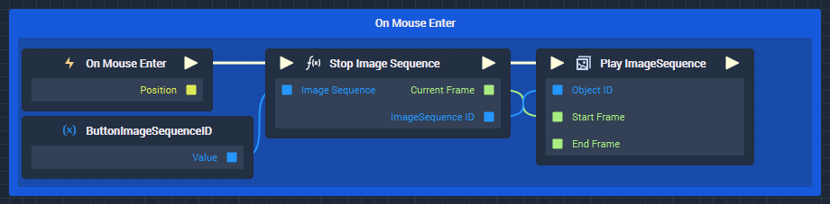

## On Mouse Enter Event Node

The first **Node** in the **Logic** is the [**On Mouse Enter Event** **Node**](../toolbox/events/mouse/on-mouse-enter.md). This means that when the mouse enters the area of the designated **Object**, the [**Pulse**](../modules/logic-editor.md#pulse) is fired.  In this case, the **Object** designated in the **Node** [**Attributes**](../getting-started/attributes/README.md) is the **Button ImageSequence Sprite** **Object**.  You can designate an **Object** by dragging the **Object** from the [**Scene Outliner**](../modules/scene-outliner.md) into the **Node Attributes** of the **Event Node**.

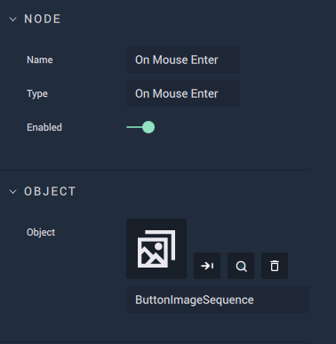

## Custom Function Node

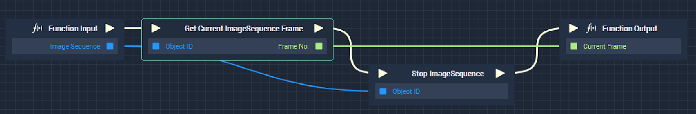

The next **Node** in the **Logic** is the [**Custom Function** **Node**](../toolbox/functions/README.md). This **Function** takes the input of the **Image Sequence Sprite** **Object** (**'Button'**) as an **Object ID**, gets the current frame of the **Image Sequence** with the [**Get Current ImageSequence Frame** **Node**](../toolbox/incari/imagesequence/getcurrentimagesequenceframe.md), stops the **Image Sequence** with a [**Stop ImageSequence** **Node**](../toolbox/incari/imagesequence/stopimagesequence.md), and outputs the last shown frame of the **Image Sequence** before it was stopped.

It is important to save the last shown frame of the **Image Sequence** before the **Image Sequence** is stopped, because the [**Stop ImageSequence** **Node**](../toolbox/incari/imagesequence/stopimagesequence.md) resets the current frame of the **Image Sequence** back to the first frame of the **Image Sequence**. This last shown frame will be used as the new starting frame for the [**Play ImageSequence** **Node**](../toolbox/incari/imagesequence/playimagesequence.md), which will come next directly after the [**Custom Function** **Node**](../toolbox/functions/README.md).

Without using the last shown frame as the new starting frame, the **Image Sequence** always plays from the beginning (the original starting frame set in the [**Play imageSequence** **Node**](../toolbox/incari/imagesequence/playimagesequence.md).  This is not ideal if the button has been clicked too fast or the mouse has gone in and out of the object area faster than the time it takes for the **Image Sequence** animation to play through fully.  Without this [**Custom Function**](../toolbox/functions/README.md), the animation may jump instead of always smoothly moving through the frames in the correct order.

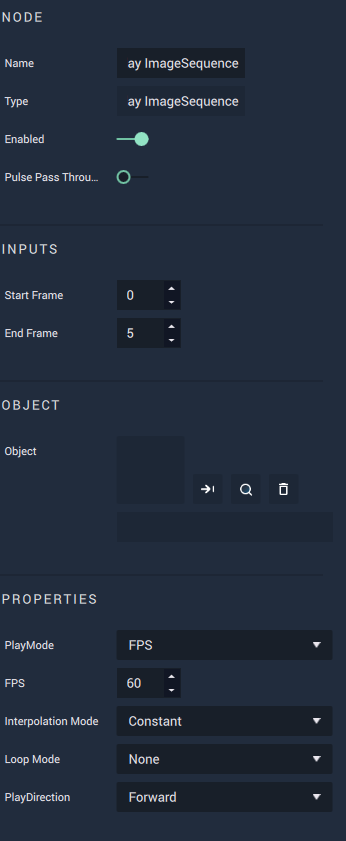

## Play ImageSequence Node

The last **Node** in each of the groups is the [**Play ImageSequence** **Node**](../toolbox/incari/imagesequence/playimagesequence.md).  While the same **Node** is used in each group, the [**Attributes**](../getting-started/attributes/README.md) are set differently for each event, because a different section and direction of the **Image Sequence** will be designated for each event.

For the [**On Mouse Enter**](../toolbox/events/mouse/on-mouse-enter.md) event, we want the button to go from an unpressed button to a half-pressed button.  This means that in the [**Attributes**](../getting-started/attributes/README.md) of the [**Play ImageSequence** **Node**](../toolbox/incari/imagesequence/playimagesequence.md), we should set the starting frame to be `0` (unpressed state) and the end frame to be `5` (half-pressed state).  Since we have `11` total frames in the **Image Sequence**, frame `5` is half-way through the frames.  The `PlayDirection` should be set to `Forward` so the frames show in ascending order: `(0,1,2,3,4,5)`.

## 'On Mouse Leave' Group

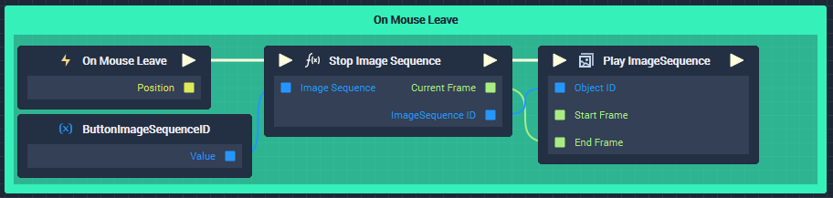

For the **'On Mouse Exit'** group, we trigger the **Logic** with the [**On Mouse Leave Event** **Node**](../toolbox/events/mouse/on-mouse-leave.md). Here, the **Image Sequence** will show the button returning to the unpressed state from the half-pressed state it is currently in. The same start and end frame from the **'On Mouse Enter'** group are used, but this time the `PlayDirection` is set to `Backward` so it plays in descending order: `(5,4,3,2,1,0)`.

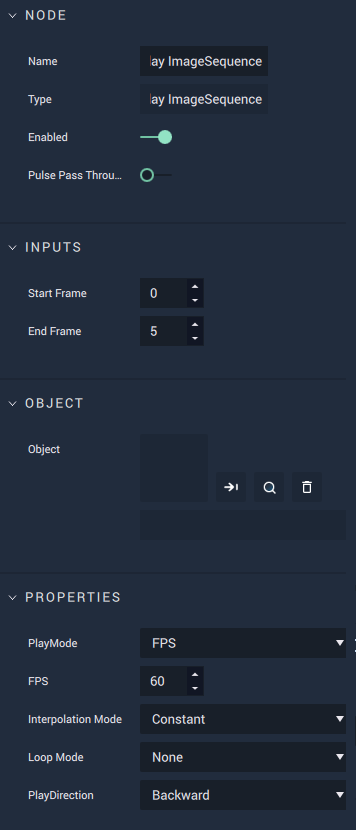

## 'On Mouse Press' Group

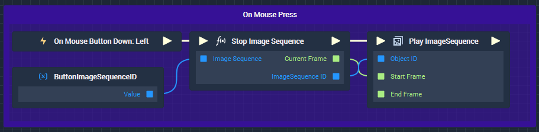

For the **'On Mouse Down'** group, we trigger the **Logic** with the [**On Mouse Button Down** **Event Node**](../toolbox/events/mouse/on-mouse-button-down.md). Here, the **Image Sequence** will show the button going to the fully pressed state when the mouse button is pressed down. This time, the starting frame is set to `0` (unpressed state) and the end frame is set to `10` (fully pressed state). The `PlayDirection` is set to `Forward`.  Remember that the start frame will not actually start at `0` and will always start from the last current frame.  Since the mouse must enter the area of the button to click it, the starting frame will likely be set to `5` by the **Logic** while the project is playing.

## 'On Mouse Release' Group

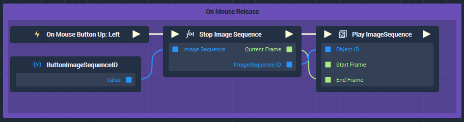

For the **'On Mouse Up'** group, we trigger the **Logic** with the [**On Mouse Button Up** **Event Node**](../toolbox/events/mouse/on-mouse-button-up.md). Here, the **Image Sequence** will show the button going fully back up to the unpressed state when the mouse button is released back up. The starting frame is also set to `0` and the end frame is set to `10`, but this time the `PlayDirection` is set to `Backward`. Remember that the start frame will not actually reach the last frame of `0` if the mouse is still hovering over the button.

