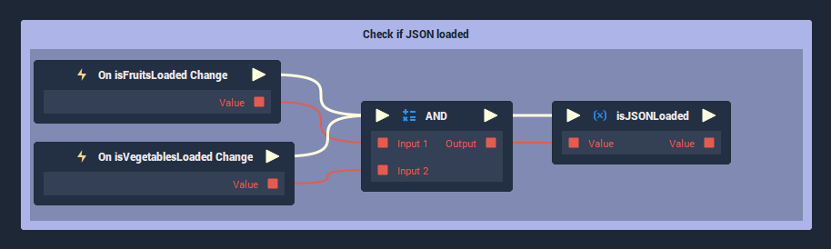

# Project Initialization

This **Demo Project** guide is broken up into two parts, with their corresponding subsections:

* [**Part One**](project-initialization.md#part-one)
  * [**Part One Overview**](project-initialization.md#part-one-overview)
  * [**The Project**](project-initialization.md#the-project)
  * [**The Problem**](project-initialization.md#the-problem)
  * [**The Solution**](project-initialization.md#the-solution)
* [**Part Two**](project-initialization.md#part-two)
  * [**Part Two Overview**](project-initialization.md#part-two-overview)
  * [**The Other File**](project-initialization.md#the-other-file)
  * [**Checking if ALL JSON Files are Loaded**](project-initialization.md#checking-if-all-json-files-are-loaded)
  * [**The Event Listener**](project-initialization.md#the-event-listener)

## Part One

### Part One Overview

In traditional, text-based programming languages, there is a clear order of execution. Lines of code are generally executed from top-to-bottom.

As **Incari** is has *non-linear* execution of **Logic**, there is no implicit way to guarantee that certain entities will be initialized *before* you try and do something with them. This is especially problematic when:

* **Working with Events** - Because **Incari** is event-driven and multiple **Branches** of **Logic** can *listen* for the same event. This means that you can’t know for sure which branch will be fired in what order.

* **Working with Asynchronous Nodes** - For most cases, **Incari** waits for **Nodes** to be evaluated *before* moving on to the next operation. It also waits for an entire **Branch** of **Logic** to finish before moving to the next **Branch**. This is referred to as *synchronous*. There are some **Nodes** however, that take a little bit longer than normal, and **Incari** will start executing other parts of the **Logic**, while waiting for these *asynchronous* **Nodes** to finish what they’re doing.

To ensure that things like **Variables** are initialized via the **Logic**, before trying to access them, you need to create some additional **Logic**. This involves creating some additional checks to verify that the **Project** is in the state that you want it to be in, before trying to work with its data.

### The Project


To demonstrate this issue, we have a simple **Project**, which loads a *JSON* file containing a single object. This object is an **Array** of fruit names:

```
{
  "fruits": [
    "apple",
    "banana",
    "orange",
    "pear",
    "grape",
    "strawberry",
    "watermelon",
    "cherry",
    "mango",
    "pineapple",
    "coconut",
    "papaya",
    "guava",
    "lemon",
    "lime"
  ]
}
```

There are 3 blocks in the `Project` tab of the **Logic** **Editor**:

1. **“Project Init”** - Uses the built-in **On Initialize Event** in combination with a **Custom Event**, called “Project Init”.

2. **“Load fruits.json”** - Loads our `fruits.json` file, uses **JSON Parse** to convert it to a **Dictionary**, gets the **Array** of fruit names, and then saves it to a **Variable**, called “Fruits”.

3. **“Get a fruit name”** - Attempts to get the fruit name with the index 10 from the “Fruits” **Variable** and print it’s name to the **Console**.

### The Problem


| :x: | `Error: cannot get array element 10. Check if index is in array range.` |
| --------- | -------------------- |

When running the **Project**, we get an error in the **Console**. This is because **Incari** is unable to find anything at the index 10, since the length of the **Array** is empty. This is due to it not yet being initialized with the loaded data from the *fruits.json* file.

### The Solution


To fix this issue, we can:

1. Create a **Boolean**-type **Variable** called `isFruitsLoaded`, with the default value of *false*.

2. *After* the **Fruits Variable's** value is assigned, set `isFruitsLoaded` to *true*.

3. Create an **Event Listener** to *listen* for the **Variable’s** value changing.

4. Create a **Branch Node** to check if `isFruitsLoaded` is *true*. If it is, continue with the **Branch** of **Logic**. 

Now, when we run the **Project**, we get the expected output:

| :white_check_mark: | `coconut` |
| --------- | -------------------- |


## Part Two

### Part Two Overview

In the previous [example](project-initialization.md#part-one), we discussed how to manually check that a specific branch of asynchronous **Logic** has been completed, before trying to use any data generated or loaded by it. There are often cases, though, where you need to ensure that multiple criteria are met before the **Project** is classified as “initialized”.

In that case, we need to:

* Create a **Boolean** **Variable** for each check

* Create another **Boolean** that ensures all other checks are *true*.

### The Other File

To illustrate the new use case, we have added an additional file, called `vegetables.json`, which contains a single object, called `vegetables`:

```
{
  "vegetables": [
    "carrot",
    "potato",
    "tomato",
    "cucumber",
    "onion",
    "pepper",
    "celery",
    "garlic",
    "ginger",
    "sweet potato",
    "pumpkin",
    "cauliflower",
    "artichoke",
    "asparagus",
    "eggplant",
    "okra",
    "zucchini",
    "brussel sprout",
    "cabbage",
    "lettuce",
    "spinach",
    "kale",
    "broccoli",
    "collard green",
    "radish",
    "pea",
    "bell pepper",
    "parsnip",
    "spring onion",
    "mushroom",
    "beet",
    "sweetcorn"
  ]
}
```
To load the *JSON*, we do the same as before, but change the:

1. `File` **Attribute** of the **Load File Node**.

2. `Key` **Attribute** of the **Get Dictionary Element Node**.

3. The **Array Variable** that is set, to a new one named `isVegetablesLoaded`.


### Checking if ALL JSON Files are loaded

Because, we now need to check that both the `Vegetables` and `Fruits` **Arrays** are loaded, we need to do things a little bit differently. Before, we could plug the **onChange Events** directly into our other **Logic**. Now, however, we need an additional **Boolean**, which we will call `isJSONLoaded`. We then need to utilize the **AND Node**, which returns *true* if all of its inputs are also *true*.



### The Event Listener

Now that we have our additional checks, we can *listen* for the `isJSONLoaded` **Variable** being changed, so that we can access both our `Vegetables` and `Fruits` **Arrays** and be sure that they have been populated with the values from the *JSON* files.


