# Skinnable Speedometer

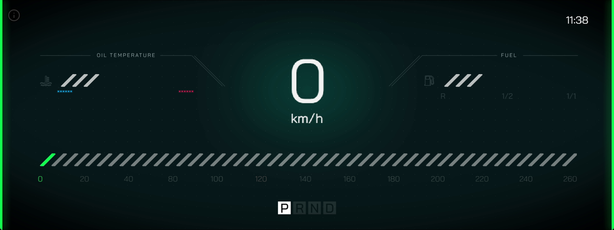

## Overview

This **Demo Project** consists of a *speedometer* whose visual presentation can be altered while maintaining the functionality. Thus, it showcases **Incari's** ability to alter and reuse **Assets** in order to fully customize the *User Interface*.

### Themes

<figure>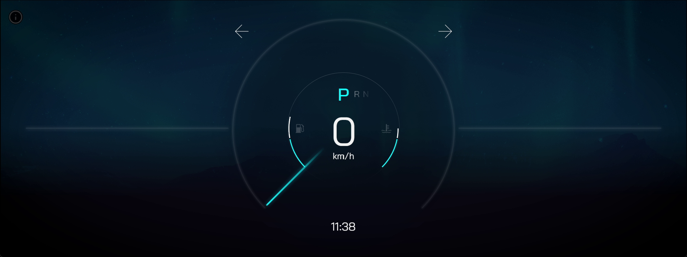<figcaption>
Blue Theme.
</figcaption></figure>
<figure>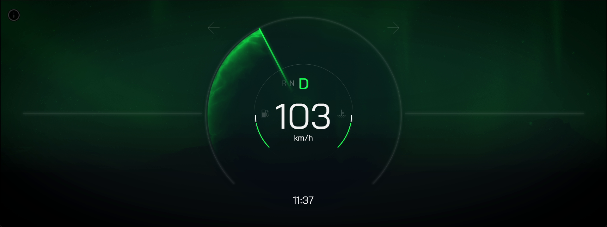<figcaption>
Green Theme.
</figcaption></figure>

The primary distinction between these two *speedometers* lies in their color themes. While one *speedometer* goes for a cool blue color palette, the other adopts a vibrant green one. The choice of colors not only affects the aesthetic appeal but can also influence the user experience. The dynamic and bold hues on one *speedometer* may evoke a sense of urgency or excitement, whereas the softer tones on the alternative *speedometer* might convey a calm and composed atmosphere. Ultimately, the difference in color serves as a visual cue that can subtly shape the driver's perception and behavior on the road.

### Views

<figure><figcaption>
Classic View.
</figcaption></figure>
<figure>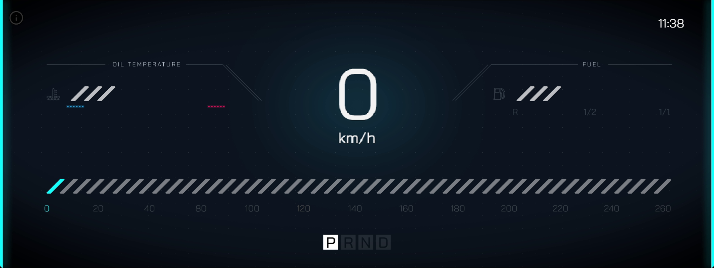<figcaption>
Modern View.
</figcaption></figure>

The disparity between two *speedometers* lies in their distinct styles, or view. One *speedometer* relies on a soft, round, classic display design. In contrast, the other *speedometer* embraces clean lines, digital displays, and a modern aesthetic. The choice of style not only reflects aesthetic preferences but also impacts the overall feel and atmosphere within the vehicle. The modern view may appeal to those seeking a high-tech and futuristic driving experience, while the classic view caters to enthusiasts who appreciate a simple and relaxed ambiance in their vehicle's instrumentation. The difference in style thus contributes to a diverse range of visual preferences and driving aesthetics among users.

### Instructions

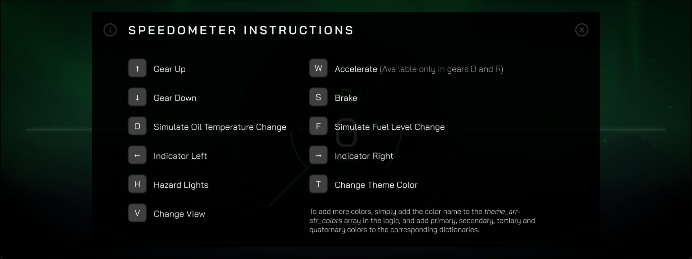

Although all four *speedometer* types look visually different, their functionality remains the same and can be managed by the same instructions. 

* `↑` indicates going up in gear.
* `↓` indicates going down in gear.
* `O` simulates the oil temperature change.
* `←` commands the left indicator.
* `H` controls the hazard lights.
* `V` changes the *speedometer* view.
* `W` causes acceleration (this is only available in *drive* and *reverse*).
* `S` brakes
* `F` simulates the fuel level change.
* `→` commands the right indicator.
* `T` changes the *speedometer*'s theme color.

## Logic

The **Logic** for switching the speedometer's theme and view is described below:

## Switching Theme

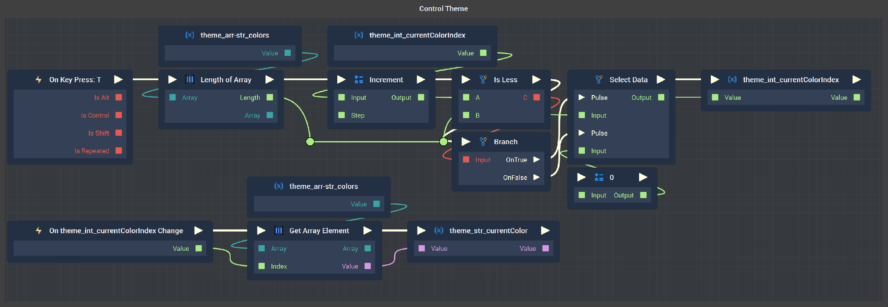

Once the user presses `T`, the number of values that are in `theme_arr-str_colors` is incremented by 1 and compared to the value of `theme_int_currentColorIndex`. If this current index is less than the length of the **Array** of **Strings** given at the start, this means that there is a next value in the **Array** of themes and it continues to this next one and selects that data. However, if it is not less than the length, this means all the values of the **Array** have been cycled through and it starts at the 'beginning' with an index of 0. This is stored as the `theme_int_currentColorIndex`.  

Whenever there is a change, this triggers `On theme_int_currentColorIndex Change`, which sets and returns the **String** value at the specified index. 

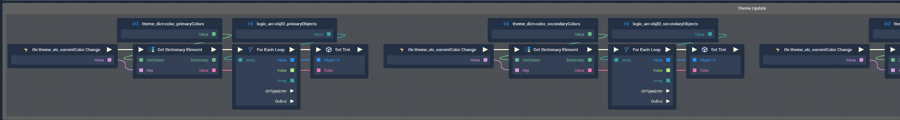

When `theme_int_currentColor` changes, it triggers the four blocks of **Logic** in the `Theme Update` grouping. These apply to the four shades of the theme's color. In the above image, the two blocks of **Logic** visible set the **Color** values for the primary and secondary **Objects** of the *speedometer*.

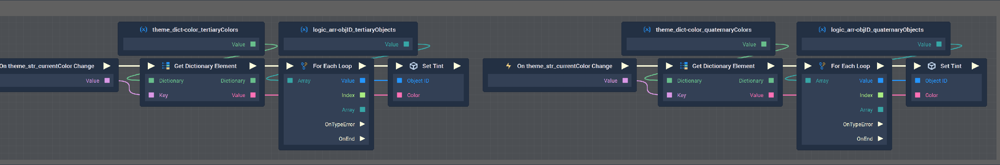

In the above image, the two blocks of **Logic** visible set the **Color** values for the tertiary and quaternary **Objects** of the *speedometer*. 

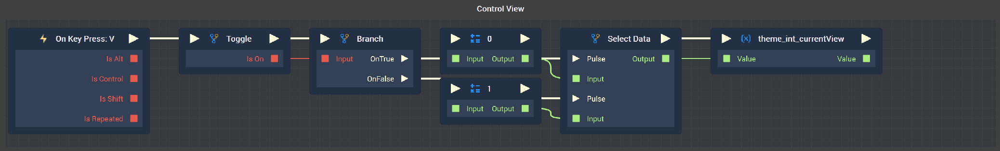

Pressing `V` triggers the **Toggle Node** and sets a variable to either 0 or 1, and stores this value in `theme_int_currentValue` to later change the theme. 

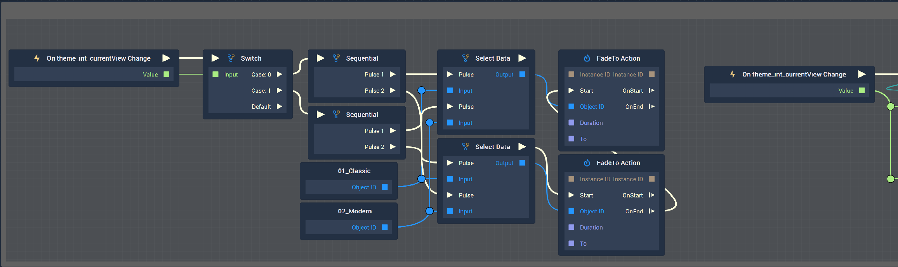

The first block of the `View Update` **Logic** is triggered by the change of the `theme_int_currentValue` variable. Depending on the resulting variable of either 0 or 1, it provokes use of the **FadeTo Node** between the current and changed view.

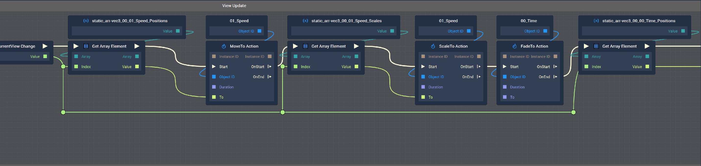

The next block of **Logic** takes the values of the variables for acceleration, time, etc. and updates the view. This **Logic** shown above continues in the image below. 

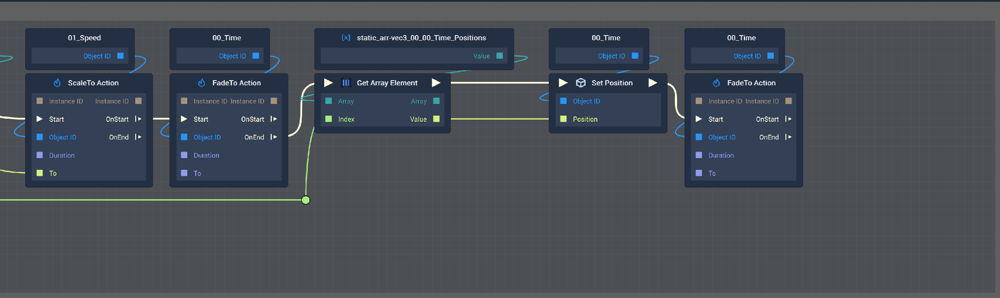
