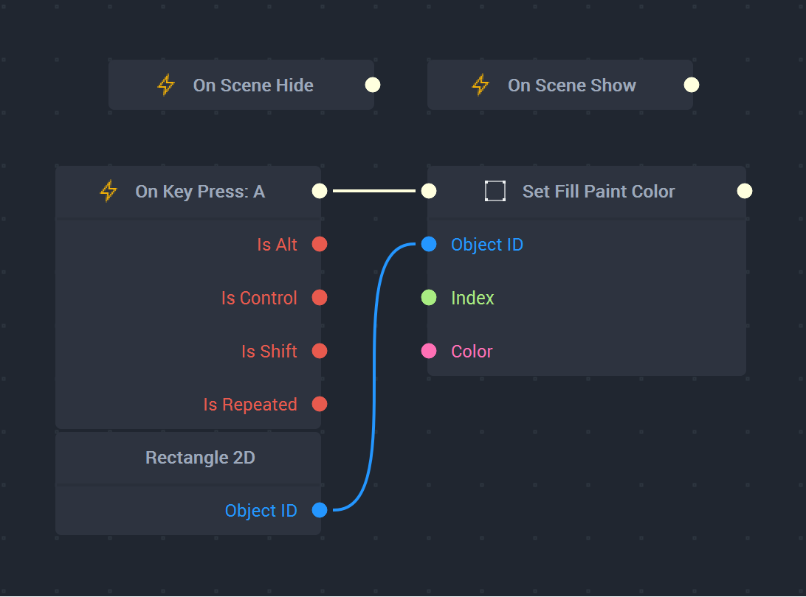

# Python Testing API

## Introduction

**Incari** now provides developers with another powerful tool to manage the entire *HMI* development process, from prototyping to mass production. With the new **Python Testing** **API**,  the user can perform automated application testing and quality assurance utilizing *Python* in conjunction with **Incari Studio**. This allows for seamless integration between **Incari Studio** and any scripts using the **API** that have been created externally. 

The **Python Testing API** gives the user everything required to understand the tools necessary for automating as well as creating their own tests in *Python* in order to check their **Incari Projects**. The following four sections provide the details:

* [**Requirements**](testing-api.md#requirements)
* [**Types**](testing-api.md#types)
* [**Template**](testing-api.md#template)
* [**Example**](testing-api.md#example)

## Requirements

It is mandatory to install *Python* to access the **incari Module**, as tests will be written in *Python* outside of **Incari Studio**. 

### Installation Requirements

*Python* version: 

* *3.10.6*, which can be installed [here](https://www.python.org/downloads/release/python-3106/).

### Adding the PATH

*PYTHONPATH* is a type of *PATH*, which is an environment variable, and is required for *Python* to function. More on *PATHs* can be found [here](https://en.wikipedia.org/wiki/PATH_(variable)). 

To make the *PATH* permanently available in *Windows*:


* Press `Win + R`, type `sysdm.cpl`, and press `Enter`

* In the *System Properties* window, go to the *Advanced* tab and click *Environment Variables*.

* Under *System Variables*, locate and select `PYTHONPATH`. 
  
  * If it doesn't exist, click `New` and then add:

    * *Variable name*: `PYTHONPATH`

    * *Variable value*: `C:\Program Files\Incari\IncariStudio\2024.1\bin`  

* Click `OK` to save and close all windows.

* Finally, if applicable, restart the *Command Prompt* or *IDE* for the changes to take effect.

## Types

There are several different *Method Types* handled by the **incari Module**. **Object** *Types* contain certain *Properties* as well. 

The types are:

* [**Object**](testing-api.md#object)
  * [**Properties**](testing-api.md#properties)

* [**Screen**](testing-api.md#screen)

* [**Scene**](testing-api.md#scene)

* [**Mouse**](testing-api.md#mouse)

* [**Keyboard**](testing-api.md#keyboard)

### Object

The **Object** *Methods* are described below. The `propertyName:Strings` are given in the [**Properties**](testing-api.md#properties) section. 

| Method Name | Method Usage | Parameter | Return Type| Method Definition|
| :--- | :--- | :--- | :--- | :--- |
|  `get_id`    | `object.get_id()`     |    --  | `incari.UUID`    |`get_id` returns the [**Debug ID** ](../objects-and-types/attributes/common-attributes/debug-id.md) of an **Object**.| 
| `get_property`     |  `object.get_property("propertyName")`    |   `propertyName:String`   | *value*    | `get_property` returns the value of the chosen [**Property**](testing-api.md#properties) of an **Object**. The returned *value* is of the *type* of the desired **Property**. This *type* is displayed in the **Property** table in the next section under **Type** (for example, `Name` is a **String**).|
|  `set_property`    | `object.set_property("propertyName", value)`     |`propertyName:String, value`      | --    |  `set_property` allows the user to set a *value* for a certain [**Property**](testing-api.md#properties). The second parameter `value` is of the *type* of the desired **Property**. This *type* is displayed in the **Property** table in the next section under **Type** (for example, `Name` is a **String**). |

#### Properties

The **Property Names** which correspond to the `propertyName:Strings` given in the section above.

| Property | Property Name| Type | Property Definition| 
| :--- | :--- | :--- | :--- | 
|   Name   |  `_name`    |   **String**   |  The name of the **Object** in **String** format.    |     
| Text     |  `_text`    |   **TranslatableText**   |  The text of a **Text Object**. Only works with **Text Objects**.    |      
|  Size    |  `_currentSize`    |  **Vec2**    |  The `X` and `Y` values of any **Object's** size.    |      
|  Rotation    |  `_currentRotation`    | **Float**     |The current rotation of an **Object** in **Float** format.|      
| Position     |  `_currentPosition`    |   **Vec2**   |   The current position of an **Object** in `X` and `Y` values in *two-dimensional space*.   |     
| Opacity     | `_currentOpacity`     |  **Float**    | The current opacity of an **Object** in **Float** format.     |     
|   Visible   |   `_enabled`   | **Bool**     |   The current visibility of an **Object**. *True* corresponds to visible and *False* corresponds to not visible.   |      
    


### Screen

The *Screen Methods* are described below.

| Method Name | Method Usage | Parameter | Return Type| Method Definition|
| :--- | :--- | :--- | :--- | :--- |
|  `get_id`    |  `screen.get_id()`    |  --    |  `incari.UUID`    |  `get_id` returns the [**Debug ID** ](../objects-and-types/attributes/common-attributes/debug-id.md) of a **Screen**.    |
| `get_keyboard`     | `screen.get_keyboard()`     |  --   |   `incari.Keyboard`   |  `get_keyboard` returns the **Keyboard** associated with the **Screen**.    |
|  `get_mouse`    | `screen.get_mouse()`     |   --   |    `incari.Mouse`  | `get_mouse` returns the **Mouse** associated with the **Screen**.     |


### Scene

The *Scene Methods* are described below.

| Method Name | Method Usage | Parameter | Return Type| Method Definition|
| :--- | :--- | :--- | :--- | :--- |
| `get_id`     |  `scene.get_id()`    |  --    |  `incari.UUID`    |  `get_id` returns the [**Debug ID** ](../objects-and-types/attributes/common-attributes/debug-id.md) of a **Scene**.     |
|  `get_object_by_id`    |  `scene.get_object_by_id()`    |    `incari.UUID`  |  `incari.Object`    |  Returns the **Object** of a specified [**Debug ID**](../objects-and-types/attributes/common-attributes/debug-id.md) for a **Scene**.    |
|  `get_root_object`    |  `scene.get_root_object()`    |  --    |  `incari.Object`    |   Returns the [**Root Object**](../objects-and-types/scene-objects#root-object) of a **Scene**.   |

### Mouse

The *Mouse Methods* are described below.

| Method Name | Method Usage | Parameter | Return Type| Method Definition|
| :--- | :--- | :--- | :--- | :--- |
| `move`     |  `mouse.move(incari.Vec2(x,y))`    |  `incari.Vec2(x1,y1)`    |  --    |   `move` chooses where the **Mouse** should move to.    |
|  `press`    | `mouse.press(incari.Mouse.Button.X)`     | `X` = `incari.Mouse.Button.LEFT` OR `incari.Mouse.Button.RIGHT`     |  --    |  `press` defines if a **Mouse** press is *left* or *right*.    |
| `release`     |  `mouse.release(incari.Mouse.Button.X)`    | `X` = `incari.Mouse.Button.LEFT` OR `incari.Mouse.Button.RIGHT`     |  --    |  `release` defines if a **Mouse** release is *left* or *right*.   |


### Keyboard

The *Keyboard Methods* are described below.

| Method Name | Method Usage | Parameter | Return Type| Method Definition|
| :--- | :--- | :--- | :--- | :--- |
|`press`|`keyboard.press(incari.Keyboard.Key.KEY_NAME)`| `incari.Keyboard.Key.KEY_NAME` (example: KEY_A if `A` is desired key.)| --| `press` defines the key pressed on a **Keyboard**.|
|`release`|`keyboard.release(incari.Keyboard.Key.KEY_NAME`|`incari.Keyboard.Key.KEY_NAME` (example: Key_A if `A` is desired key.) | -- | `release` defines the key released on a **Keyboard**.|


## Template

The following template provides all the method definitions in the **incari Module**. 

Please note that to use the **incari Module** in *Python*, one needs to makes sure all requirements are met (as mentioned [above](testing-api.md#requirements)). 

Additionally, it is imperative to first use `import incari` to import the **Module**.

```
import incari

def set_up(ip, port):
    """
    eg: (ip, port) = ("127.0.0.1", 52001)
    """
    intercom = incari.Intercom(ip, port)
    return intercom


def get_screen(screen_id, intercom):
    """
    screen_id: string
    intercom: returned from set_up()
    """
    screen = intercom.get_screen_by_id(incari.UUID(screen_id))
    return screen


def get_scene(scene_id, intercom):
    """
    screen_id: string
    intercom: returned from set_up()
    """
    scene = intercom.get_scene_by_id(incari.UUID(scene_id))
    return scene


def get_mouse(screen):
    """
    screen: returned from get_screen()
    """
    mouse = screen.get_mouse()
    return mouse


def get_keyboard(screen):
    """
    screen: returned from get_screen()
    """
    keyboard = screen.get_keyboard()
    return keyboard
    
def mouse_click_left(mouse, x, y):
    """
    Mouse click on Left button.
    x, y: are the exact position to click
    """
    mouse.move(incari.Vec2(x, y))
    mouse.press(incari.Mouse.Button.LEFT)
    mouse.release(incari.Mouse.Button.LEFT)
def mouse_click_right(mouse, x, y):
    """
    Mouse click on right button.
    x, y: are the exact position to click
    """
    mouse.move(incari.Vec2(x, y))
    mouse.press(incari.Mouse.Button.RIGHT)
    mouse.release(incari.Mouse.Button.RIGHT)
def swipe_leftbutton(mouse, x1, y1, x2, y2):
    '''
    swiping from (x1, y1) to (x2, y2) using left mouse button
    '''
    mouse.move(incari.Vec2(x1, y1))
    mouse.press(incari.Mouse.Button.LEFT)
    time.sleep(0.1)
    mouse.move(incari.Vec2(x2, y2))
    mouse.release(incari.Mouse.Button.LEFT)
def long_press_mouse_left(mouse, x, y):
    """
    long Mouse click on Left button.
    x, y: the exact position where to click
    """
    mouse.move(incari.Vec2(x, y))
    mouse.press(incari.Mouse.Button.LEFT)
    time.sleep(1)
    mouse.release(incari.Mouse.Button.LEFT)
    
# Class IncariObject is a wrapper class for IncariObject returned from get_object().
# It contains additional methods to interact with the object.
# It takes an IncariObject as an argument.   
class IncariObject:
    def __init__(self, incari_object):
        self.incari_object = incari_object

    def getPosition(self):
        pos_vec = self.incari_object.get_property("_currentPosition") # incari.vector in format <Vec2: x=0, y=0>
        return (int(pos_vec.x), int(pos_vec.y))

    def setPosition(self, x, y):
        self.incari_object.set_property("_currentPosition", f"({x} {y})")
        
    def getRotation(self):
        return self.incari_object.get_property("_currentRotation")

    def setRotation(self, rotation):
        self.incari_object.set_property("_currentRotation", rotation)

    def getText(self):
        return self.incari_object.get_property("_text").get_text()
    
    def getOpacity(self):
        return self.incari_object.get_property("_currentOpacity")
    
    def setOpacity(self, opacity):
        self.incari_object.set_property("_currentOpacity", opacity)
    
    def getVisibility(self):
        return self.incari_object.get_property("_enabled")
    
    def getSize(self):
        size = self.incari_object.get_property("_currentSize") # incari.vector in format <Vec2: x=0, y=0>
        return (int(size.x), int(size.y))
    
    def getName(self):
        name = self.incari_object.get_property("_name")
        return name
    
    def getId(self):
        return self.incari_object.get_id()
        
        
        
``` 

## Example

To better clarify how to use the **Python Testing API**, here is an example use-case: 

```
def rotate_object_with_mouse_and_keyboard(object, mouse, keyboard):
    """
    Rotate an object continuously, interacting with mouse and keyboard.
    Args:
        object (IncariObject): The extended Incari object.
        mouse: Mouse object.
        keyboard: Keyboard object.
    """
    rotation = object.get_rotation()
    press_mouse, press_key = True, True
    try:
        while True:
            rotation += 6.0
            object.set_rotation(rotation)
            if press_mouse:
                mouse.press(incari.Mouse.Button.LEFT)
            else:
                mouse.release(incari.Mouse.Button.LEFT)
            if press_key:
                keyboard.press(incari.Keyboard.Key.KEY_A)
            else:
                keyboard.release(incari.Keyboard.Key.KEY_A)
            press_mouse = not press_mouse
            press_key = not press_key
            time.sleep(0.5)
    except KeyboardInterrupt:
        print("Rotation loop interrupted by user.")
# Configuration
config = {
    "ip": "127.0.0.1",
    "port": 52001,
    "screen_id": "c967b33f-67fd-4cf1-936a-0bbf4db9931f",
    "scene_id": "31983131-4aba-403e-b97b-656fd5df51d2",
    "object_id": "dedc4c26-6a8b-4a7c-b786-4c6db7bd5c8c",
}
# Setup and execution
if __name__ == "__main__":
    intercom = set_up(config["ip"], config["port"])
    screen = get_screen(config["screen_id"], intercom)
    scene = get_scene(config["scene_id"], intercom)
    incari_object = scene.get_object_by_id(incari.UUID(config["object_id"]))
    object = IncariObject(incari_object)
    mouse = get_mouse(screen)
    keyboard = get_keyboard(screen)
    print("Starting rotation...")
    rotation = object.get_rotation()
    press_mouse, press_key = True, True
    while True:
        rotation += 6.0
        object.set_rotation(rotation)
        if press_mouse:
            mouse.press(incari.Mouse.Button.LEFT)
        else:
            mouse.release(incari.Mouse.Button.LEFT)
        if press_key:
            keyboard.press(incari.Keyboard.Key.KEY_A)
        else:
            keyboard.release(incari.Keyboard.Key.KEY_A)
        press_mouse = not press_mouse
        press_key = not press_key
        time.sleep(0.5)
``` 

To follow along, please create a **Project** which contains a **Rectangle** in a **Scene2D** as well as copy and paste the above script to the desired *Python* location. In addition, recreate the **Logic** shown below in the **Logic Editor**. 



This will set the color of the **Rectangle** to blue when `A` is pressed. 


The **Incari Project** and script are connected by the *port number*, which is given with the line ` "port": 52001,`. **Incari Studio** is aware of this *port number* and deals with it automatically when the **Player** is run. 

The script (shown above) rotates the **Rectangle** by 6 degrees when `A` is pressed while the **Player** is running. 


Furthermore, the alphanumerics shown in the script lines describing the various **IDs** as:

```
  "screen_id": "c967b33f-67fd-4cf1-936a-0bbf4db9931f",
  "scene_id": "31983131-4aba-403e-b97b-656fd5df51d2",
  "object_id": "dedc4c26-6a8b-4a7c-b786-4c6db7bd5c8c",
```

should be changed to what is displayed in the [**Debug IDs**](../objects-and-types/attributes/common-attributes/debug-id.md) of the respective object types in the **Project** previously created by the user (i.e. the **ID** of the **Project's** **Screen**, **Scene2D**, and **Rectangle**)

When **Incari Player** is run from **Incari Studio**, the **Rectangle** will be blue *and* will rotate. The **Player** *must* be run before running the script. 

This shows that the **Python Testing API** aids in automation and can be extended to testing.