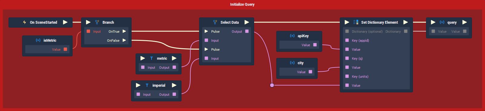
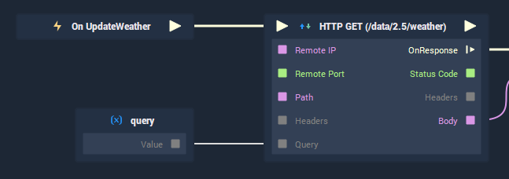
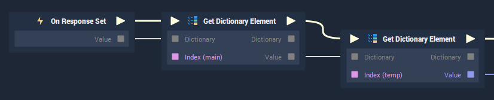

# Using APIs to Pull Dynamic Data

### Introduction

_Application programming interfaces_ \(APIs\) allow developers to retrieve data from various services, based on some queries and parameters. _What_ and _how_ data can be accessed is decided by the API provider and this information is usually made available in the form of documentation.

There are thousands of paid and free API services that exist on the Internet, ranging from grabbing random ["facts" about Chuck Norris](https://api.chucknorris.io/) to retrieving detailed information about what the weather is like... [on Mars](https://api.nasa.gov/)!

For our latest demo though, we will be looking at the weather much closer to home and the basic workflow of working with APIs.

#### OpenWeatherMap

[*OpenWeatherMap*](https://openweathermap.org/) provides a free API, capable of getting detailed weather information from over 200,000 cities. To be able to use the service in our **Incari** demo, you will first need to [create an account](https://home.openweathermap.org/users/sign_up) and [generate an API Key](https://home.openweathermap.org/api_keys). An API Key is a 32-character code, unique to your account, which will be used every time you make an API request.

#### Getting the Demo

As an example of how to use an API and how the data retrieved can be used in **Incari**, we have created a fully-functional weather application, which you can download from the _Remote Projects_ section of **Incari Hub**. There, you will see a project called **'WeatherWidget'**, which you can download to your local machine by pressing the download icon.

### Project Overview


If you open up the **Project** and look inside the **Logic Editor**, under the **'Root'** **Scene** tab, you will see the top-level **Logic** for the demo. To get things working, you will first need to change a few variables, which can be seen in the **Variables** tab of the **Logic Editor**. The **Variables** are:

1. `apiKey` - The 32-character API key, unique to your OpenWeatherMap account.
2. `city` - The city which you want to retrieve the weather for. To reduce ambiguity problems with city names, it is better to use the city name _and_ country. "San Francisco" could be 1 of 5 locations, so "San Francisco, US" will give much more specific results. To see the search results beforehand, you can check them [here](https://openweathermap.org/find).
3. `isMetric` - Whether or not the temperature should be in metric \(°C\) or imperial \(°F\) units.


Once these **Variables** are changed you can press play to start the simulation. You should now be able to see current weather information for the city whose name you provided in the `city` variable.

### HTTP GET

**Incari's** **HTTP GET Node** is what makes this kind of functionality possible. It takes some information, based on the documentation of the API provider, constructs and calls an API request, and asynchronously returns the response as a string.

If you take a look at the documentation at [*OpenWeatherMaps's API documentation*](https://openweathermap.org/current), you will see that one of the examples of an API call that it provides, is the following:

```text
http://api.openweathermap.org/data/2.5/weather?q=London&appid={API key}
```

#### The Connection Attributes

* `Remote IP` - The first section of this request is `http://api.openweathermap.org`, which is our endpoint. This is the value we put inside the `Remote IP` **Attribute**. A couple of notes regarding this **Attribute**:
  1. An IP address can also be used, instead of a URL.
  2. The **HTTP GET Node** currently supports the _HTTP_ protocol only. _HTTPS_ is not supported.
* `Remote Port` - For the `Remote Port` **Attribute**, this should be set to 80, which is the standard port for _HTTP_ usage.

#### The Request Header Attributes

* `Method` - Because we want to _get_ data, the `Method` **Attribute** should be set to "GET".
* `Path` - This is the specific path defined by the API provider. Usually, this is the text after the main root URL but before the`?`character. In the case above, the path is `/data/2.5/weather`.
* `Authentication` - This is used if the API requires a username and password, however OpenWeatherMap doesn't require this, so we set it to "None".
* `Default Headers` - This allows us to add additional information in the form of key-value pairs, using [_HTTP headers_](https://developer.mozilla.org/en-US/docs/Web/HTTP/Headers). For our example, though, we don't need to add any.

#### The Request Query Attributes


A query is a selection of key-value pairs, which form the parameters of the API call. One of these pairs almost always relates to the API key. In the case of OpenWeatherMap, this parameter is called `appid` and needs to be used whenever attempting to retrieve data.

In the example call above, you will see that part of the string says `q=London`. By looking at the [documentation](https://openweathermap.org/current), you will see that the parameter `q` is the "City name, state code and country code divided by comma".

Also, for localization purposes, there is one more query, which determines the temperature format. By default, the SI unit, Kelvin, is used when making API calls on OpenWeatherMap. To change this to degrees Celsius \(°C\) or degrees Fahrenheit \(°F\), the `units` parameter should be set to "metric" or "imperial".

If we were to put this information directly into the **Attributes** of the **Node**, it would look something like the image here:

#### The Request Query as a Variable



Although building the query directly in the **Attribute Editor** may work correctly, it is much better practice to break this up into **Variables**, so that all settings of our application can be changed in one place (the **Variable** tab of the **Logic Editor**) and can be dynamically adjusted on-the-fly. If you look at the initialization **Logic** above, we are using the variables `isMetric`, `apiKey`, and `city` to build a **Dictionary**, which will form our `query` **Variable**.



This **Variable** is then passed into the `Query` input socket of the **HTTP GET Node**, overriding any information in its `Request Query` **Attribute**.

### JSON

JavaScript Object Notation (JSON) is a data-interchange format, commonly used by APIs. Some APIs may require the format of the response to be defined explicitly, however, OpenWeatherMap returns JSON-formatted data by default.

Because **HTTP GET** returns the JSON as one big **String**, we need to convert this into a format that we can use. The **Dictionary** data type is the perfect option for this, as it is made up of [key-value pairs](https://www.techopedia.com/definition/13645/key-value-pair-kvp), which can be accessed by name in other parts of our **Logic**.


To convert the `Body` output (the response) into a **Dictionary**, we can use the new **JSON Parse Node** to convert the **String**. Because JSON can also be parsed as an **Array**, we need to tell **Incari** that we are expecting a **Dictionary**, not an **Array**. We do this by using the **Conversion** **Node** to _cast_ the **Any**-type output of the **JSON Parse Node** to a **Dictionary**.

### Dictionaries

**Dictionaries** are a common data structure, used in many programming languages. The term "dictionary" stems from the fact that, like a dictionary, you look up a string of characters (a word in the case of a physical dictionary) to get the information or definition associated with that particular string.

**Dictionaries** share _some_ similarities with **Arrays**, namely that they are both _collections_ of data. Where they differ, though, is that **Dictionaries** are _unordered_ (can't be iterated over using loops) and their values can only be accessed via their _key_. Conversely, **Arrays** are _ordered_ and the values are accessed by their _index_.

The reason why **Dictionaries** are advantageous when dealing with APIs is that once the JSON has been parsed we can access what we need by a _key_ name that relates to the information we need. **Dictionaries** can even contain other **Dictionaries**.



For example, if you look at the image above, you will see that from the main `Response` variable, we are getting another **Dictionary** called `main`. From this, we are then able to get the temperature \(`temp`\) as a **Float**. This structure (`main` &gt; `temp`) corresponds to the [OpenWeatherMap documentation](https://openweathermap.org/current#parameter), which shows an example of the hierarchy of the API response.

### On Set

In [Part 8 of our Tutorial for Beginners](https://www.youtube.com/watch?v=odtn4941x4Q&ab_channel=IncariHMIDevelopmentPlatform), I discussed the advantages of _decoupling_ **Logic**.


By plugging the`Output`of the **JSON Parse Node** into the `Value` input of a **Dictionary**-type variable (called `Response` in this case), it is possible to trigger **Logic** in several places whenever the value of that **Variable** is set. This **Variable** is then fed into a number of custom **Functions** to get the relevant key-value pairs and process them so that the text and images of the weather app change to reflect the API response.

### Conclusion

Although we have focused primarily on weather information for this example, there are thousands of different APIs which can be applied in an infinite amount of ways. The core functionality in **Incari**, however, will remain the same:

1. You use the **HTTP Get Node** to make an API call, parse the data into a **Dictionary** using the **JSON Parse Node**
2. You then use that data to change aspects of your application.

Whether you want to get [playlists from Spotify](https://developer.spotify.com/documentation/web-api/quick-start/), [navigation information from Mapbox](https://docs.mapbox.com/api/), or [financial market data from Finnhub](https://finnhub.io/), APIs open a whole world of possibilities when it comes to creating engaging HMI experiences.

### Links

* [_Understanding And Using REST APIs - Smashing Magazine_](https://www.smashingmagazine.com/2018/01/understanding-using-rest-api/)

* [_HTTP request methods_](https://developer.mozilla.org/en-US/docs/Web/HTTP/Methods)

* [_Weather API_](https://openweathermap.org/api)

