# Widgets

_Graphical widgets_ are a cornerstone in building _User Interfaces_ and consist of elements of interaction that have an effect. For example, a _toggle switch_ that changes an _Interface_ between light and dark modes is a _widget_. Learn more about [_Graphical widgets_ on Wikipedia](https://en.wikipedia.org/wiki/Graphical\_widget).

One approach for building _widgets_ in **Incari** is to use **Prefabs**, which are reusable components that can be adjusted accordingly for particular cases. See [**Prefabs**](../objects-and-types/prefabs/) for a detailed description of them and their use.

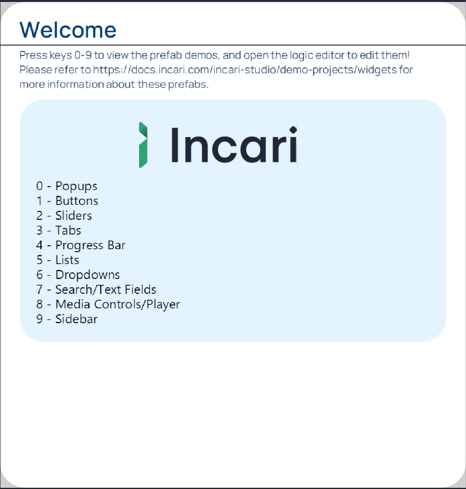

This **Demo Project** is a showcase of several common _widget_ types and how they can be connected to sources of data. It is composed of ten [**Scenes**](../objects-and-types/project-objects/scene.md), each of them showing one major _widget_ type. The goal is to show how to use these _widgets_ and provide the **Prefabs** for them. Thus, the **Prefabs** can then be reused in other **Projects**. For this, find at the end of this page a guide for [Exporting a **Prefab**](widgets.md#exporting-a-prefab).

When running the **Project**, choose which **Scene** to show by using the numerical keys $$0-9$$ on the keyboard.

For each **Scene**, the resulting _Interface_ is shown with a short description. Then, the necessary **Logic** to use the corresponding **Prefab Nodes** is explained. Therefore, the information included for each **Prefab** is: how to initialize the **Prefab Node**, the inputs that it requires, and the outputs it gives out.

The included **Scenes** are:

* **0 -** [**Popup**](widgets.md#0.-popup)
* **1 -** [**Buttons**](widgets.md#1.-buttons)
* **2 -** [**Slider**](widgets.md#2.-slider)
* **3 -** [**Tabs**](widgets.md#3.-tabs)
* **4 -** [**Progress Bar**](widgets.md#4.-progress-bar)
* **5 -** [**List Picker**](widgets.md#5.-list-picker)
* **6 -** [**Dropdown**](widgets.md#6.-dropdown)
* **7 -** [**Search Bar**](widgets.md#7.-search-bar)
* **8 -** [**Media**](widgets.md#8.-media)
* **9 -** [**Sidebar**](widgets.md#9.-sidebar)

## **0. Popup**

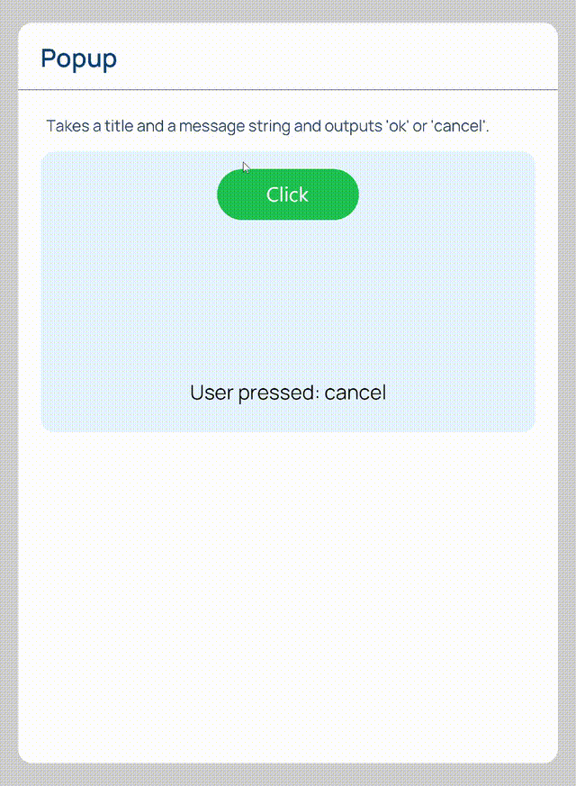

This **Scene** displays a button, implemented through the **Prefab** explained in [**Buttons**](widgets.md#1.-buttons), that opens a _popup_ window when clicked on. This _popup_ window is implemented through a **Prefab**, whose **Logic** takes the title and message that will be displayed on it and gives out the option clicked by the user, which can be either `cancel` or `ok`.

### Logic

The `Popup` **Prefab Node** receives two **Strings**: one for the title and another one for the message that will be displayed. It then outputs either `ok` or `cancel`, according to which button is pressed in the _popup_.

To start using it, the `Popup` **Prefab Node** has to be initialized with the command `init` in the `cmd` **Input Socket**.

## **1. Buttons**


This **Scene** has two buttons implemented through **Prefabs**:

* `TextButton`: A button that receives as input the text that will be shown on it. When pressed, it changes its shade of green momentarily and activates a **Pulse** in the **Logic**. In this case, it is implemented as a counter.
* `RadioButton`: A button with two states: _on_ and _off_. It outputs a **Boolean** indicating the current state and changes color accordingly. Here, it activates the _rotation_ of a dot.

### Logic

#### **`TextButton` initialization**

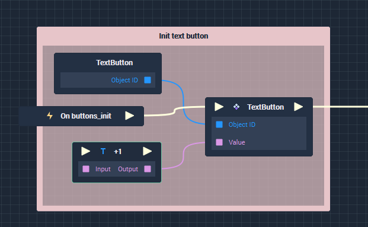

This part of the **Scene** **Logic** initializes the `TextButton` button:

* The [**Event**](../toolbox/events/) `buttons_init` is triggered when the **Scene** starts showing.
* The **Prefab Node** `TextButton` is triggered. It takes a **String** in the `Value` **Input Socket** and writes it on the button.

#### **`RadioButton` initialization**

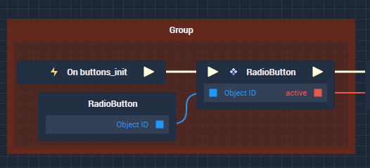

Here, `RadioButton` is initialized with the `buttons_init` [**Event**](../toolbox/events/). Remember that this **Event** is triggered when the **Scene** starts showing. It is also shown that the **Prefab Node** `RadioButton` outputs a **Boolean** indicating the current state of the button.

## **2. Slider**

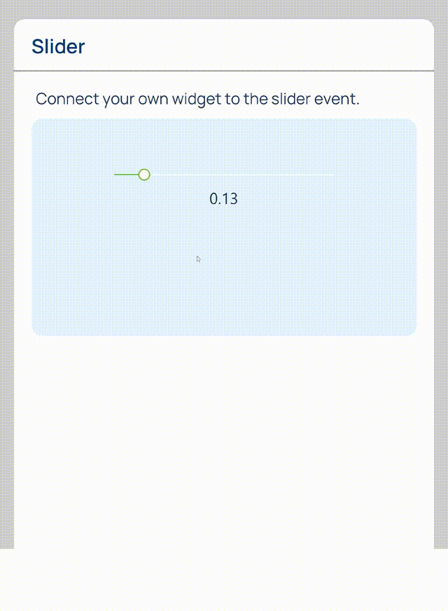

This **Scene** shows a _slider_ that can be set by clicking and dragging its indicator. A number between $$0$$ and $$1$$ representing the indicator's position in shown right below it.

### Logic

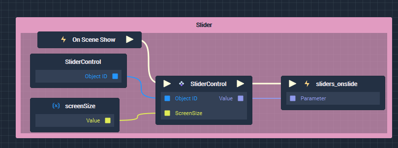

The _slider_ is initialized when the **Scene** starts showing. For this, it needs as input the **Screen's** `Size` as a **Vector2**.

Once initialized, the **Prefab Node** `SliderControl` outputs a **Pulse** and a **Float** between $$0$$ and $$1$$ each time the _slider_ indicator is moved.

## **3. Tabs**

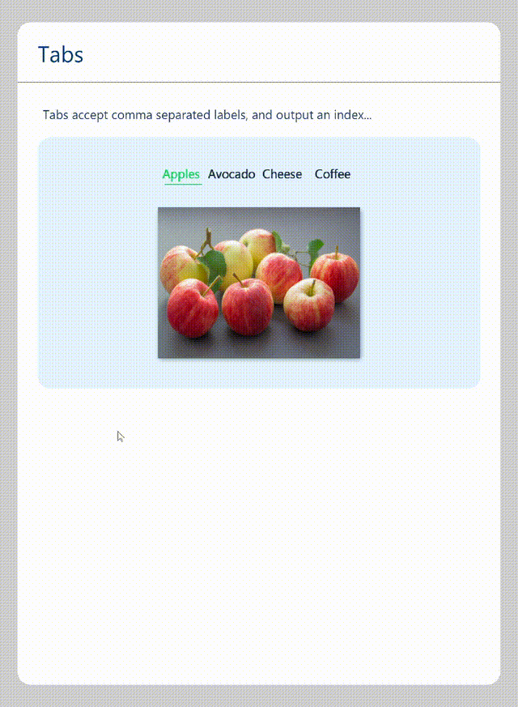

This **Scene** shows four _tabs_, each with a different _label_ and an image. It allows the user to switch between _tabs_ by clicking on their _label_. When this occurs, it changes the image and highlights the selected _tab_.

### Logic

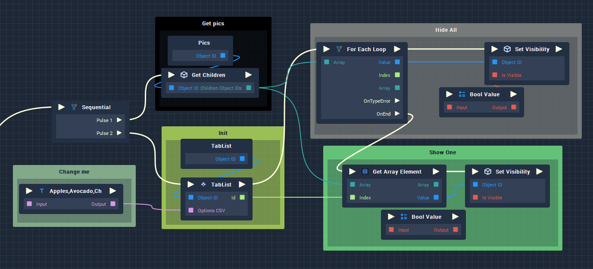

The `TabList` **Prefab Node** receives the list of _labels_ as a **String** containing the options separated by commas and creates the titles for the _tabs_. It also includes the **Logic** for switching between _tabs_ and outputs the index of the selected _tab_, which is then used to display the corresponding image.

Each of the **Logic Groups** shown above has the following function:

* `Change me`: Includes the [**String Value**](../toolbox/string/stringvalue.md) **Node** with the list of _labels_ that will be used for the _tabs_. They have to be given as _CSV_ (_comma-separated values_). The default example is: `Apples,Avocado,Cheese,Coffee`.
* `Init`: Initialization of the `TabList` **Prefab Node**. This occurs automatically when the **Scene** starts showing. Moreover, the `TabList` **Prefab Node** is triggered each time a _tab_ is clicked and outputs the `id` of the selected _tab_, which is then used to modify the **Scene's** interface.
* `Get pics`: This part of the **Logic** obtains the references to the pictures from the **Scene** and outputs them as an **Array**. The pictures must be included in the **Scene** in the `Pics` [**Group**](../objects-and-types/scene-objects/group.md).
* `Hide All`: This part of the **Logic** sets the `visibility` of all the pictures to _false_. For this, it uses the [**For Each Loop**](../toolbox/flow-control/foreachloop.md) **Node** to go through the **Array** and the [**Set Visibility**](../toolbox/incari/object/set-visibility.md) **Node**. This is triggered from the **Prefab Node** each time a _tab_ is selected.
* `Show One`: This part of the **Logic** gets triggered when the `Hide All` section finishes. It obtains the `id` of the selected _tab_ from the `TabList` **Prefab Node** and uses it to set the `visibility` of the corresponding image to _true_, thus showing it on the **Scene**.

## **4. Progress Bar**

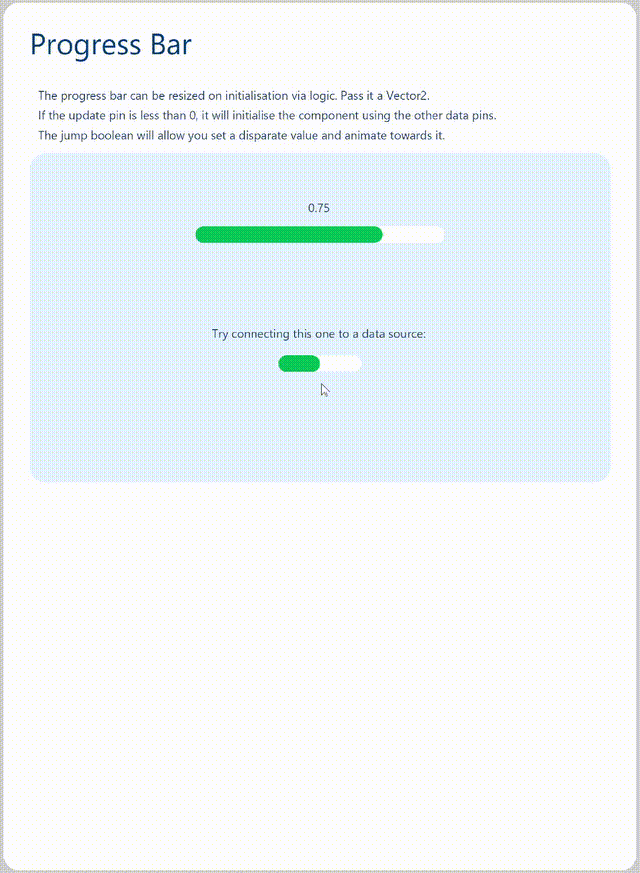

This **Scene** displays two **Instances** of the `ProgressBar` **Prefab**: one of them with its functionality implemented and the other one with its functionality waiting to be implemented.

The `ProgressBar` displays the evolution of a value and it can take values only in the range $$[0,1]$$. It does this according to some data source that has to be provided as input. Moreover, its size is set with an input parameter.

### Logic

The `ProgressBar` **Prefab Node** requires the following parameters to be initialized:

* `Size` (**Vector2**): Size of the bar in pixels.
* `Start value` (**Float**): The initial value, between $$0$$ and $$1$$.
* `Update value` (**Float**): This value must be negative in order to initialize. Later on, it receives the values to which the progress bar will be moved.
* `Jump duration` (**Float**): The time it takes to animate between two values.

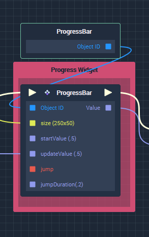

After initialization, the progress bar can be updated by just giving a new value (a **Float** between $$0$$ and $$1$$) in the `Update value` **Input Socket**. When updated, the `ProgressBar` **Prefab Node** will output the new value.

To animate between distant values, _true_ should be given to the `jump` **Input Socket**. This will create a _tweening animation_.

## **5. List Picker**

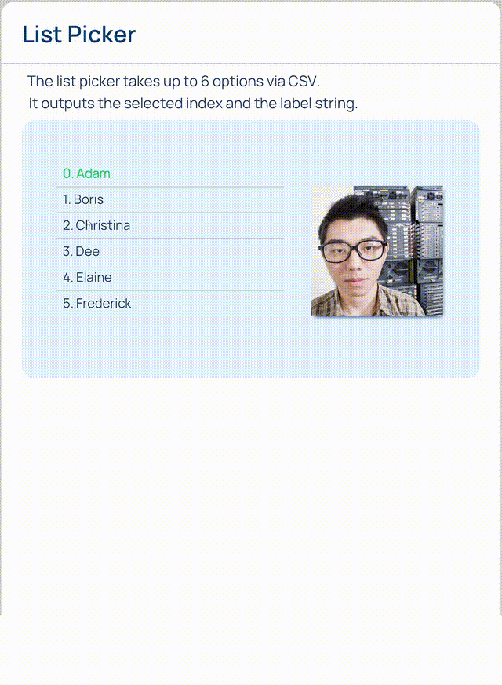

This **Scene** displays a list of up to $$6$$ options, which have to be given to the `ListPicker` **Prefab Node**. The list's functionality consists of allowing the user to choose an item of the list and it then highlights the chosen option and shows an image linked to this option.

### Logic

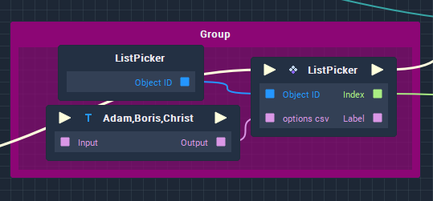

The `ListPicker` **Prefab Node** receives a **String** with the options and generates the list with them. They can be up to $$6$$ and are given through a **String Value** **Node** and must be formatted as _CSV_ (_comma-separated values_). Any time an option in the list is selected, it outputs the selected index (`Index`) and its corresponding label (`Label`).

## **6. Dropdown**

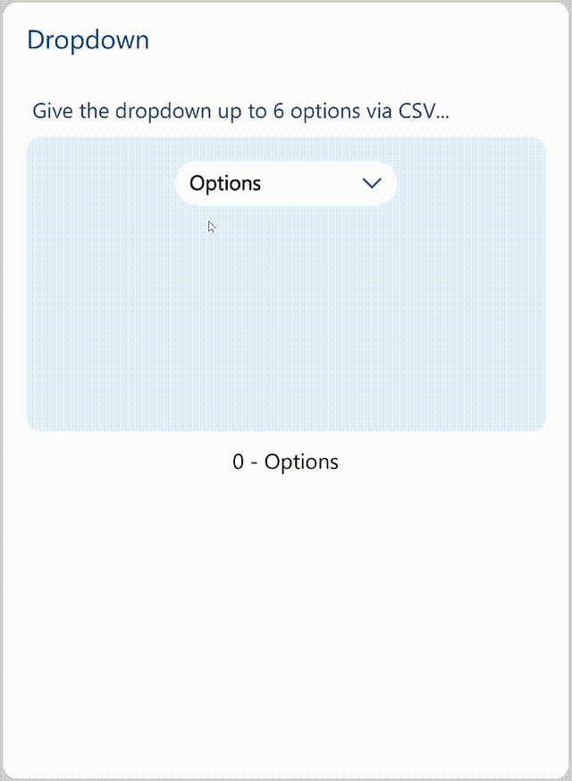

This **Scene** shows a _dropdown menu_ where the options to show must be provided to the `Dropdown` **Prefab Node**. It takes up to $$6$$ options and they should be given in a **String** as _CSV_ (_comma-separated values_).

### Logic

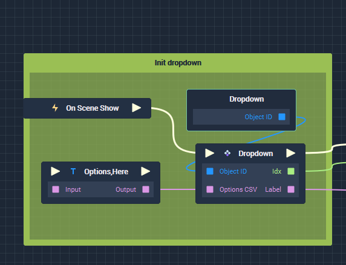

The `Dropdown` **Prefab Node** receives a **String** with the list of options and generates the _dropdown menu_ with them. They can be up to $$6$$, are given through a **String Value** **Node**, and must be formatted as _CSV_ (_comma-separated values_). Later on, these options can be updated by triggering again this **Node**.

Any time an option in the _dropdown_ is selected, the **Prefab Node** outputs the corresponding index (`idx`) and label (`Label`).

## **7. Search Bar**

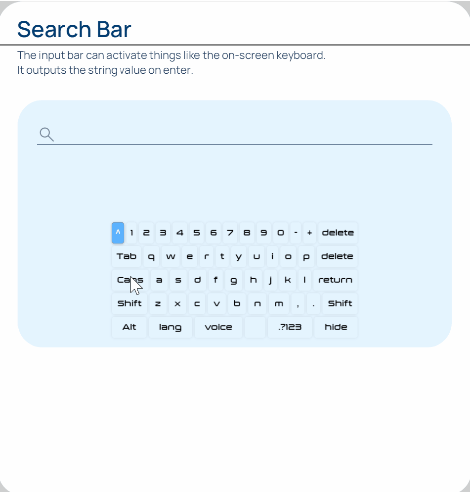

This **Scene** displays a field in which the user can input text. The **Prefab Node** then outputs the inputted text, allowing for it to be used in subsequent **Logic**.

### Logic

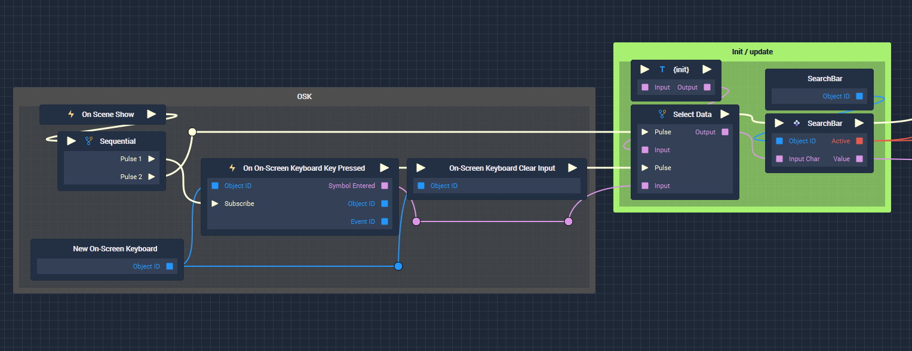

The `SearchBar` **Prefab** is designed to work together with the [**On-Screen Keyboard**](../objects-and-types/scene-objects/3dobjects/onscreenkeyboard.md), from which the text input will be obtained.

To initialize the `SearchBar` **Prefab Node**, the **String** `{init}` has to be passed to it in the `Input Char` **Input Socket**. This will set the **Node** to its `Active` state, trigger the **Output Pulse** once, and output _true_ from the `Active` **Output Socket**.

Once the `SearchBar` **Prefab Node** has been initialized, subsequent inputs of _characters_ through the `Input Char` **Input Socket** will update the text field that is displayed on the **Scene**. The **Prefab Node** has no output at this stage.

Then, pressing `Enter` on the **On-Screen Keyboard** will cause the **Prefab Node** to trigger its **Output Pulse** and give two outputs:

* `Active` **Ouput Socket**: _False_. The intention of this **Boolean** is for it to be used to trigger changes in the interface, such as the `visibility` of the **On-Screen Keyboard**.
* `Value` **Output Socket**: A **String** that concatenates all the inputted _characters_. This can then be used in subsequent **Logic**.

## **8. Media**

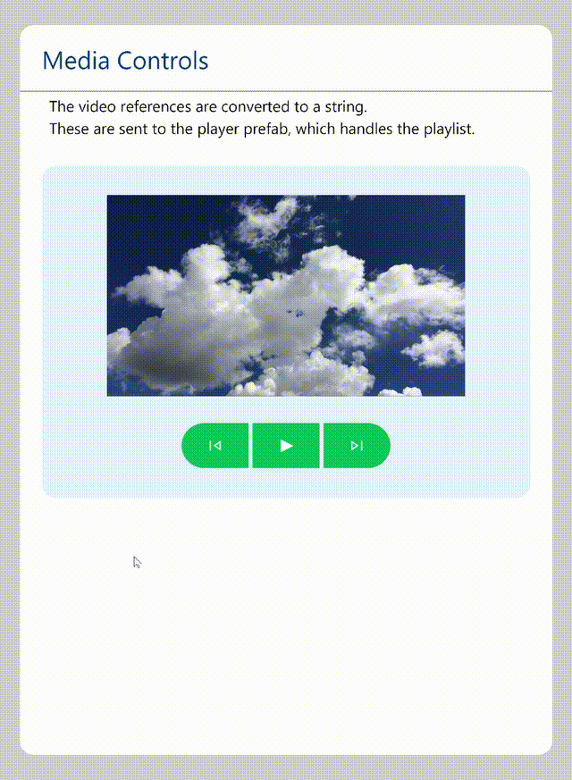

This **Scene** includes two **Prefabs**: `MediaPlayer` and `MediaControls`. They are designed to work together and implement a _widget_ to control a **Media Objects**, which in **Incari** can be either [**Audio**](../objects-and-types/scene-objects/audio.md) or [**Video**](../objects-and-types/scene-objects/3dobjects/video.md).

### Logic

To initialize the `MediaControls` **Prefab Node**, the **String** `init` should be given to the `StateUpdate` **Input Socket**. Then, the `MediaControls` will be ready to use.

A click on one of the buttons will make the `MediaControls` **Prefab Node** to output a **Pulse** together with a label of which button was clicked: `play`, `pause`, `next`, or `prev`. This is then used on the `MediaPlayer` **Prefab Node**.

To update the state of the middle button (for it to show either the play or pause icon), `playing` or `paused` is passed to the `StateUpdate` **Input Socket**.

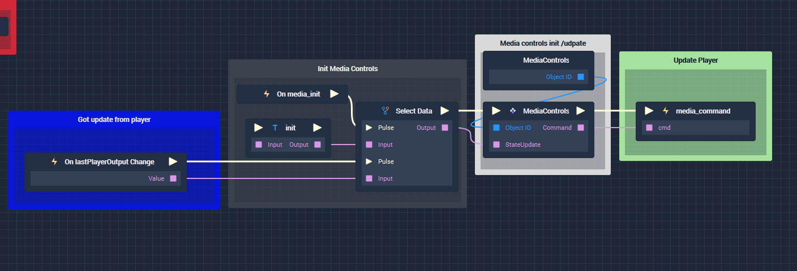

Before initializing the player, a list of **Media Objects** references has to be given. The `MediaPlayer` **Prefab Node** accepts this data as a particular format of **String**: a _stringified JSON_ _array_, that is, a **String** generated from an **Array** via the [**JSON Stringify**](../toolbox/string/jsonstringify.md) **Node**.

An example workflow for achieving this is the following:

1. Create **Video Objects** in the **Scene** and put them all in a [**Group**](../objects-and-types/scene-objects/group.md).
2. Drag and drop this **Group** into the [**Logic Editor**](../modules/logic-editor.md). A **Node** will be created.
3. Connect the newly created **Node** to a [**Get Children**](../toolbox/incari/object/get-children.md) **Node**.
4. Create a [**JSON Stringify**](../toolbox/string/jsonstringify.md) **Node** and connect to it the output **Array** from the **Get Children** **Node**.
5. Connect the [**Conversion**](../toolbox/utilities/conversion.md) **Node** that was automatically created.

This **Logic** configuration is shown in the image below in the `init video array` [**Group**](../toolbox/utilities/group.md).

An example of the type of **String** obtained with this **Logic** configuration is:

```
[‌"34f3f5f8-4ee3-415a-b1db-f67e01720b71",
"7dc076eb-92df-413b-94e6-f9b5225ff407"]
```

The **String** that is obtained from this **Logic** configuration should then be connected to the `MediaPlayer` **Prefab Node** in the `vidList` **Input Socket**.

Now, to initialize the player, the **String** `init` has to be given to the `command` **Input Socket** of the `MediaPlayer` **Prefab Node**. Once this has been done, that same **Input Socket** can receive the following commands: `play`, `pause`, `next`, `prev`.

Finally, the two **Prefab Nodes** are connected via [**Events**](../toolbox/events/):

1. Clicking one of the buttons makes `MediaControls` to output a command. This triggers an **Event**, which carries the command and gives it as **Input** to the `MediaPlayer` **Prefab Node**.
2. The `MediaPlayer` **Prefab Node** receives this command, carries out the desired action and outputs the current state (`playing` or `paused`), triggering another **Event** that then carries this state back to the `MediaControls` **Prefab Node**, which on receiving it updates the button displayed.

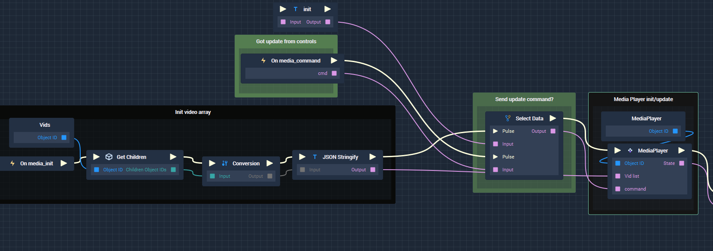

## **9. Sidebar**

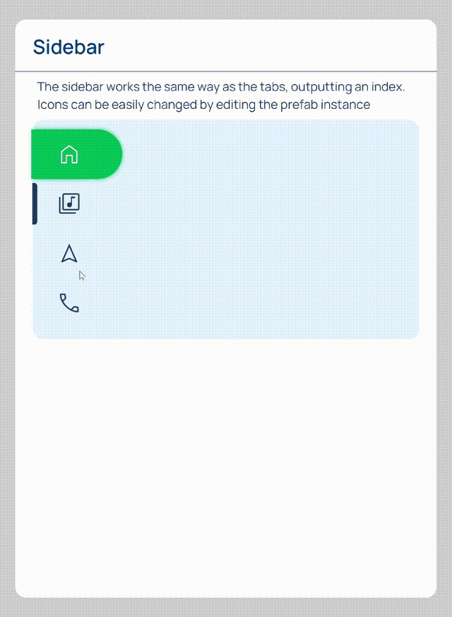

This **Scene** displays a _sidebar menu_ with four options, each with its own icon. It allows the user to switch between these options and highlights the current one.

### Logic

The _sidebar_ works identically to the _tab_ selector, except there is no list of _labels_ to give as input.

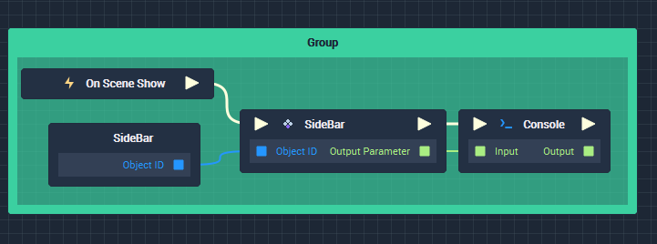

To change the icons, change the `Diffuse Texture` **Attribute** of the **Sprite Objects** in the **Scene** to the desired image, which has to be chosen from the **Assets** in the **Project**.

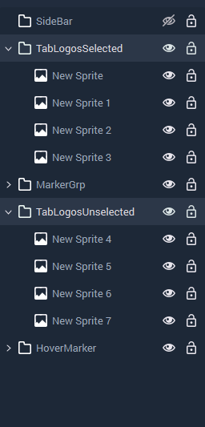

## Exporting a Prefab

A **Prefab** can be exported as a single file to then be used in a different **Incari Project**. An exported **Prefab** is saved as a `.prefabpackage` file. This section shows the steps to follow for exporting a **Prefab**.

To export a **Prefab**:

1. Find the **Prefab** to export in the **Asset Manager**. In the case of this **Demo Project**, all **Prefabs** are in the `Prefabs` folder.
2. Right-click the **Prefab** to export and choose `Export Prefab` from the popup menu, as shown on the image below.

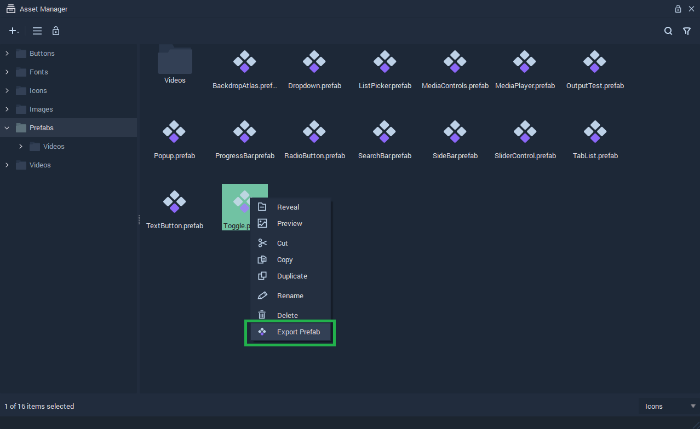

3. Choose the folder in which to export the **Prefab** in the _File Explorer_ window that will open.
4. The exported **Prefab** will be saved as a `.prefabpackage` file in the chosen folder.

## See also

* [**Prefabs**](../objects-and-types/prefabs/)
* [**Events**](../toolbox/events/)
