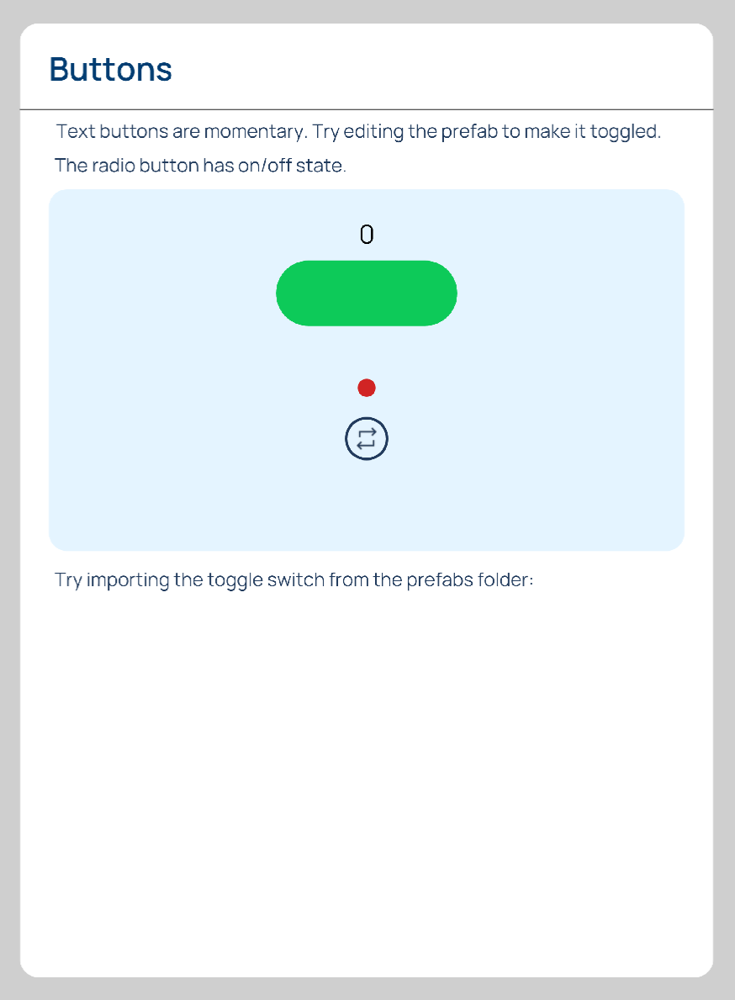
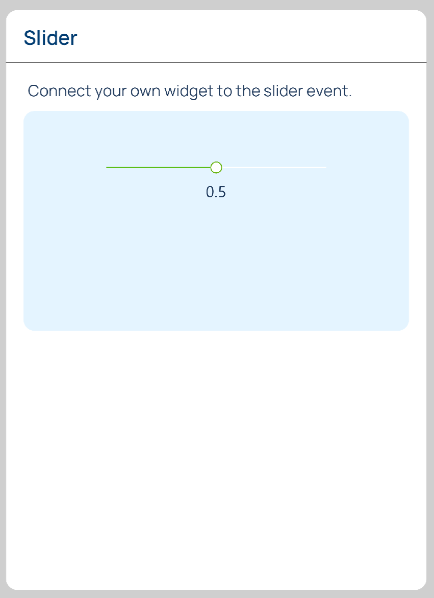
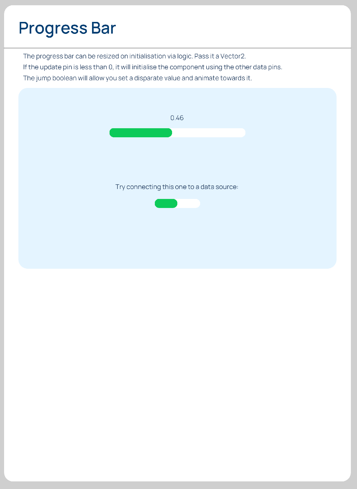
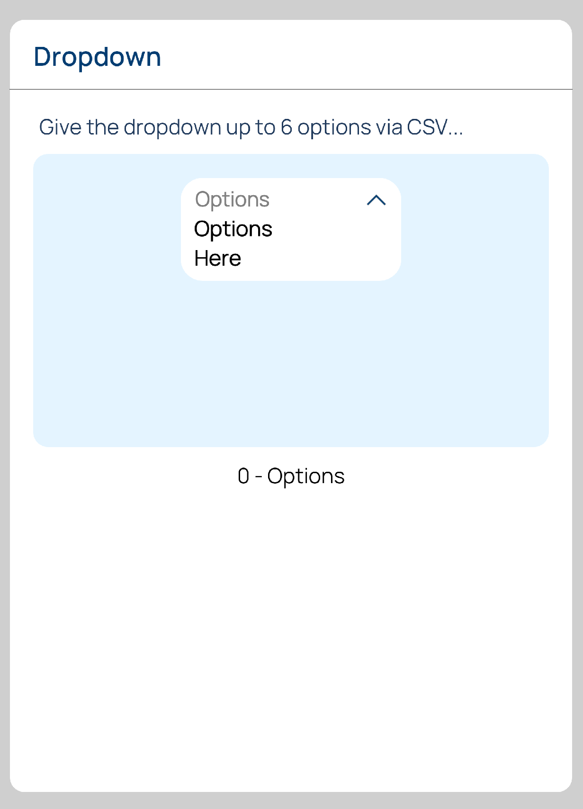
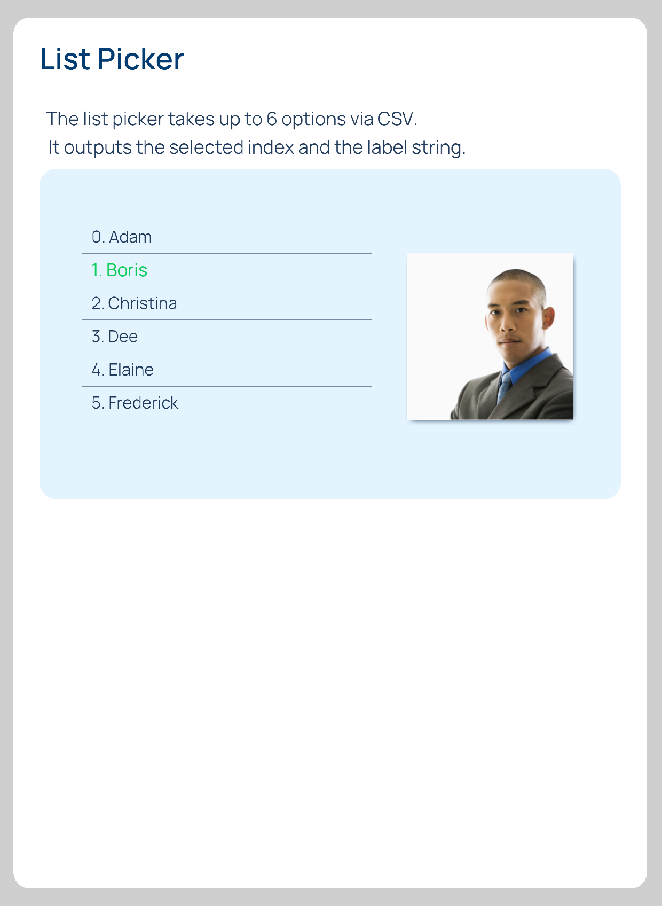
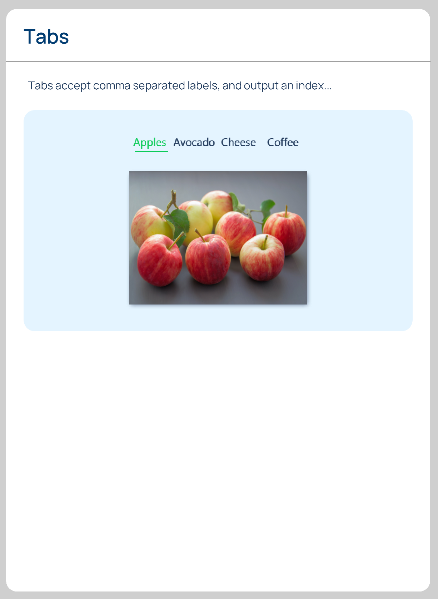
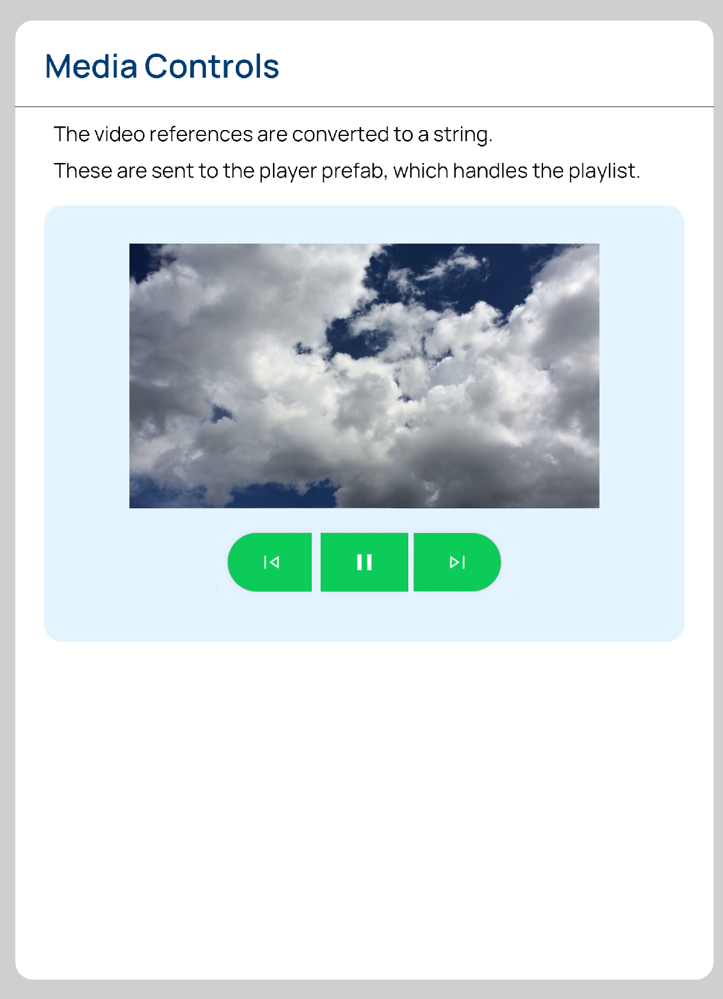
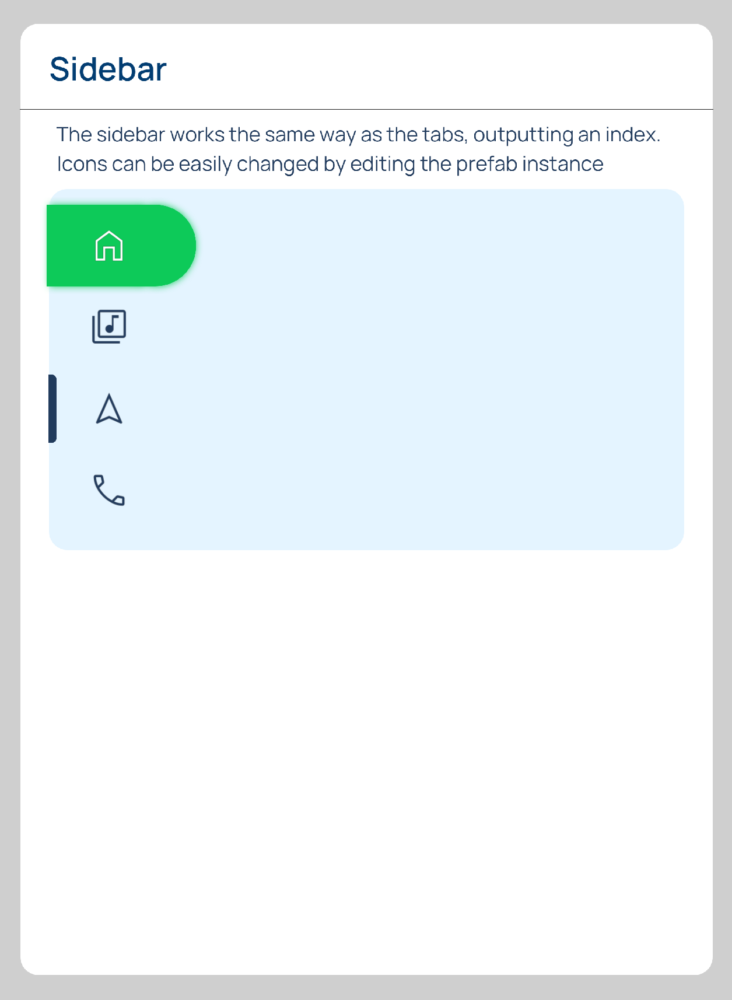

# Widgets

*Graphical widgets* are a cornerstone in building *User Interfaces*. One approach for building *widgets* in **Incari** is to use **Prefabs**, which are reusable components that can be adjusted accordingly for particular cases. See [**Prefabs**](../objects-and-types/prefabs/README.md) for a detailed description of **Prefabs** and their use.

This **Demo Project** is a showcase of several common *widget* types and how they can be connected to sources of data. It is composed of nine [**Scenes**](../objects-and-types/project-objects/scene.md), each of them showing one major *widget* type. 

To choose which **Scene** to show, use the numerical keys 1-9 on the keyboard.

For each **Scene**, the resulting *Interface* is shown and the **Logic** used is explained.

The included **Scenes** are:

<!-- no toc -->
1. [**Buttons**](#1-buttons)
2. [**Slider**](#2-slider)
3. [**Progress Bar**](#3-progress-bar)
4. [**Dropdown**](#4-dropdown)
5. [**List Picker**](#5-list-picker)
6. [**Tabs**](#6-tabs)
7. [**Media**](#7-media)
8. [**Input Bar**](#8-input-bar)
9. [**Sidebar**](#9-sidebar)

## **1. Buttons**

## **2. Slider**

## **3. Progress Bar**

## **4. Dropdown**

## **5. List Picker**

## **6. Tabs**

## **7. Media**

## **8. Input Bar**

## **9. Sidebar**

