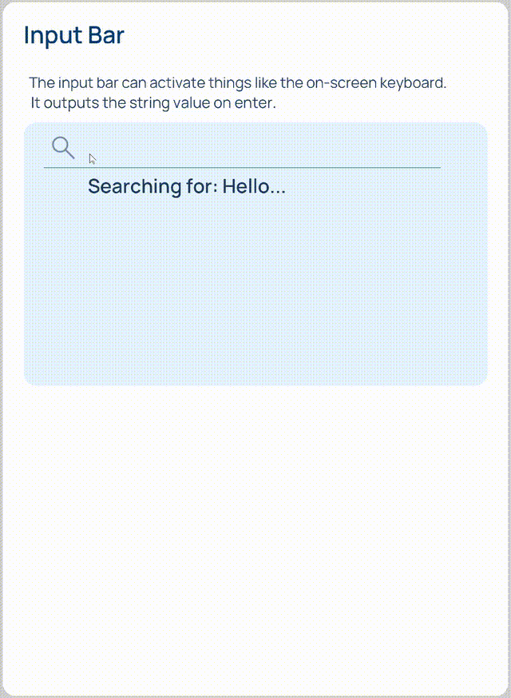

# Widgets

*Graphical widgets* are a cornerstone in building *User Interfaces*. One approach for building *widgets* in **Incari** is to use **Prefabs**, which are reusable components that can be adjusted accordingly for particular cases. See [**Prefabs**](../objects-and-types/prefabs/README.md) for a detailed description of **Prefabs** and their use.

This **Demo Project** is a showcase of several common *widget* types and how they can be connected to sources of data. It is composed of ten [**Scenes**](../objects-and-types/project-objects/scene.md), each of them showing one major *widget* type. 

To choose which **Scene** to show, use the numerical keys $$1-10$$ on the keyboard.

For each **Scene**, the resulting *Interface* is shown and the **Logic** used is explained.

The included **Scenes** are:

<!-- no toc -->
1. [**Buttons**](#1.-buttons)
2. [**Slider**](#2.-slider)
3. [**Tabs**](#3.-tabs) 
4. [**Dropdown**](#4.-dropdown)
5. [**List Picker**](#5.-list-picker)
6. [**Progress Bar**](#6.-progress-bar)
7. [**Media**](#7.-media)
8. [**Input Bar**](#8.-input-bar)
9. [**Sidebar**](#9.-sidebar)
10. [**Popup**](#10.-popup)

## **1. Buttons**

This **Scene** has two buttons implemented through **Prefabs**: 

* `TextButton`: A button that receives as input the text that it will show. When pressed, it changes its shade of green for an instant and activates a **Pulse** in the **Logic**. In this case, it is implemented as a counter.

* `RadioButton`: A button with two states: *on* and *off*. It outputs a **Boolean** indicating the current state and changes color accordingly. Here, it activates the *rotation* of a dot.

### Logic

* **`TextButton` initialization**

This part of the **Scene** **Logic** initializes the `TextButton` button: 

* The event `buttons_init` is triggered when the **Scene** starts showing.
* The **Prefab Node** `TextButton` is triggered. In it, the text given is set on the button and the **Event Nodes** in the **Prefab Logic** are subscribed to.

* **`RadioButton`**

Here, `RadioButton` is initialized with the `buttons_init` **Event**. Remember that this **Event** is triggered when the **Scene** starts showing. It is also shown that the **Prefab Node** `RadioButton` outputs a **Boolean** indicating the current state of the button.

## **2. Slider**

This **Scene** shows a *slider* that can be set by clicking and dragging its indicator and a number between $$0$$ and $$1$$ representing the indicator's position.

### Logic

The *slider* is initialized when the **Scene** starts showing. For it, it needs as input the **Screen's** `Size` as a **Vector2**. 

Once initialized, the **Prefab Node** `SliderControl` outputs a **Pulse** and a **Float** between $$0$$ and $$1$$ each time the *slider* indicator is moved.

## **3. Tabs**

This **Scene** shows four *tabs*, each with a different *label* and an image. The **Logic** for the `TabList` **Prefab** receives the list as a **String** with the options separated by commas and creates the *labels* for the *tabs*. It also includes the **Logic** for switching between *tabs* and it outputs the index of the selected *tab*, which is then used to display the corresponding image.

## **4. Dropdown**

The `Dropdown` **Prefab Node** receives a **String** with the list of options (max 6) separated by commas and generates the *dropdown* with the options given. The options can be updated by triggering again this **Node**. Any time an option in the *dropdown* is selected, it outputs the selected index and its corresponding label.

## **5. List Picker**

The `ListPicker` **Prefab Node** receives a **String** with the list of options (max 6) separated by commas and generates a numbered list that is shown on the **Scene**. Any time an option in the list is selected, it outputs the selected index and its corresponding label.

## **6. Progress Bar**

The `ProgressBar` **Prefab Node** requires the following parameters to be initialized:

* `Size` (**Vector2**): Size of the bar in pixels. 
* `Start value` (**Float**): The initial value, between $$0$$ and $$1$$.
* `Update value` (**Float**): This value must be negative in order to initialize.
* `Jump duration` (**Float**): The time it takes to animate between two values.

After initialization, the **Prefab Node** can be triggered with just an update value.

To animate between distant values, *true* should be given to the `jump` **Input Socket**. This will create a *tweening animation*.

When updated, the `ProgressBar` **Prefab Node** will output the new value.

## **7. Media**

This **Scene** includes two widgets implemented as **Prefabs**: `MediaPlayer` and `MediaControls`. They are designed to work together.

To initialize the `MediaControls` **Prefab Node**, the **String** `init` should be given to the `StateUpdate` **Input Socket**. Then, the `MediaControls` will be ready to use.

A click on one of the buttons will make the **Prefab Node** to output a **Pulse** together with a label of which button was clicked: `play`, `pause`, `next`, or `prev`. This is then used on `MediaPlayer`.

To update the state of the play button (for it to show either play or pause), `playing` or `paused` is passed to the `StateUpdate` **Input Socket**.

Before initializing the player, a list of **Media Objects** references has to be given. The `MediaPlayer` **Prefab Node** accepts this data as a stringified JSON **Array**.

An example workflow for achieving this:

1. Create **Video Objects** in the **Scene** and put them all in a **Group**.
2. Drag and drop this **Group** into the **Logic Editor**. A **Node** will be created.
3. Connect the newly created **Node** to a **Get Children** **Node**.
4. Create a **JSON Stringify** **Node** and connect to it the output **Array** from the **Get Children** **Node**.
5. Connect the **Conversion** **Node** that was automatically created.
   
This **Logic** configuration is shown in the image below under `init video array`.

The **String** that is obtained from this **Logic** configuration should then be connected to the `MediaPlayer` **Prefab Node** in the `vidList` **Input Socket**.

Now, to initialize the player, an `init` **String** has to be given to the `command` **Input Socket** of the **Node**. Once this has been done, the following commands can be given: `play`, `pause`, `next`, `prev`.

Finally, the two **Prefab Nodes** are connected via **Events**:

1. Clicking one of the buttons makes `MediaControls` to output a command. This triggers an **Event**, which carries the command and gives as **Input** to the `MediaPlayer` **Prefab Node**.
2. The `MediaPlayer` **Prefab Node** receives this command, carries out the desired action and outputs the current state (`playing` or `paused`), which triggers another **Event** that then carries this command back to the `MediaControls` **Prefab Node**, which on receiving it updates the button displayed.

## **8. Input Bar**

## **9. Sidebar**

The sidebar works identically to the tab selector, except there is no list of labels to give as input.

To change the icons, change `Diffuse Texture` **Attribute** of the **Sprite Objects** in the **Scene** to the desired image, which has to be chosen from the **Assets** in the **Project**.

## **10. Popup**

The `Popup` **Prefab Node** receives two **Strings**: one for the title and another one for the message that will be displayed. It then outputs either `ok` or `cancel`, according to which button is pressed in the *popup*.

To start using it, the `Popup` **Prefab Node** has to be initialized with the command `init` in the `cmd` **Input Socket**.

