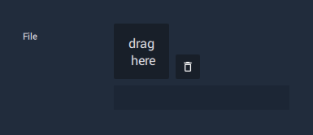

# Asset/Object Attribute

Some **Objects** and **Nodes** need to be linked to another piece of data to function, whether that be an **Asset** or an **Object**.

For example, a **Sprite Object** supplies the **Attributes** to customise how an **Image** is represented in a **Project**, but it isn't the **Image** itself. It needs to be linked to the **Image Asset**, so that **INCARI** knows what **Image** to apply these **Attributes** _to_.

Depending on how you create your **Nodes** or **Objects**, the **Asset**/**Object** slot may already be linked to some data. If there is no data assigned, you will need to drag the element on the slot to create a link. This can also be done by selecting the **Asset**/**Object** first, then clicking the small arrow button at the side of the slot to assign it.

