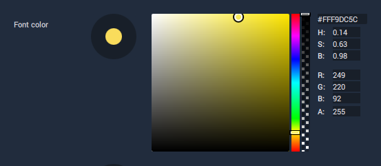

# Color Attribute

**Color Attributes** are used to set the color and opacity of several **Objects** in **Incari**. They can be set in a variety of ways:

* Using the _saturation_/_brightness_ picker.
* Using the _hue_ and _alpha_ sliders.
* Setting a 8-digit **ARGB** _hex code_.
* Manually setting _hue_, _saturation brightness_ \(**HSB**\) levels.
* Manually setting _red_, _green_, _blue_ and _alpha_ \(**RGBA**\)

  levels.

## Hex Codes

Currently the _hex code_ **Field** of the **Color Attribute** only accepts _full_ 8-digit _hex codes_. It does _not_ support shorthand _hex codes_ \(e.g. \#FFF\), and does not automatically interpret 6-digit _hex codes_ as 8-digit _hex codes_.

Additionally, the first two digits of the code represent the _alpha_ value, not the _red_ value, therefore 6-digit _hex codes_ must have an _alpha value_ added to _the front_ of the code \(e.g. \#FF0000 would become \#FFFF0000\).

## Hue, Saturation and Brightness

**HSB** values in **Incari** are within the range 0 - 1, which may differ from other software. _Hue_ properties, for example, are often given in degrees \(0° - 360°\), while saturation and brightness are often represented as a percentage \(0% - 100%\). To translate values from another application to **Incari**, you may need to convert the values first.

## Red, Green, Blue and Alpha

**RGBA** are all within the range of 0 - 255. This is a fairly common convention, however there are some cases where _alpha values_ are given as a percentage, or within the range 0 - 1. As with **HSB**, values may need to be converted beforehand.

