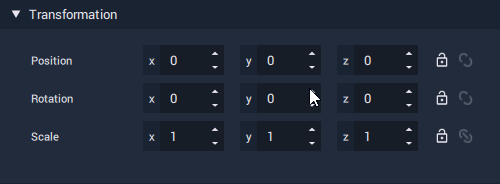
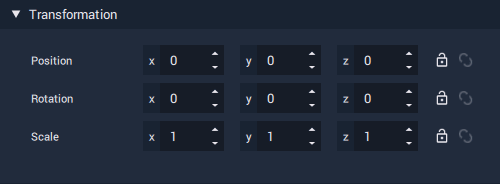
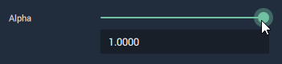
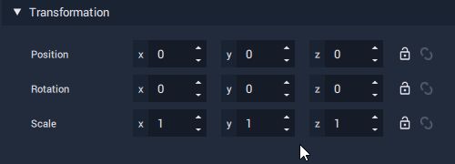

# Numerical Attribute

**Numerical Attributes** are **Attributes** that hold **Numerical Data**. These include **Byte**, **Int**, **Float**, **Vector2**, **Vector3** and **Vector4**.

## Adjusting Numerical Attributes

Their **Values** can be increased/decreased by clicking the arrow buttons of a **Numerical Attribute Field**. This can also be done by hovering your mouse pointer over the **Field** and using your mouse's scroll wheel.

We can change the _step_ \(the amount to increment by\), by right-clicking the **Field**, and selecting an amount from the menu.

Alternatively, you can set the **Value** manually by clicking the **Field** and typing.

There are some cases where a **Numerical Attribute** can be adjusted using a slider.

### Locking and Linking

**Vector Type Attributes** can have their **Values** linked so that they either all have the _same_ **Value** when adjusted, or have the same ****_relative_ **Value** when adjusted.

| Lock Icon | Link Icon | Before | After |
| :--- | :--- | :--- | :--- |
| Active | Active | 1, 2, 1 | 2, 4, 2 |
| Active | Inactive | 1, 2, 1 | 2, 2, 2 |

If both the _lock_ and _link_ icons are active, all **Values** will be adjusted while _maintaining their ratio_ to one another.

If only the _lock_ icon is active, all **Values** will be adjusted to be _the same_ **Value**.

