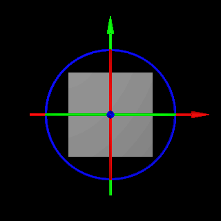
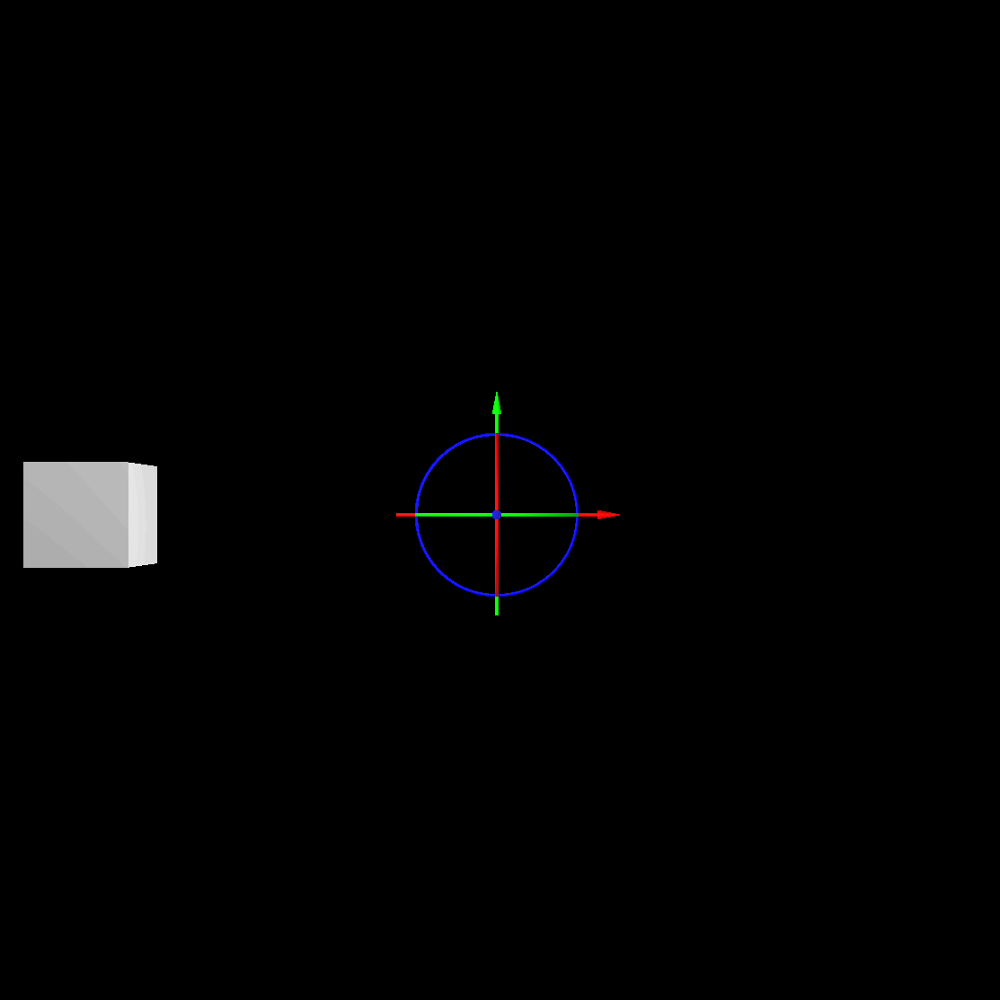

# Rotation Pivot

Every **Object** in **INCARI** has its own **Pivot Point**. This is the point in 3D space, that the **Object** will be rotated around. One of the most common places to have the **Pivot Point** is at the centre of the **Object**, which can be set automatically, using the `Center` button, under **Rotation Pivot** in the **Attribute Editor**.

There are times, though, where you will want to set the **Pivot Point** to somewhere else, such as a hinge on a door. In this case, you can either manually set the `Position` of the **Pivot Point** by editing the values in the **Attribute Editor**, or by using the **Pivot Point Widget** in the **Scene Window**.

Generally it is much better practice to set the origin of your 3D meshes in your 3D application, before importing them into **INCARI**.

