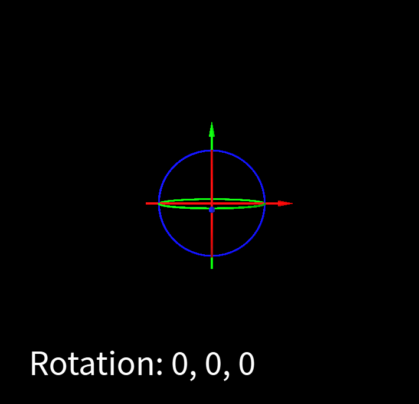
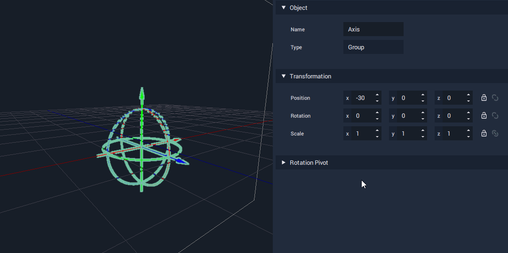
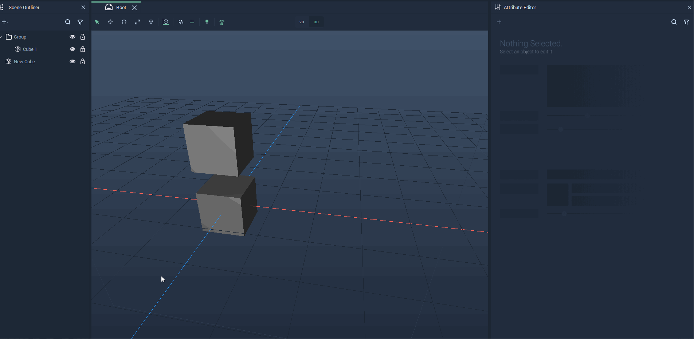

# Transformation

All **Objects** in **Incari** exist in _3D_ space, and have a set of **Attributes** to define their **Transformation** data. **Transformation** is divided into three **Vector3** type **Attributes**: `Position`, `Rotation`, and `Scale`.

## Position

`Position` is defined by three values, representing each of the three axes of a three dimensional Cartesian coordinate system.

In most _2D_ graphics applications, you will typically see a coordinate system with the origin \(0,0\) at the top-left corner of a document, and the X value increasing from left-to-right and the Y value increasing from top-to-bottom.

In **Incari**, coordinates are in 3D Euclidean space, with the origin \(0, 0, 0\) at the center, and the `x` value increasing from center-to-right, the `y` value increasing from center-to-top and the `z` value increasing from center-to-front.

Any point in space can be determined by these `x`, `y`, and `z` values.

## Rotation

The `Rotation` **Attribute** represents the Euler angle of rotation of an **Object** along each of its axes. The **Object** is rotated in _local space_, meaning that any adjustments will be made along its _own_ axes, not the axes of the **Scene** itself. Axes can be thought of as being like three skewers, going through the **Object** and intersecting at the **Object's** **Pivot Point**.

## Scale

`Scale` multiplies the size of an **Object** along its axes, relative to its **Origin**. By default, `Scale` is set to 1, 1, 1, meaning that it is at 100% of its size on all axes.

## Groups

There is one special case that is worth noting, that of **Objects** that are part of a **Group**. In this case, the `Position` and `Rotation` **Attributes** of the **Objects** are relative to the `Position` and `Rotation` of the **Group**.

For this to be clearer, let us see two examples, one for the `Position` **Attribute** and one for the `Rotation` one.

Consider a **Group** containing one **Object**, a cube. Setting the `Position` of the **Group** to `x=100` and the `Position` of the cube to `x=100` will result in the cube being located at `x=200` in the **Scene** space.

To illustrate this, see the following example, in which there are two cubes: one with `Position` `x=100` in a **Group** with `Position` `x=100` and another one that is not part of a **Group** and has `Position` `x=200`. For visualization purposes, the two cubes have been set at different heights along the Y axis.

The same applies to rotations. Consider, for instance a **Group** containing one **Object**, a cube. Setting the `Rotation` of the **Group** to `x=30` and the `Rotation` of the cube to `x=30` will result in the cube being rotated 60 degrees with respect to the **Scene** coordinate system.

To illustrate this, see the following example, in which there are two cubes: one with `Rotation` `x=30` in a **Group** with `Rotation` `x=30` and another one that is not part of a **Group** and has its `Rotation` set to `x=60`. For visualization purposes, the two cubes have been set at different heights along the Y axis.

