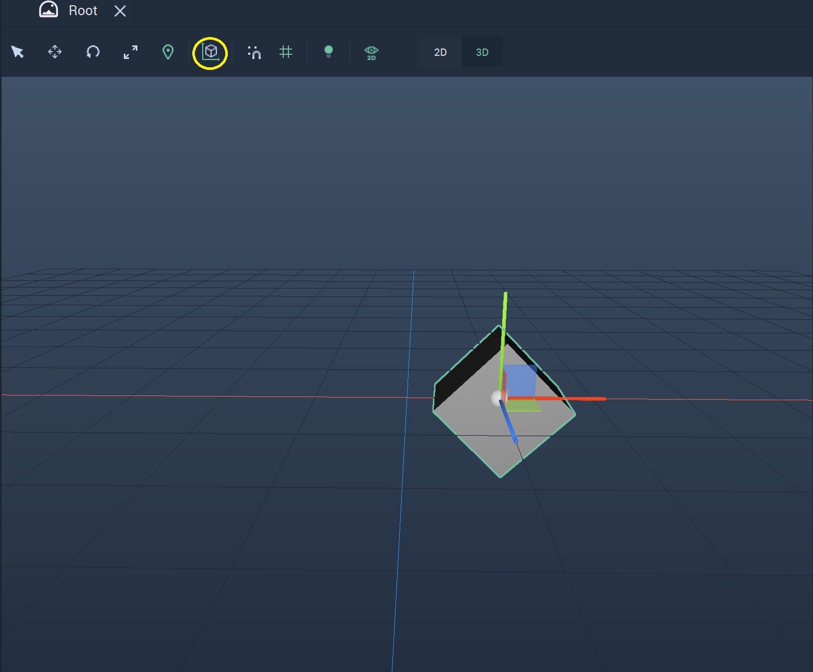
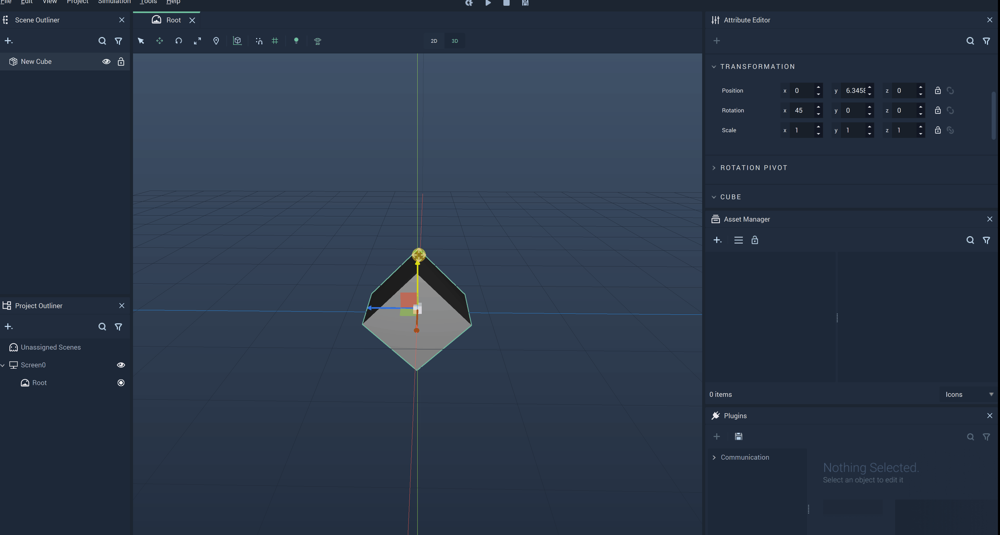
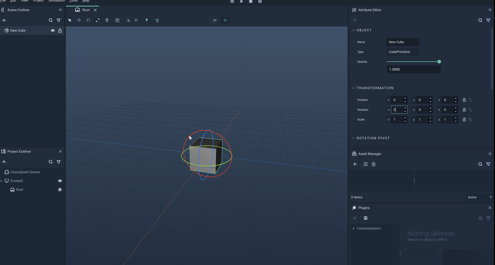
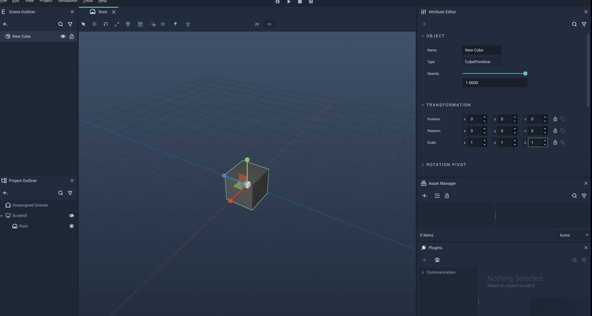

# Global Transformations

## Overview

**Global** **Transformations** are performed along the **Scene** axes, regardless of the **Object's** `Position` and `Rotation` **Attributes**.

The following example shows the **Global** axes for several **Objects**:

**Global** **Transformations** are done directly in the **Scene Viewport** in **Global** mode. To switch to **Global** view simply click on the `Local Global` icon on the top Menu of the **Viewport**. This is only necessary if **Local** mode is currently selected, as **Global** mode is the default on start. 

The **Global** mode allows one to change the [`Position`](#position), [`Rotation`](#rotation), and [`Scale`](#scale) of an **Object**. It can also be used for [**Groups**](#groups).

## Position

To modify an **Object's** **Position**, click on the `Translate` icon, second from the left on the top Menu. This will show the axes along which the **Object's** **Position** can be modified. In **Global** mode, the **Object's** **Global** axes are shown, meaning they reflect the orientation of the origin.

To move an **Object** along an axis, click on the preferred axis and drag the **Object**. It can also be moved in any direction by dragging the origin of the shown axes.

The example below shows an **Object** being moved along its **Global** axes.

## Rotation

To be able to rotate an **Object**, click on the `Rotate` icon, third from the left on the top Menu. This will make the *rotation gizmo* appear for the **Object**. Each circle represents an axis along which a rotation can be performed. For rotating the **Object**, click on a circle of the gizmo and drag towards the direction in which to perform the rotation. In **Global** mode, the **Object** is rotated with respect to the origin axes.

## Scale

To scale an **Object**, simply locate the `Scale` icon fourth from the left on the top Menu. This will make the *scale gizmo* appear. Each axis ends in a small cube and pulling on these axes, after clicking with the mouse, will change the shape of the **Object**, as if molding it like clay. In **Global** mode, the **Object** is scaled with respect to to the axes of the origin. 

## Groups