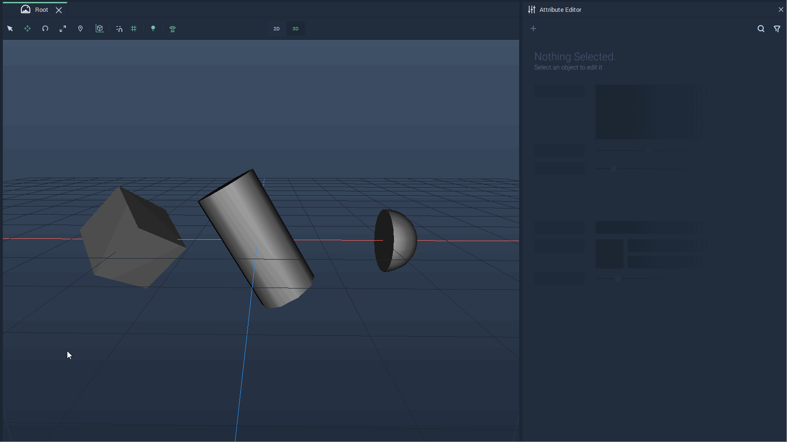
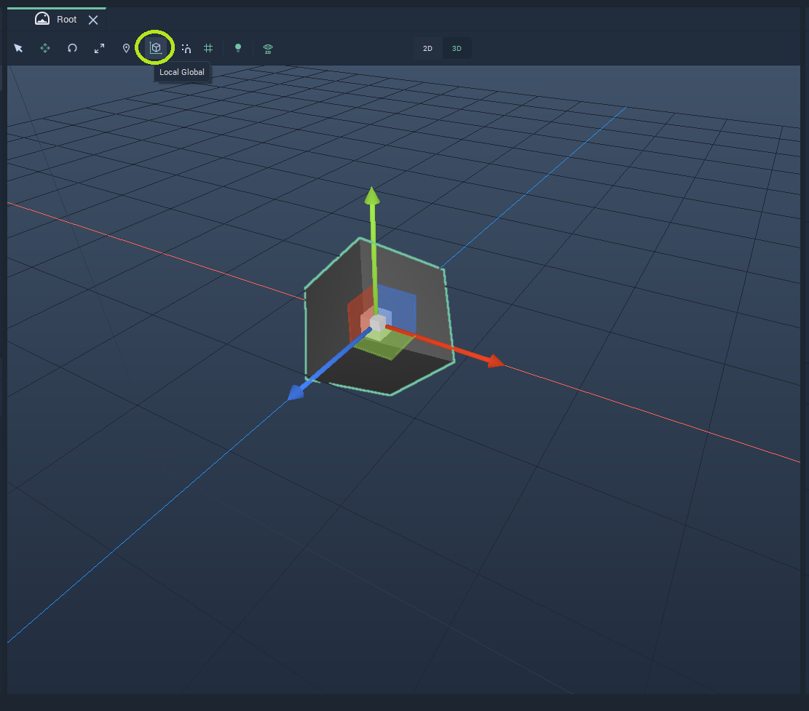
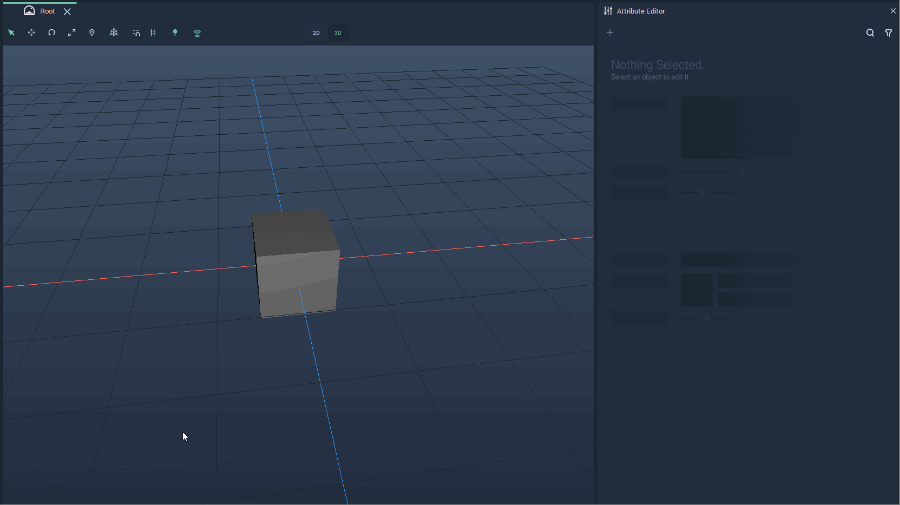
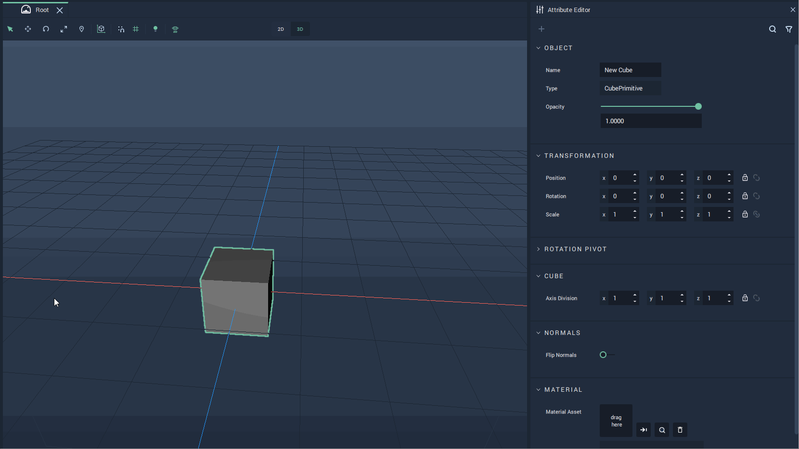
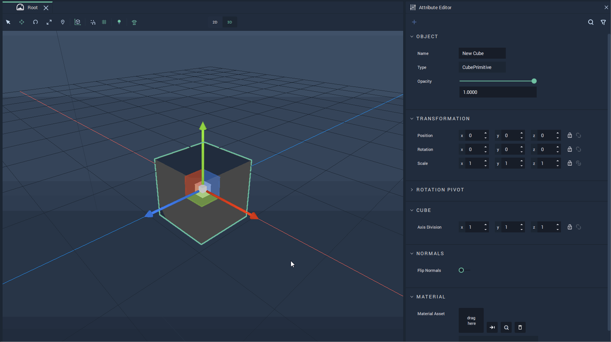
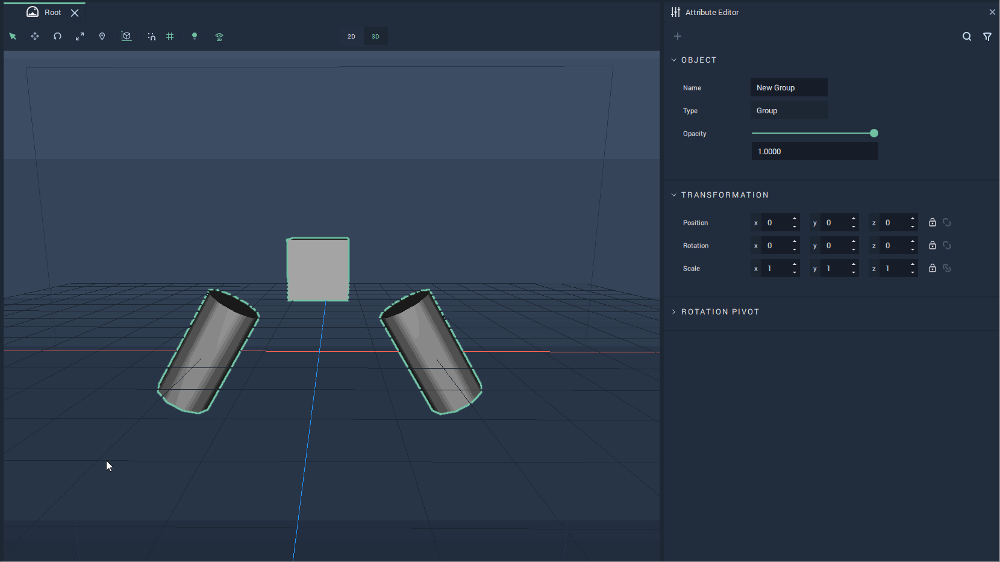

# Global Transformations

## Overview

**Global** **Transformations** are performed along the **Scene** axes, regardless of the **Object's** `Position` and `Rotation` **Attributes**.

The following example shows the **Global** axes for several **Objects**:

**Global** **Transformations** can be done either directly in the **Scene Viewport** in **Global** mode or in the [**Attribute Editor**](../../../../modules/attribute-editor.md). 

To switch to **Global** view simply click on the `Local Global` icon on the top Menu of the **Viewport**. This is only necessary if **Local** mode is currently selected, as **Global** mode is the default on start. 

The **Attributes** of an **Object** can be modified in the **Attribute Editor**. They will appear there when the **Object** is selected.

The **Global** mode allows one to change the [`Position`](#position) and [`Rotation`](#rotation) of an **Object**. It can also be used for [**Groups**](#groups).

## Position

Translating an **Object** can be done either in the **Scene Viewport** or in the **Object's** **Attributes**.

To modify an **Object's** **Position** in the **Viewport**, click on the `Translate` icon, second from the left on the top Menu. This will make a *gizmo* appear, showing the axes along which the **Object's** **Position** can be modified. In **Global** mode, the **Scene** axes are shown.

To move an **Object** along an axis, click on the preferred axis and drag the **Object**. It can also be moved in any direction by dragging the center of the *gizmo* or in a plane by dragging the square between two axes.

The example below shows an **Object** being moved along its **Global** axes.

It is also possible to change an **Object's** **Position** from its **Attributes**. For this, modify the `Position` values under `Transformation` in the **Attribute Editor**: with a right-click, a drop-down Menu for the step change opens; after choosing the step, change the value by scrolling or use the up and down arrows at the right of the value. It is also possible to directly set the value in the input box.

The following example shows the modification of the `Position` values for a **Cube**.

## Rotation

Rotating an **Object** can be done either in the **Scene Viewport** or in the **Object's** **Attributes**.

In order to rotate an **Object** in the **Viewport**, click on the `Rotate` icon, third from the left on the top Menu. This will make the *rotation gizmo* appear for the **Object**. Each circle represents an axis along which a rotation can be performed. For rotating the **Object**, click on a circle of the *gizmo* and drag towards the direction in which to perform the rotation. In **Global** mode, the **Object** is rotated with respect to the **Scene** axes.

The example below shows a **Global** rotation of an **Object**.

It is also possible to rotate an **Object** from its **Attributes**. For this, modify the `Rotation` values under `Transformation` in the **Attribute Editor**: with a right-click, a drop-down Menu for the step change opens; after choosing the step, change the value by scrolling or use the up and down arrows at the right of the value.

The following example shows the modification of the `Rotation` values for a **Cube**.

When modifying a `Rotation` value, it is possible that the other two values get automatically changed. This is just a recalculation of the rotation angles required to successfully perform the desired transformation.

## Groups

It is possible to perform **Transformations** over several **Objects** as if they were parts of one **Object** by putting them into a **Group**. This can be done directly in the **Viewport** or in the **Attribute Editor**.

The example below shows a **Global** rotation and translation of a **Group** composed of two cylinders and a cube.

The following example shows the same **Group** being translated and rotated by modifying its **Attributes** in the **Attribute Editor**. To set the step, right-click the input box, and then modify the value by either scrolling or using the up and down arrows on the right.

