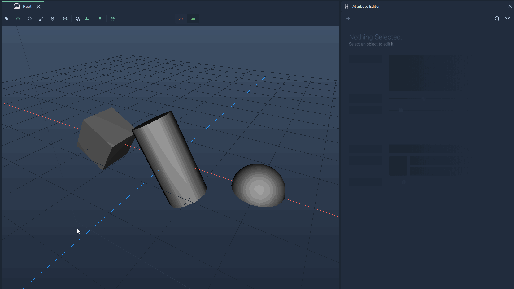
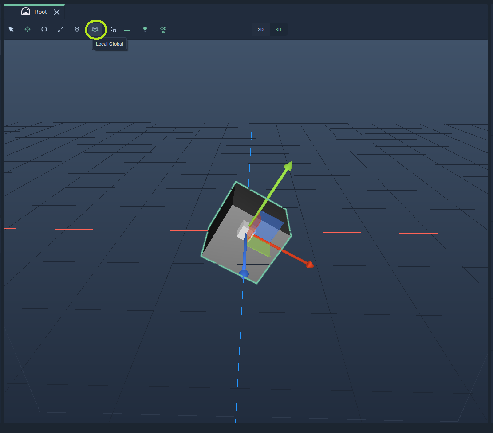
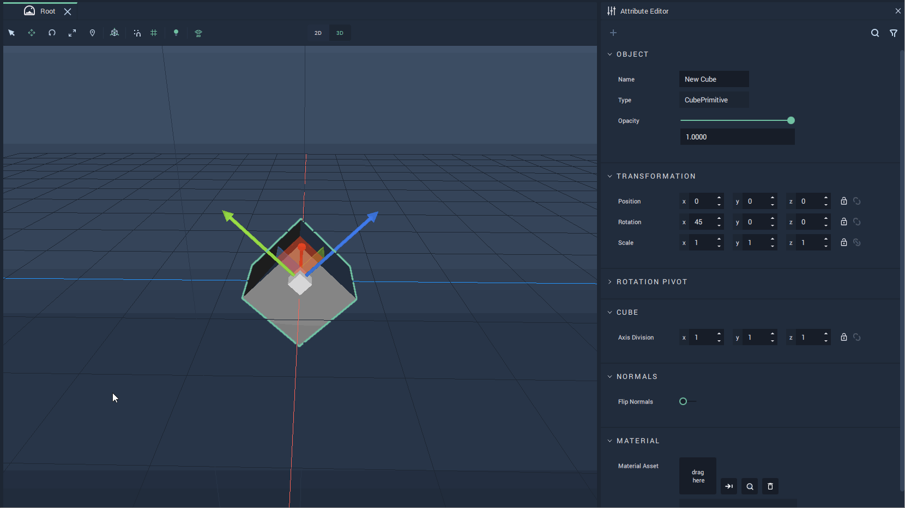
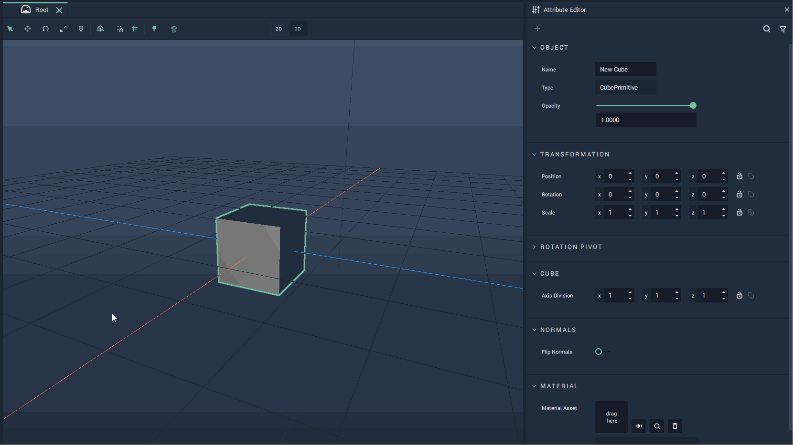
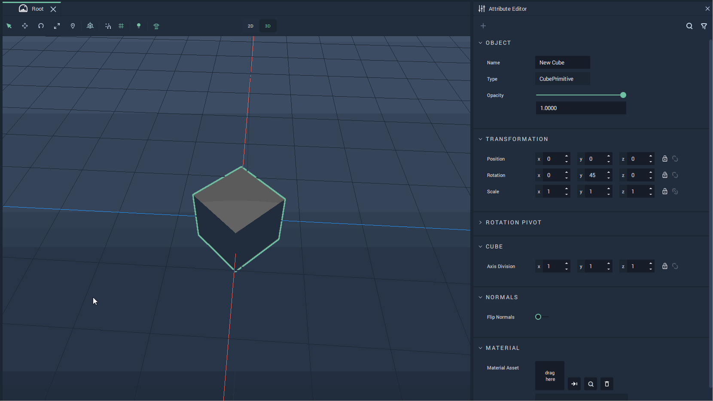
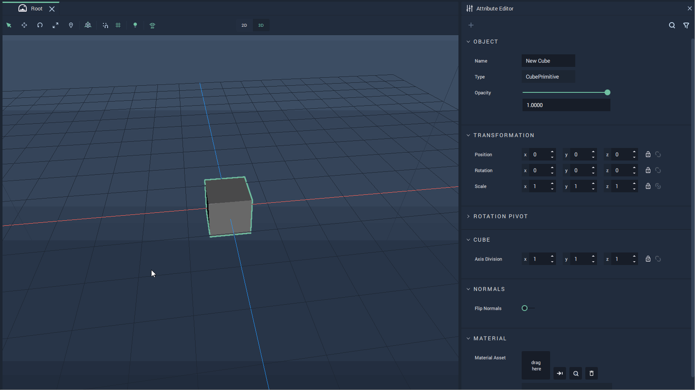
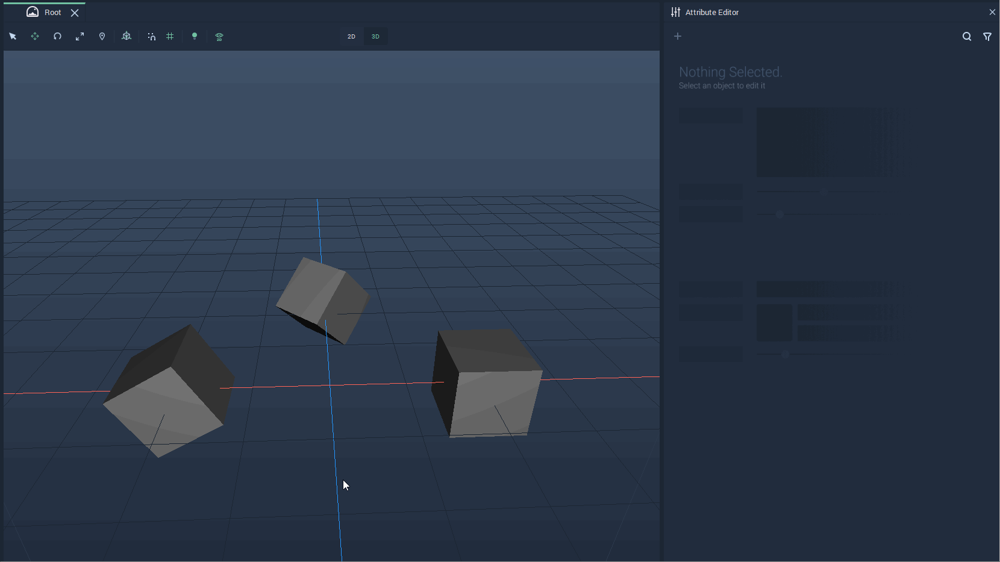
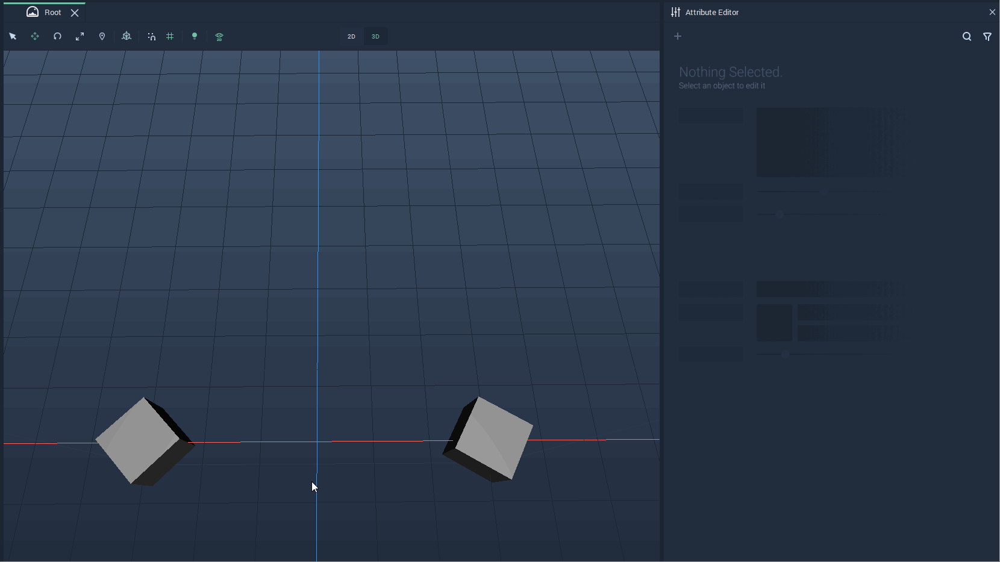
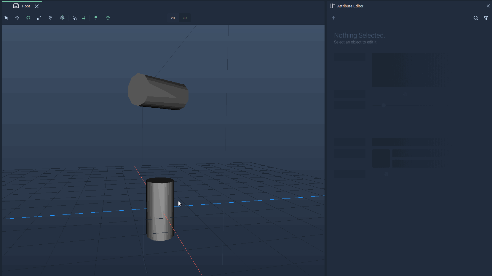
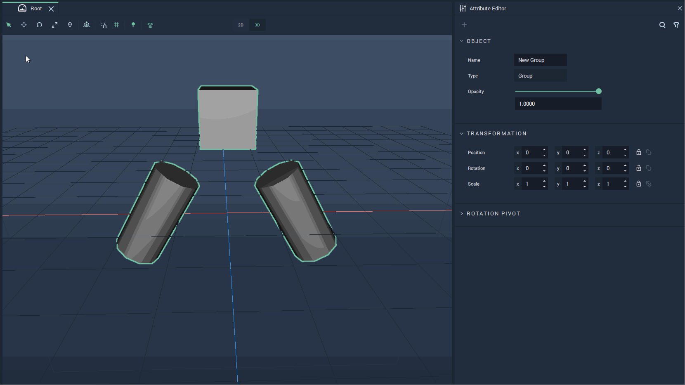

# Local Transformations

## Overview

**Local** **Transformations** are performed along the *principal axes* of an **Object**, which can be thought as the most natural axes for the rotation of an **Object**.

As an example, the **Local** axes for a cube, a cylinder, and a dome are:

**Local** **Transformations** for `Position` and `Rotation` are done directly in the **Scene Viewport** in **Local** mode. To switch to **Local** mode simply click on the `Local Global` icon on the top Menu of the **Viewport**.

The **Local** mode allows one to change the [`Position`](#position), [`Rotation`](#rotation), and [`Scale`](#scale) of an **Object**. It can also be used for [several **Objects**](#several-objects) and [**Groups**](#groups).

## Position

To modify an **Object's** **Position**, click on the `Translate` icon, second from the left on the top Menu. This will make a *gizmo* appear, showing the axes along which the **Object's** **Position** can be modified. In **Local** mode, the **Object's** **Local** axes are shown.

To move an **Object** along an axis, click on the preferred axis and drag the **Object**. It can also be moved in any direction by dragging the center of the *gizmo* or in a plane by dragging the square between two axes.

The example below shows an **Object** being moved along its **Local** axes.

## Rotation

To be able to rotate an **Object**, click on the `Rotate` icon, third from the left on the top Menu. This will make the *rotation gizmo* appear for the **Object**. Each circle represents an axis along which a rotation can be performed. For rotating the **Object**, click on a circle of the *gizmo* and drag towards the direction in which to perform the rotation. In **Local** mode, the **Object** is rotated with respect to its own **Local** axes.

The example below shows an **Object** being locally rotated. Note that as the **Object** is rotated, its **Local** axes also rotate.

## Scale

Scaling an **Object** can be done either in the **Scene Viewport** or in the **Object's** **Attributes**.

To scale an **Object** in the **Viewport**, simply locate the `Scale` icon fourth from the left on the top Menu. This will make the *scale gizmo* appear. Each axis ends in a small cube and pulling on these axes, after clicking with the mouse, will change the shape of the **Object**, as if molding it like clay. The **Object** is always scaled with respect to its **Local** axes. 

The example below shows a cube being scaled in the **Viewport**.

It is also possible to scale an **Object** from its **Attributes**. For this, modify the `Scale` values under `Transformation` in the **Attribute Editor**.

The following example shows the modification of the `Scale` values for a cube.

## Several Objects

It is also possible to perform **Local** **Transformations** on several **Objects** at once. For this, simply select the **Objects** to modify either in the **Scene View** or in the **Scene Outliner**. It will show the *gizmo* positioned in the center of all the selected **Objects** and the axes direction of the last selected **Object**.

**Transformations** will then apply to all selected **Objects**.

The first example shows the **Transformation** *gizmo* of each individual **Object** and then how it looks when they are all selected.

The next two examples show the translation of two cubes and the rotation of two cylinders, respectively.

## Groups

Another way of performing **Transformations** over several **Objects** is by putting them into a **Group**. Then, performing **Transformations** over the **Group** will **Transform** the **Objects** that compose it as if they all were just parts of only one **Object**.

The example below shows a **Local** rotation and translation of a **Group** composed of two cylinders and a cube.

## External Links

* [*Principal Axes*](https://en.wikipedia.org/wiki/Moment_of_inertia#Principal_axes) on Wikipedia.
