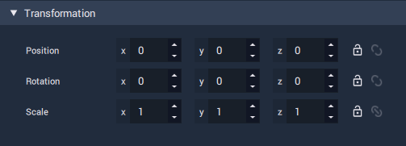

# Vector3

The **Vector3** **Data Type** represents three [**Floating Point**](float.md) numbers.

They are almost always used to represent dimensions or co-ordinates relating to *3D* geometric space.

In **Incari**, you will encounter **Vector3** data types frequently, because they are the data types used to hold information relating to **Transformation**.

