# Best Standards and Practices 

It is understandable that learning any new software can be a bit overwhelming. However, we at **Incari** aim to streamline the learning process and limit how daunting it can be. Therefore, this page highlights some **Incari** standards and practices that the user can incoporate into their creative process in order to make using **Incari Studio** that much more enjoyable. 

## Conceptualizing

**Incari Studio** is a powerful tool which offers a multitude of ways for executing the same general concepts <!-- better word here--> -- this enables the user to apply it to an abundance of different situations. Yet, this also means that planning the structure of a **Project** is incredibly important. There are some questions which should be considered at the beginning of every **Incari Project** before commencing with the details.

### 1. Planning the General Structure

  Is performance/consumption a very important factor for this __Project__? 

 

If yes, the **Project** should be split into as many **Scenes** as rationally makes sense. This way the user can utilize the **Scene** loading feature <!-- need link here-->in **Incari** to load **Scenes** and **Assets** only when they are needed.

This significantly decreases any burden on the target device and increases performance.

Does this **Project** use *3D* components or rely on *3D* animations? 

 
If not, the user might consider using [**Scene2Ds**](../../objects-and-types/project-objects/scene2d.md). They are less powerful when it comes to things such as masking or animating, but it is much easier to turn them into pixel-perfect implementations. This is especially true when implementing a design from *Figma*, *Adobe XD*, or other similar softwares. **Incari Studio** can import these and render them comparably within a **Scene2D**. 

Furthermore, if *3D* components end up being needed further on, the user can always add a **Scene2D** as an [**Overlay**](../../objects-and-types/scene-objects/overlay.md) to a **Scene**.

Does the **Project** require a lot of similar components used in a number of different places? 

If the answer is yes, build [**Prefabs**](../../objects-and-types/prefabs/README.md) for these components. They make the **Logic** significantly easier to understand and maintain.

Best part is, if this component gets updated in the design at some point, the user just needs to update the main **Prefab**. Same for the **Logic** driving it.

Does this **Project** contain multiple **Screens**?

If the answer is yes, one should consider if all of them are run on a single device or if each **Screen** is run on a seperate target device. 

In the case that the whole **Project** runs on a single device, it is possible to create a single **Incari Project** for all of the **Screens**. 

In the case that the **Project** runs on multiple targets, each **Screen** needs to have its own **Incari Project**. If needed, additional communication needs to be implemented between the **Projects**.

### 2. Planning the Logic 

Is this **Project** data driven?

If the answer is yes -- and in most cases it should be -- avoid hard-coded values as much as possible. The extensive and structured use of **Variables** (see [**Logic**](#logic) section below) is crucial to the maintainability of the **Project** further on.

Do the interactions in this **Project** rely on the screen/device on which the **Project** is being run?

If yes, the user should consider setting a *static variable* in the beginning for the screen resolution (or aspect ratio, depending on the situation) and use it for all **Logic** purposes. In the future, **Incari** will have a **Get Screen Resolution Node**.

For instance, assume there is an interaction where an **Object** is being moved from `W/4` to `3W/4` on the *X* axis, with *W* representing the screen width. If one were to hard code the positions, any screen size change (even if the aspect ratio stays the same) will result in the interaction being broken. A suggested resolution path could be as follows:

* Create a variable called `static_global_vec2_screenResolution` to store the screen resolution.

* Create an **Array** to store the initial and end location of the **Object** (e.g. `scene1_arr-vec2_obj1Locations`).

* On **Project** initialization, use a function to calculate `.75` of the resolution width and set the items in the **Array** accordingly.

* Next, when building the animation, fetch the correct value from the **Array**.

Although the initial setup is slightly heftier, in a **Project** with a multitude of these interactions where the resolution changes, all that will be needed is to change a single variable instead of modifying dozens of different **Nodes**.

## Logic

**Logic** in **Incari** provides the functional background for a user's **Project**. Below are some tips on how to build and structure **Logic** while incorporating **Variables**. 

### 1. Creating, Maintaining, and Naming Variables

It is recommended to have a system for keeping track of **Variables**. This guide on **Variables** refers to the current and all previous releases of **Incari Studio**, but since **Incari** always aims to improve and streamline the creative process, there may be some changes in the near future which will add functionality regarding the way **Variables** are displayed. 

Usually, a good **Variable** name will indicate a selection of the following:

* If the **Project Logic** and **Variables** are **Scene**-based, then it is suggested to incorporate the name of the **Scene** being used, or the term `global`:

  * `global`, `scene1`, `view1`, etc.

* If it is more dependent on the inner **Variables** in the **Logic**, include the type of the **Variable**:

  * `int`, `dict`, `bool`, etc.

* If it is a **Bool**, use an indicator of what *True* symbolizes:

  * `isOn`, `isRunning`, `isElonMusk`, etc.

* There are several ways to do this, but if the user would also like to know the type of **Variables** in their array (if it is one of a single-type), they can do something like this: 

  * `arr-int`, `arr-vec3`, etc.
  
* Lastly, one can incorporate details of what the **Variable** is. Usually this is either one phrase, but sometimes two. Additionally, if it shouldn’t be changed, one can also include the `static` keyword as a prefix. A few examples are:

  * `tweetsView_bool_tweetAuthor_isElonMusk`

  * `global_int_diagnostics_oilTemp`

  * `static_global_vec2_screenDimensions`

These conventions make it significantly easier for the user to maintain **Logic** and work collaboratively. 

### 2. Building Logic

#### 1. Decouple Logic and Visually Update 

It is good practice to decouple **Logic** that actually handles state change and **Variable** values and that which handles a **Scene** **Object's** update **Logic**. This allows the user to quickly change how a **Scene** itself reacts to a state change without any integration into the actual **Logic** and vice versa. The **Logic** can be changed without altering how the **Scene** reacts -- for instance, this could be something like changing how data is fed to the **Project** from mocked data to real data coming from communication. 

This approach applies both to **Scene** and **Prefab** **Logic**.

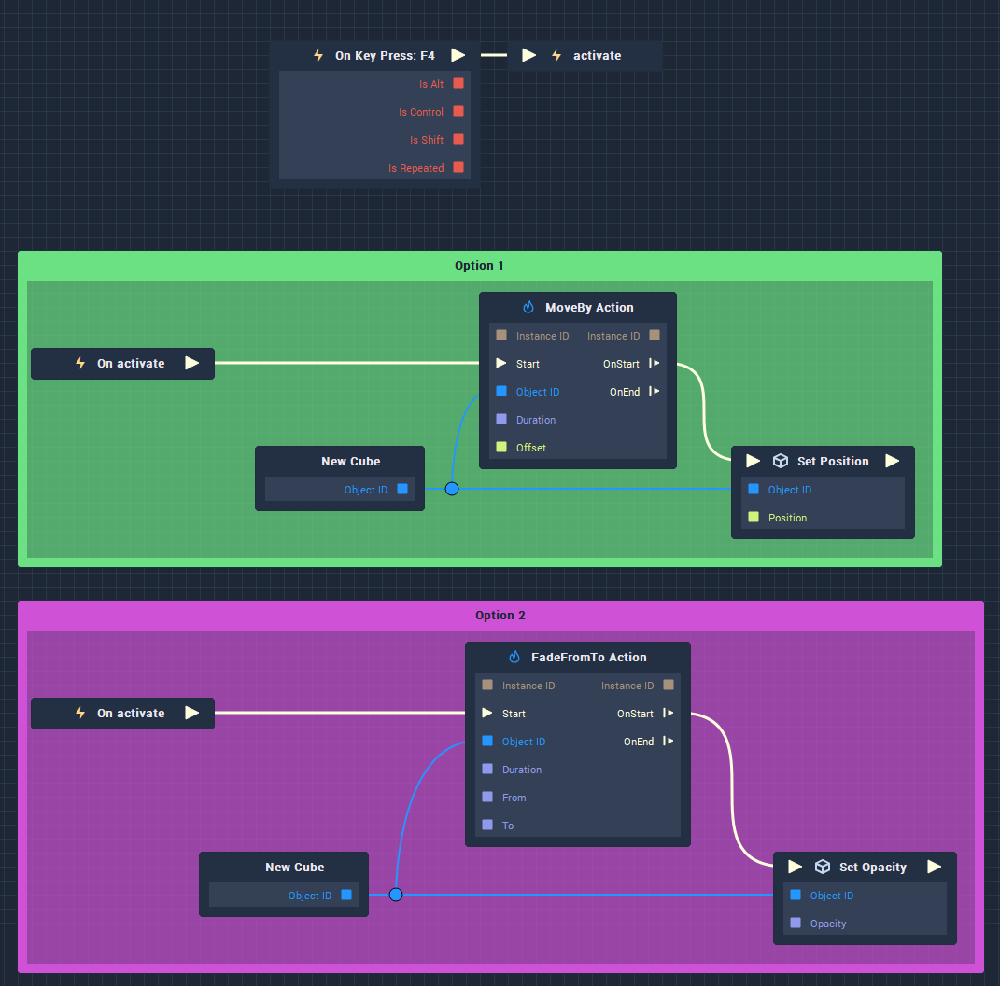

#### 2. How to Initialize and Update Prefabs at Runtime

It is recommended to split **Prefab Logic** into the part responsible for intialization (triggered only once, at start up) and the part that is updated at runtime. 

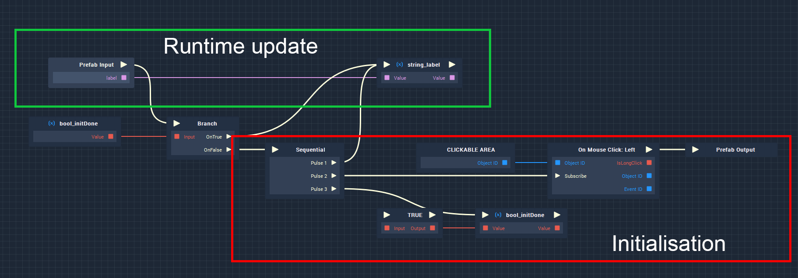

Each **Prefab** that is placed in a **Scene** and has **Logic** implemented needs to be initialized at the **Scene** level in order to get it working. To do so, the user needs to place a **Prefab** **Node** into the **Scene** **Logic**, connect it to an **Event**, connect all inputs, and attach the **ObjectID** from the **Scene**:

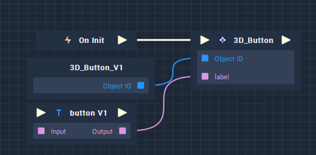

If the **Prefab** needs to react to more than one input **Variable**, it needs to be set up properly. This means that all **Events** should be connected to the **Input Pulse** (In the image below, the **Events** are `On global_bool_inputFieldActive Change` and `On global_string_inputFiledValue Change`) and all values that need to be passed to **Prefab** are passed as **Getters**. 

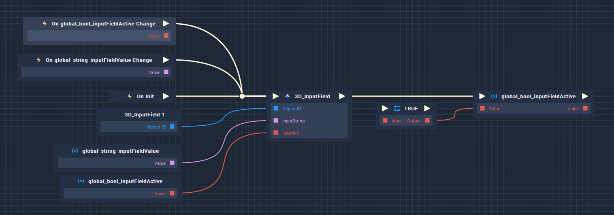

The **Logic** in the image above works (if only the **Bool** **Variable** is changed, both the **Float** and **Bool** values are passed to the **Prefab** so none are reset to default).

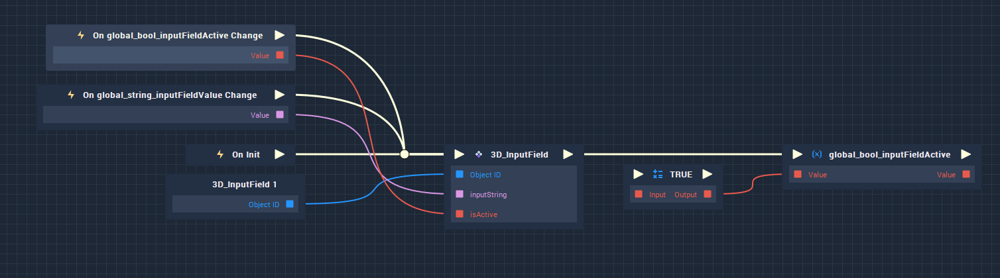

However, the **Logic** in *this* image above does not (if only the **Bool** **Variable** is changed, only this value is passed to the **Prefab**, while the **Float** value is reset to default).

#### 3. Execution Order inside a Prefab

It is important to keep in mind how internal **Prefab** **Logic** works. Triggering a **Prefab's** **Output** stops all internal **Logic** executions inside a **Prefab**. In case the user wants to simultaneously update the **Prefab** itself (for instance change its state and visual aspects) and use its **Output**, the **Logic** needs to be structured properly so that the **Prefab** **Output** is triggered at the very end. The solution in the image below will always work and all visual update **Logic** will be triggered before the **Prefab** **Output**.

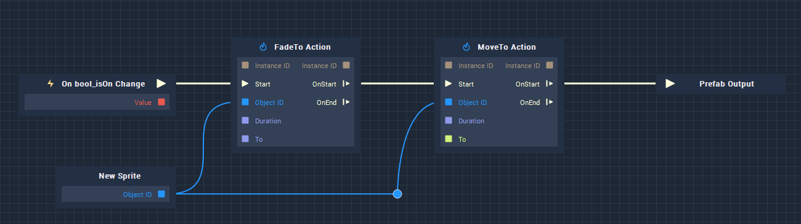

If the **Logic** is structured like in the image below, there is a huge change that the **Action Nodes** wouldn’t be triggered at all. However, depending on the machine that the **Project** is on, it may work. This is something the user should keep in mind when executing their ideas in **Incari Studio**. 

#### 4. Communication Logic on the Project Level

Keep all [**Communication**](../../toolbox/communication/README.md) relevant **Logic** at the **Project** level and update the **Project's** **Variables** with incoming messages. This way, communication can be handled easily without the possibility of breaking the **Scene's** **Logic**.

#### 5. Incari as an Event-Based System

**Incari** allows the user to implement a variety of **Events** across a **Project**. It is important to identify which [**Event**](../../toolbox/events/) should be used for which situation. For example, when user input should trigger some action, **Mouse** or **Keyboard** **Event Nodes** can be used. It can also be practical to have custom **Events** used for initialization across the whole **Project**. If a **Variable's** value changes or the setting a **Variable** should trigger an action, [**On Variable Change**](../../toolbox/events/variables/on-variable-change.md) or [**On Variable Set**](../../toolbox/events/variables/on-variable-set.md) should be used.

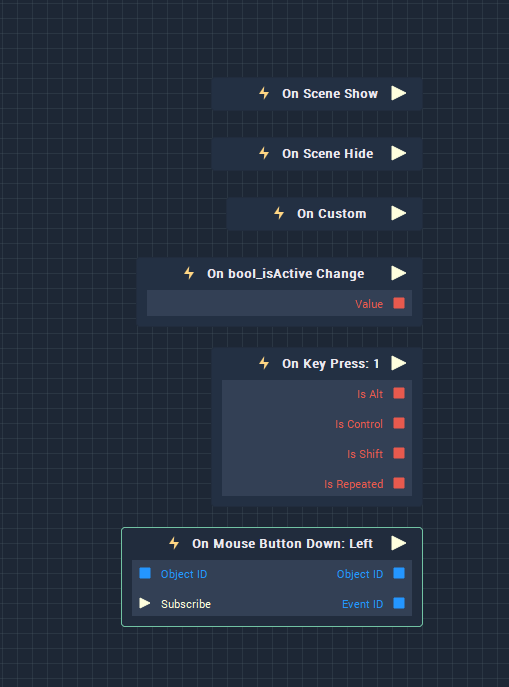

#### 6. Avoid Spaghetti Code

**Node**-based **Logic** editors are powerful, user-friendly tools. But without the proper approach, code can become unreadable fast. That is why users should keep their **Logic** as clean and readable as possible. To do so, keep the **Logic** flowing from left to right. Try to make **Pulse** and **Variable** connections in a way that it is easy to determine where the connection begins and ends. Additionally, do not cover **Nodes** with other **Nodes**.

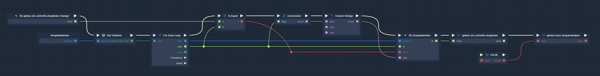

Below are a few examples of what *not* to do:

1. Even in an example with fewer than 10 **Nodes**, it can be difficult to tell how exactly the **Logic** flows when set up incorrectly. Here it is hard to tell what the execution order is and where exactly the **Pulses** are going.

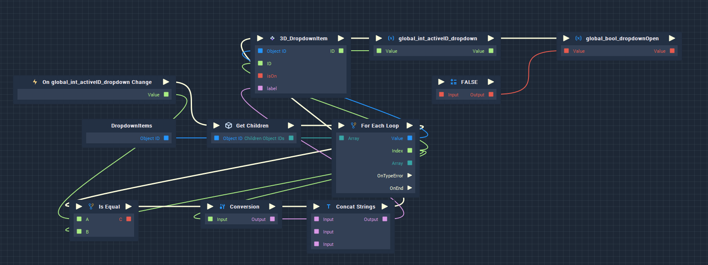

2. In this example, it is possible to se what the execution order looks like, but very difficult to determine where any value connections are made.

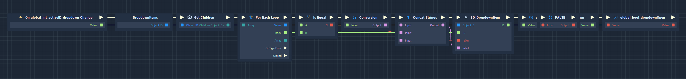

#### 7. Do Not Rename Node Types

Currently, the search engine inside **Incari's** **Logic View** uses only **Node** names. That is why it is not recommended to rename **Nodes** as they will not appear in the search results. In the example below there are to **Console Nodes** -- One where the default name is used and one where its name was changed. This affects all types of **Nodes**. 

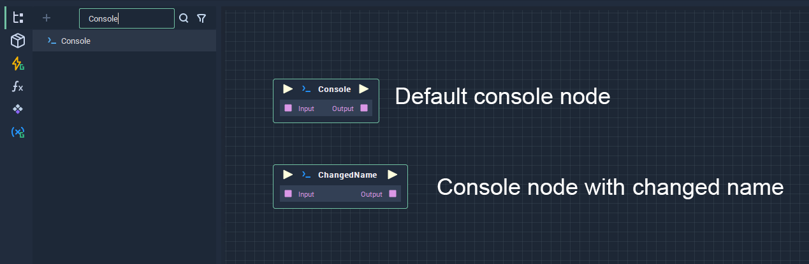

#### 8. Update/Run as Few Elements as Possible at Once

To keep the **Project** as performant as possible, it is really important to update only those **Objects** that should be updated at a certain time. 

#### 9. Differentiate Global Variables and Local (Single Scene Specific) Variables
    
To keep the **Logic** as readable as possible, it is a good practice to differentiate **Variables** that are used *globally* (updating **Objects** in multiple **Scenes** or getting data fed from outside the **Project**) from those that are only relevant to a single **Scene** (those that are used to update **Objects** in one single **Scene**). for more information about naming conventions, please see the section [**Creating, Maintaining and Naming Variables**](#1-creating-maintaining-and-naming-variables).

#### 10. Create Functions for Repetitive or Complex Chunks of Logic

If there are parts of the **Logic** that are reused multiple times, it is a good idea to enclose them in [**Functions**](../../toolbox/functions/README.md) that have their inputs and outputs defined. Additionally, it could also be useful to create **Functions** for complex segments of **Logic** (ex. mathematical functions that should return a single value). **Functions** can be used across **Project**, **Scene**, and **Prefab** scopes.

#### 11. Prevent Interpolators from being Triggered Multiple Times

Triggering an interpolator multiple times, before it has ended, can cause unwanted behavior. To prevent it, the user can create a logical gate that will prevent triggering the interpolator before it has ended. 

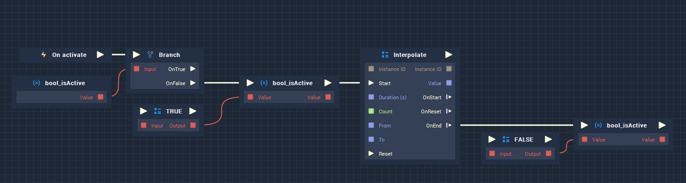

#### 12. Use Prefabs for All Repetitive Elements 

If an element is used multiple times, it is a good idea to make a  **Prefab** for each one of those elements. This way, **Logic** and **Scene** elements can be bundled into one single **Object**. This allows the user to change/update several **Objects** at the same time.  Using **Prefabs** also allows the user to move **Objects** and **Logic** between **Projects**, which helps with cooperation in a single project. 

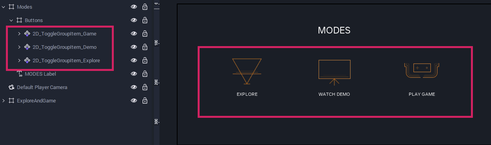

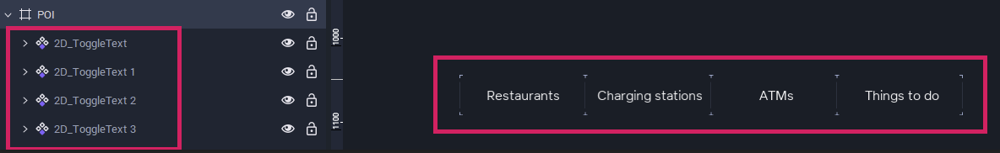

### 3. Grouping and Structuring Logic 

Looking at visual **Logic** can oftentimes be overwhelming, especially if the **Project** is extensive. [**Groups**](../../toolbox/utilities/group.md) give a straightforward way to understand the overall structure of the code and make necessary changes. You can choose one of the two approaches depending on the type of logic you are working on, or even merge them.