# Incari Hub

**Incari Hub** serves as a central access point to all **Incari** products. It allows one to install the latest version of **Incari**, manage existing **Projects**, and obtain **Demo Projects**.

On the left-side Menu, there are several sections. We will go through each, one by one. Feel free to jump to the section you are most interested in:

* [Projects](incari-hub.md#projects)
  * [My Projects](incari-hub.md#my-projects)
  * [Remote Projects](incari-hub.md#remote-projects)
* [Applications](incari-hub.md#applications)
  * [Incari Studio](incari-hub.md#incari-studio)
  * [Incari Player](incari-hub.md#incari-player)
* [Community](incari-hub.md#community)
  * [Documentation](incari-hub.md#documentation)
  * [Forum](incari-hub.md#forum)
  * [Support](incari-hub.md#support)
* [Settings](incari-hub.md#settings)

## Projects

### My Projects

The _My Projects_ section allows the user to access, create, and manage their local **Projects**. Here there are two existing **Projects** called **'test_1'** and **'test_2'**. The leftmost square with the plus icon is used to [create a new **Project**.](creating-a-project.md) 

It is also possible to change the order the **Projects** are displayed. This can be `Alphabetical`, `Date Created`, or `Date Updated`.

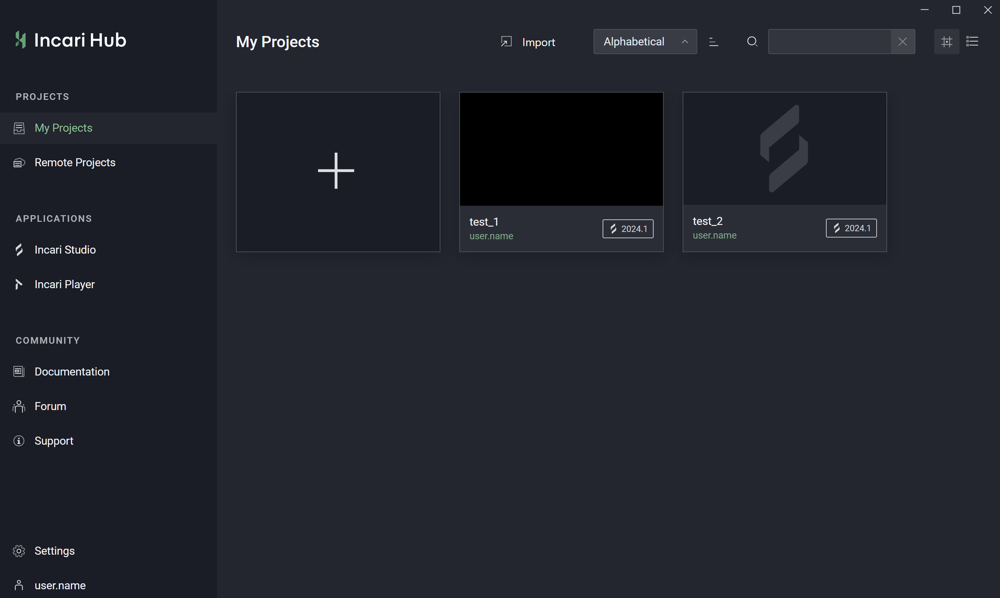

Each **Project** displays the username and **Incari Studio** version at the bottom. Clicking on the three dots that appear when hovering over a **Project** allows the user to open the **Project**, play the **Project** in **Incari Player**, show the **Project** in the user's local file library, edit the **Project's** settings, and inspect a **Project's** info. It is also possible to delete the **Project** from here, either by removing it from the **Hub** or deleting it completely from the local disk.

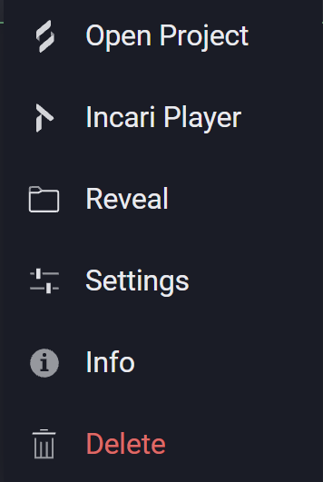

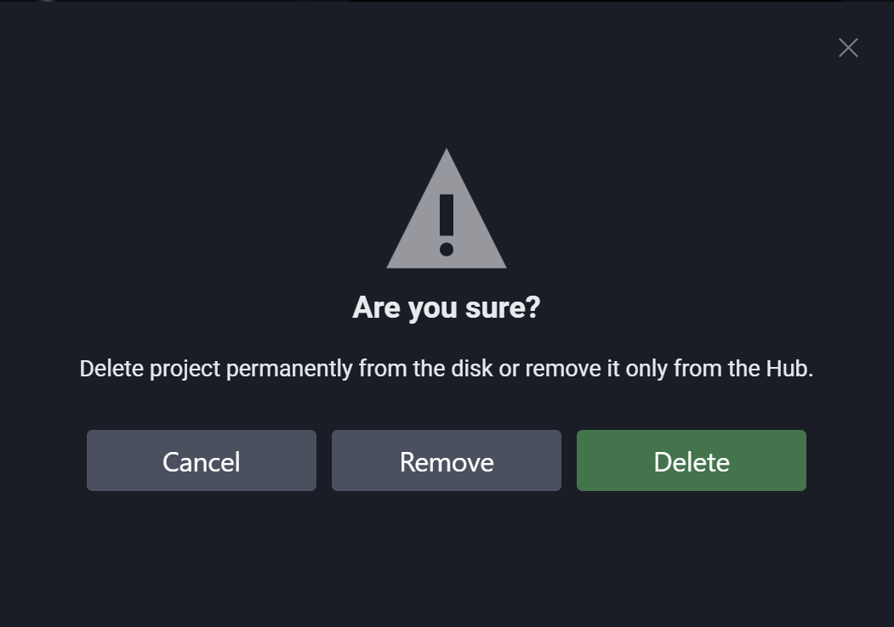

### Remote Projects

The tab _Remote Projects_ gives access to **Demo Projects** that have been created by our very own **Incari** team. These can be downloaded with the small cloud icon at the bottom right. The **Project** will then appear under _My Projects_ and can be opened from there.

**Demo Projects** allow one to see how certain functionalities can be implemented in **Incari**. These range from a simple button to examples of the several methods of **Animation** available to the user. Discover more in the [**Demo Projects**](../../demo-projects/overview.md) documentation.

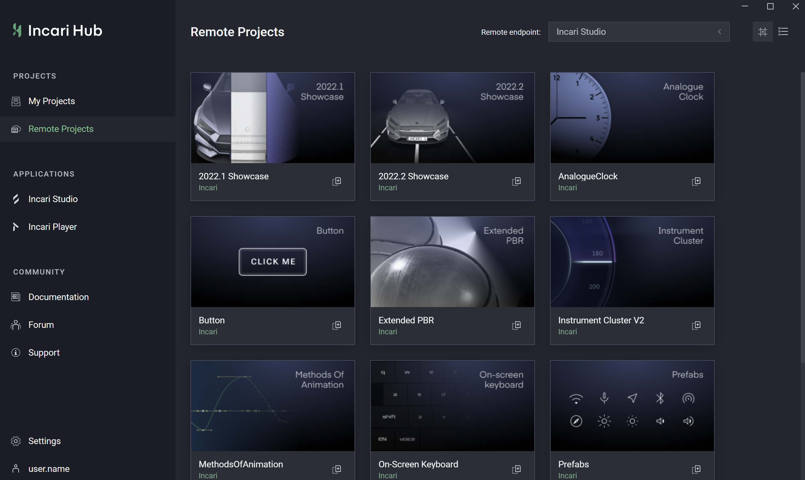

## Applications

### Incari Studio

Under _Incari Studio_, one can install different versions of **Incari Studio**. This can be done by locating a folder on your local machine, where **Incari Studio** is installed, or using the built-in installer. If there are no installations, a message will appear prompting the user to either `Locate` or `Install` a version of **Incari Studio**. Otherwise, the user can use the icon on the top right to do the same.

Note: Locating does not install **Incari Studio**. It simply points to where it is already existing on your computer after you have clicked through the file library that pops up.

Please note that if an existing **Project** was made with a previous version of **Incari Studio**, and this version is not currently installed within **Incari Hub**, you will be prompted to upgrade to the most recent version or locate the compatible version. Otherwise it will be impossible to open the **Project**.

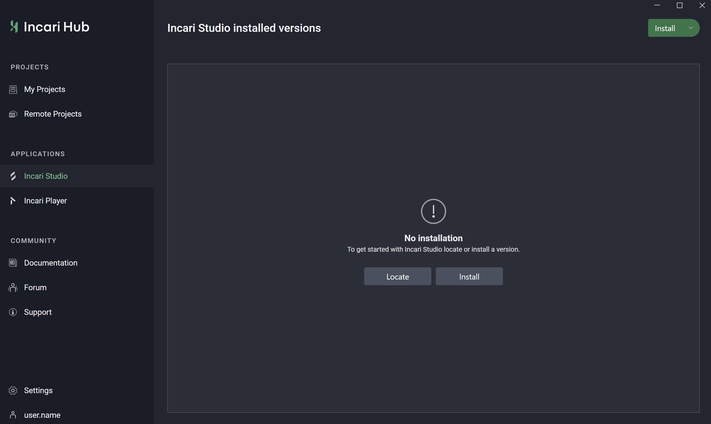

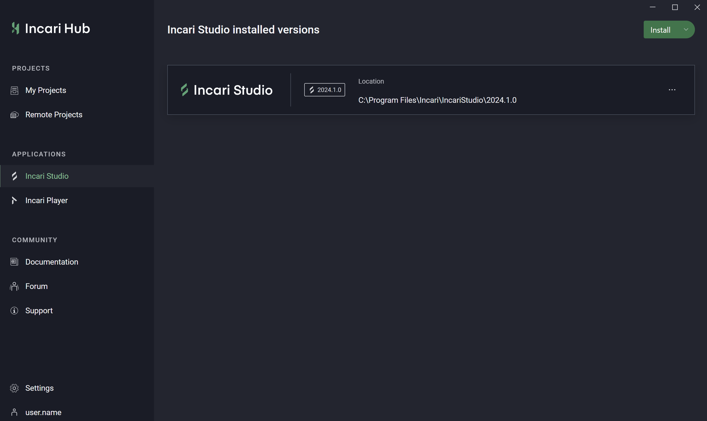

### Incari Player

Under *Incari Player*, one can add specific versions of the **Incari Player** for different platforms. This is essential to successfully export **Projects** which utilize different *Target Platforms*, such as *Linux*. The **Incari Player** added should match the *Target* type eventually selected in the [**Exporter**](../../modules/exporter.md) (it must first be added in the **Hub** to be useable in the **Exporter** of a **Project**).

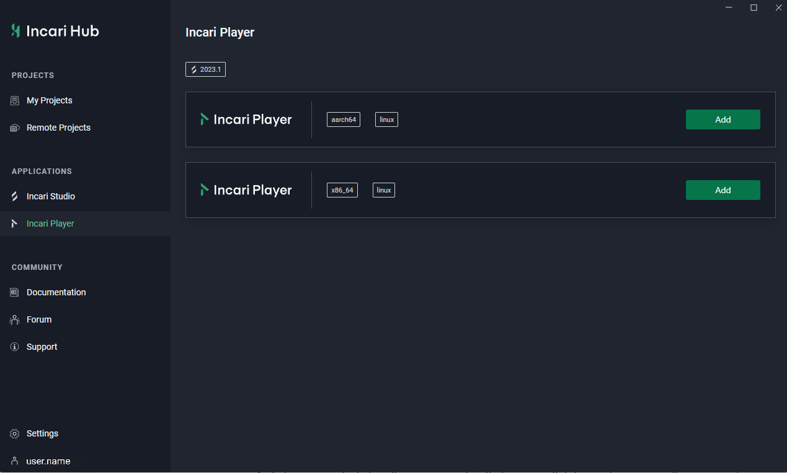

After adding a **Player**, it will appear like this in the **Hub**:

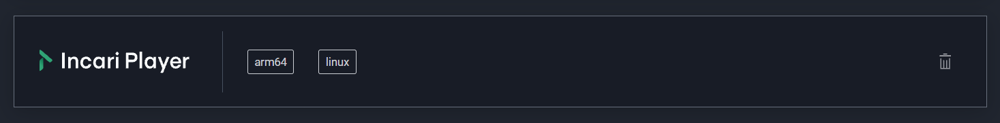

The user then has the option to remove a **Player** by clicking the trash icon to the right.

## Community

### Documentation

The **Documentation** takes you straight to the instructional texts that teach the user the ins and outs of **Incari**, which you are at right now! It gives a run down of the basics, helps you get started, thoroughly explains each component of **Incari Studio**, and provides more information on a few **Demo Projects**. There's a lot to discover in the **Documentation**, written with care by the **Documentation** team.

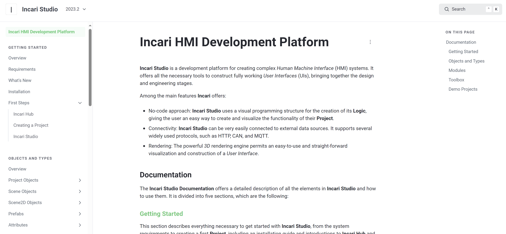

### Forum

The **Forum** is where the **Incari** community can come together to discuss issues, ideas, features, and give feedback.

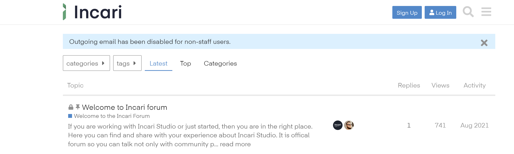

### Support

Clicking on _Support_ takes you to the **Support** channel. It may ask you to log in at first, so don't forget your **Incari Account** password!

Here the user can create _tickets_ to report bugs or suggest new features and improvement. We are always aiming to improve **Incari**, so we are excited to receive _tickets_ from you.

## Settings

In *Settings*, the user can check whether they have *Visual Studio* installed, as per the [requirements](../requirements.md). If it is not, they will be prompted to do so. 

%20-%20Copy.png)

It is possible to choose a proxy server. This means, for example, if there is a proxy server set in *Windows*, the **Hub** will take into account the assigned setting and either ignore it, use the system proxy, or define a proxy server manually.

They can also connect to repositories using the `Add Endpoint` feature. **Projects** in this repository namespace will appear as an option in the upper right corner on the *Remote Projects* section.

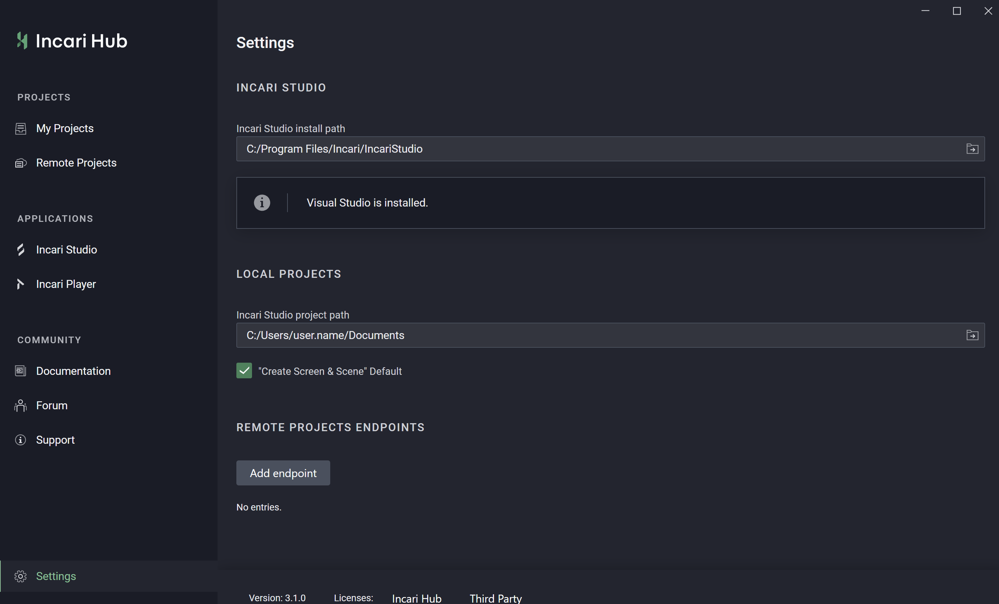
