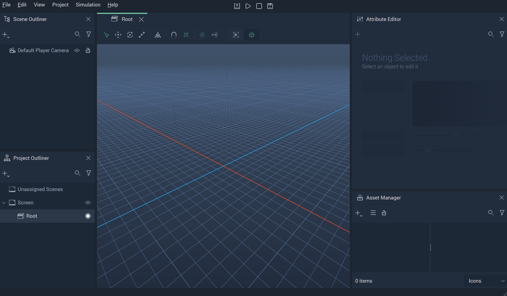
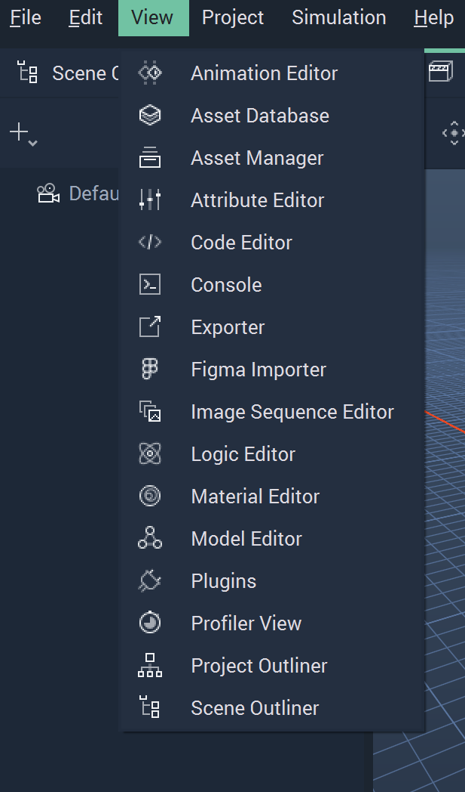
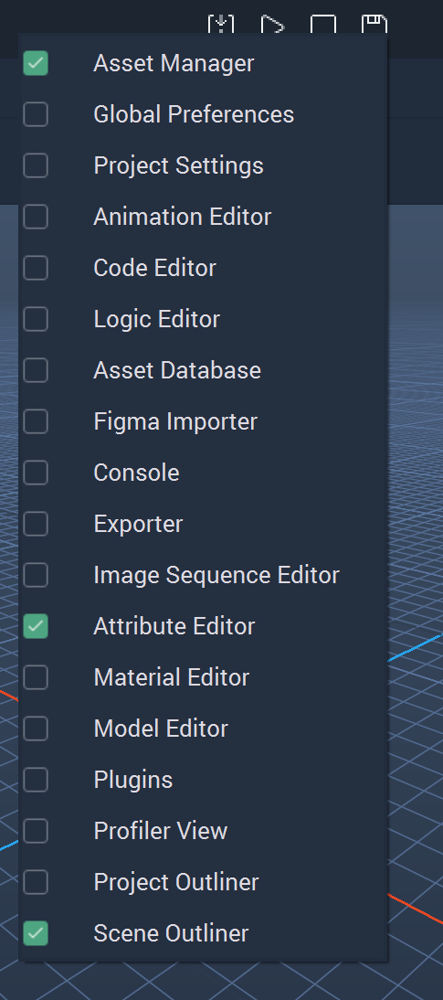
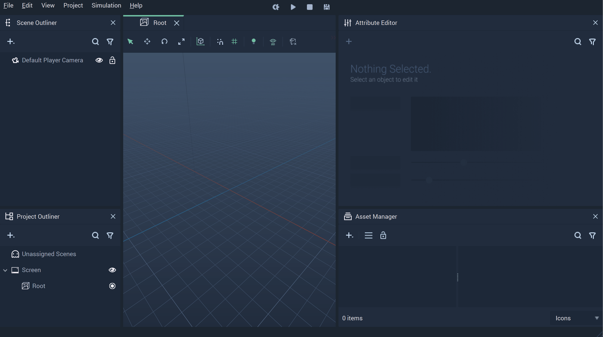
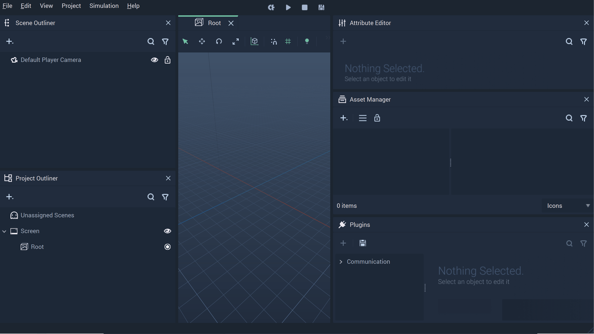
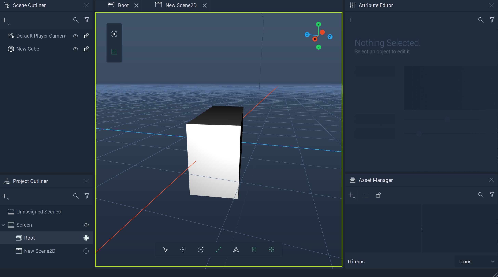
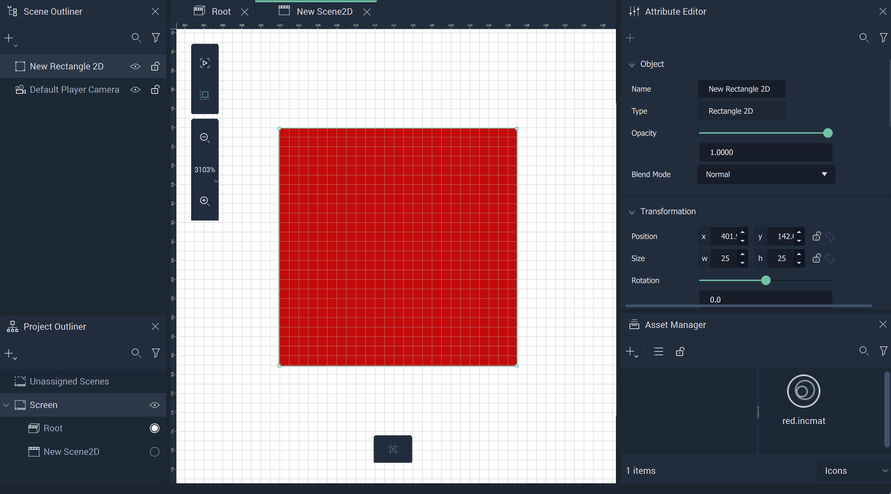

# Incari Studio

After creating a **Project** from **Incari Hub**, **Incari Studio** starts and loads this newly created empty **Project**.

The *Interface* is composed of the **Viewport** and the **Modules**. The **Viewport** contains what will be displayed when the **Project** is played and the different **Modules** offer distinct functionalities to work in the **Project**. For a detailed description of each **Module**, see the **Modules** category of the **Documentation** on the left-hand side index. This page deals with all the possibilities that **Incari** offers in order to accommodate the user's preferences regarding the *Interface*.  

## Modules

When starting a new **Project**, the **Incari Studio** *Interface* looks as in the following image:

There are many **Modules** available in **Incari Studio**. The user can show or hide any **Module** at their discretion in order to customize their workspace. There are several ways of changing the visibility of **Modules**:

* **Modules** can be made visible from the `View` menu in the top bar.

* **Modules** can be shown or hidden by right-clicking the top bar and selecting or deselecting them.

* **Modules** can be hidden by clicking the `x` in the top right corner of each of them.

Besides giving the option to choose which **Modules** are visible, **Incari Studio** gives the user total freedom to customize how the visible **Modules** are organized. Particularly, their position and size can be set by the user.

Moreover, **Modules** can be docked together and then accessed via the tabs that are automatically created.

**Modules** can also be used as independent windows, which can be very useful when working with more than one computer screen.

**Modules** that are individual windows can be locked so they do not dock on the main **Incari Studio** *Interface*. This is done by clicking on the lock icon that appears on the top-right of a **Module** that is displayed as an independent window.

This way, the *Interface* of **Incari Studio** can be customized in the way that best suits the user and their work.

## Viewport

The **Viewport** shows the visual aspects of a **Scene** or **Scene2D**. An **Object's** visibility is governed by the [**Scene Outliner**](../../modules/scene-outliner.md). A hidden **Object** will not appear in the **Viewport**.

The **Viewport** also has two floating toolbars which allow the user to enact changes within its bounds. These can affect the **Objects** themselves or simply alter the way they are presented. These *transformations* can be done on either a local or a global level, which is explained in greater detail [here](../../objects-and-types/attributes/common-attributes/transformation/README.md). They vary slightly between **Scenes** and **Scene2Ds**. The above image shows the **Viewport** in a **Scene**.

### Scenes

There is a gizmo in the upper right-hand corner which allows the user to move the view of the **Viewport** around.

The toolbar at the bottom has seven icons. These correspond to `Select`, `Translate`, `Rotate`, `Scale`, `Local Global`, `Grid`, and `Headlight`, respectively. The *gif* above demonstrates what changes visually when each feature is selected. An eighth icon, `Leave look-through mode`, appears only when one has entered `Look-through Mode`. This can be done by right-clicking a **Camera Object** and selecting it, or pressing `Ctrl+Space` when the **Camera** is selected. 

At the top-left of the **Viewport** is the second toolbar, which governs `Player view` and `Editor view`. It defaults to `Editor view`, but when `Player view` is selected, the user can see what the **Scene** looks like in **Incari Player** without running the **Project**. This saves time and maximizes efficiency. 

In `Player view`, it is possible to zoom in and out by clicking the icons or scrolling up and down on the mouse or a device's touchpad. One can also pan, not just by clicking and dragging the scrollbars to the right and bottom of the **Viewport**, but also by holding down a mouse's middle button and moving the mouse around.

### Scene2Ds

The toolbar at the bottom governs the enabling of the `Grid`. The *gif* above shows how this looks like when clicked on and off. 

At the top-left of the **Viewport** is the second toolbar, which governs `Player view` and `Editor view`. It defaults to `Editor view`, but when `Player view` is selected, the user can see what the **Scene** looks like in **Incari Player** without running the **Project**. This saves time and maximizes efficiency. 

In both `Editor view` and `Player view`, it is possible to zoom in and out by clicking the icons or scrolling up and down on the mouse or a device's touchpad. One can also pan, not just by clicking and dragging the scrollbars to the right and bottom of the **Viewport**, but also by holding down a mouse's middle button and moving the mouse around.