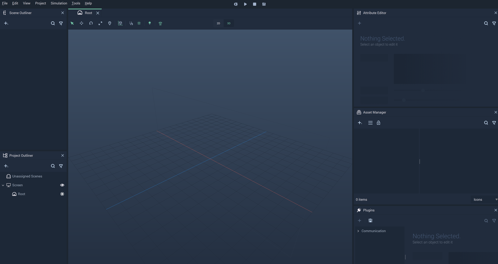
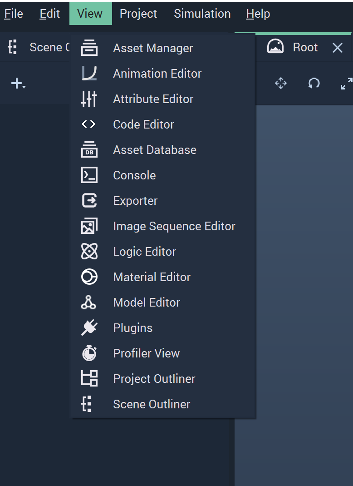
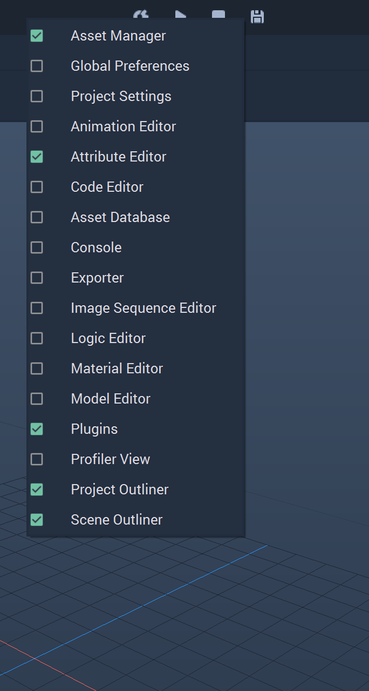
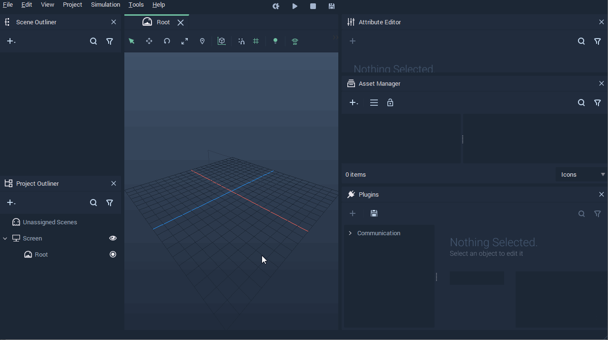
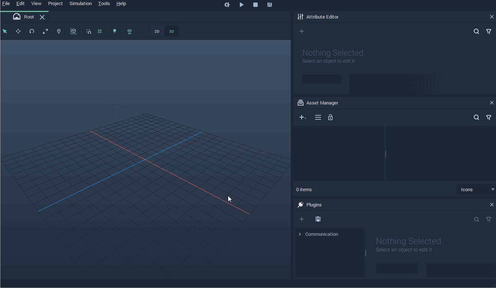
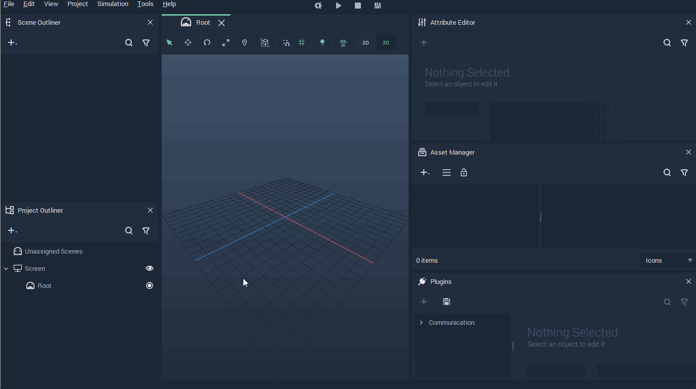
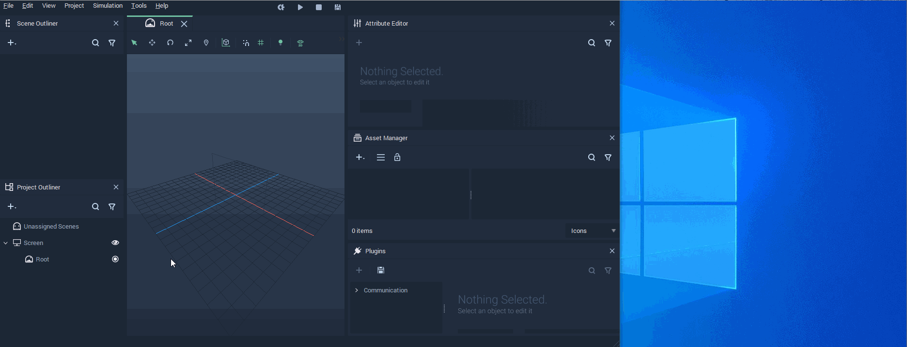
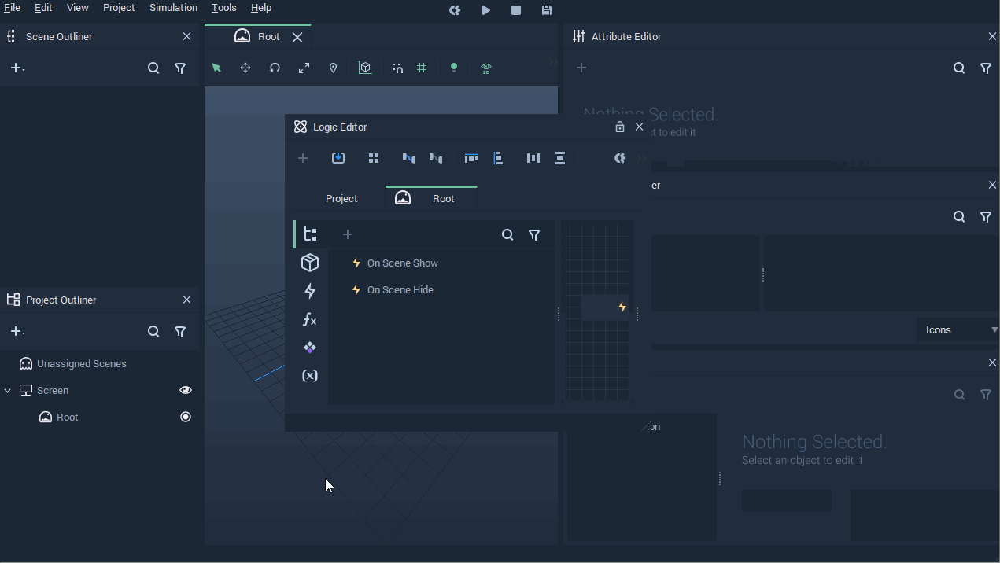

# Incari Studio

After creating a **Project** from **Incari Hub**, **Incari Studio** starts and automatically loads this newly created empty **Project**.

The *Interface* is composed of the **Viewport** and the **Modules**. The **Viewport** contains what will be displayed when the **Project** is played and the different **Modules** offer distinct functionalities to work in the **Project**. For a detailed description of each **Module**, see the **Modules** category of the **Documentation** on the left-hand side index. This page deals with all the possibilities that **Incari** offers in order to accommodate the user's preferences regarding the *Interface*.  

When starting a new **Project**, the **Incari Studio** *Interface* looks as in the following image:

There are many **Modules** available in **Incari Studio**. The user can show or hide any **Module** at their discretion in order to customize their workspace. There are several ways of changing the visibility of **Modules**:

* **Modules** can be made visible from the `View` menu in the top bar.

* **Modules** can be shown or hidden by right-clicking the top bar and selecting or deselecting them.

* **Modules** can be hidden by clicking the `x` in the top right corner of each of them.

Besides giving the option to choose which **Modules** are visible, **Incari Studio** gives the user total freedom to customize how the visible **Modules** are organized. Particularly, their position and size can be set by the user.

Moreover, **Modules** can be docked together and then accessed via the tabs that are automatically created.

**Modules** can also be used as independent windows, which can be very useful when working with more than one computer screen.

**Modules** that are individual windows can be locked so they do not dock on the main **Incari Studio** *Interface*. This is done by clicking on the lock icon that appears on the top-right of a **Module** that is displayed as an independent window.

This way, the *Interface* of **Incari Studio** can be customized in the way that best suits the user and their work.