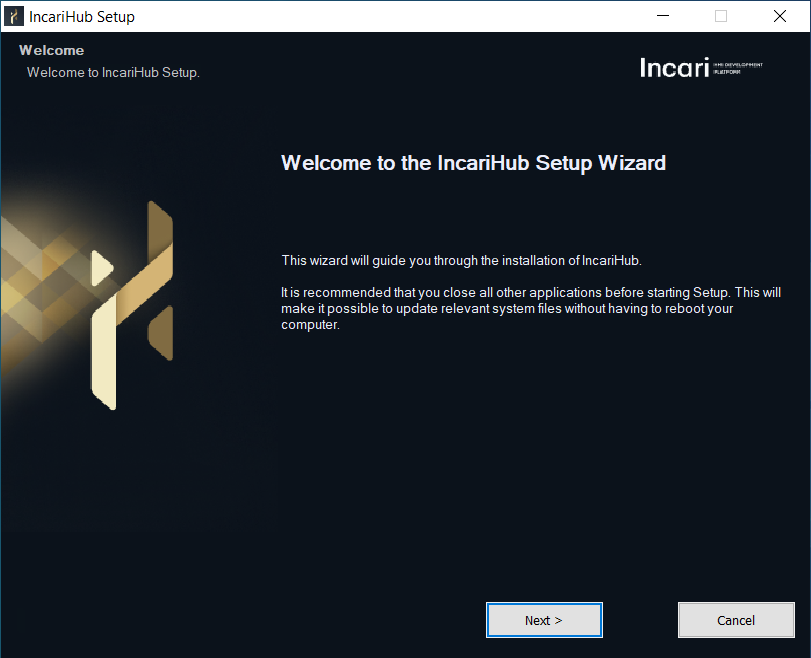
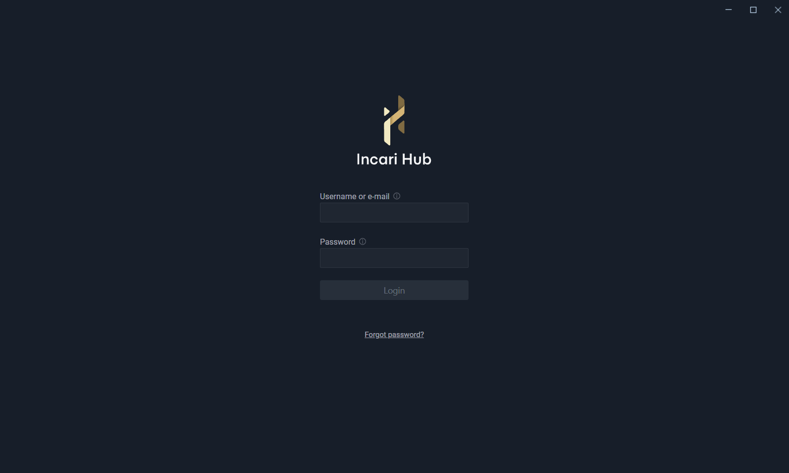
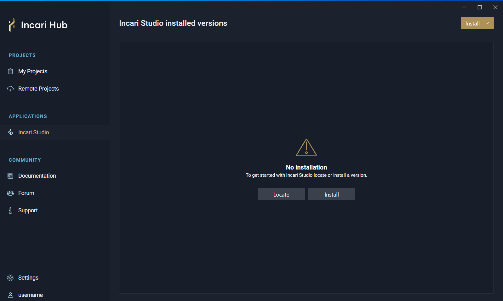
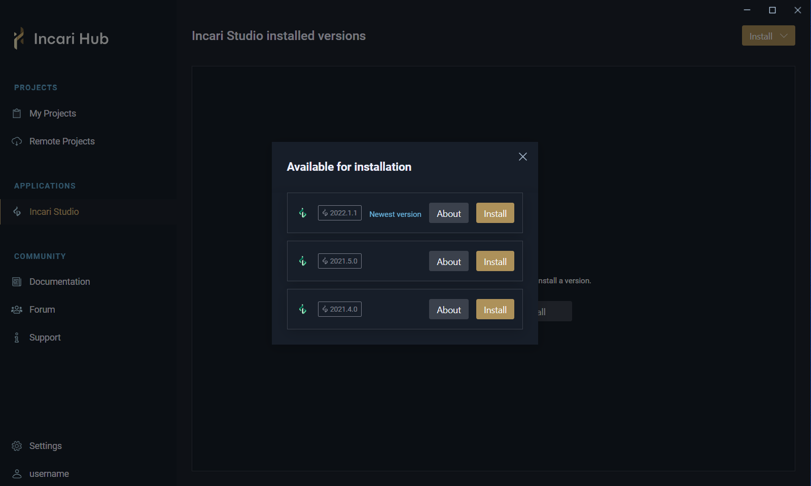
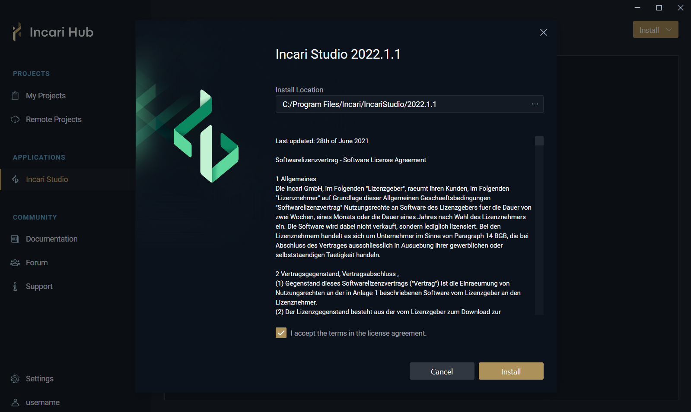
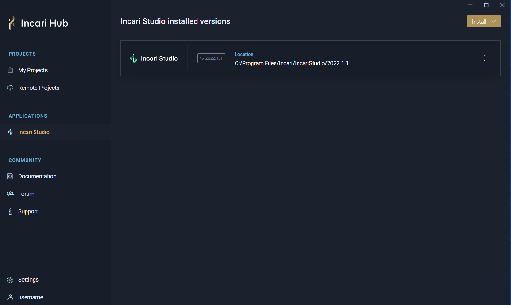
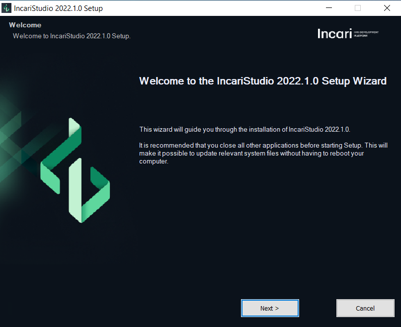
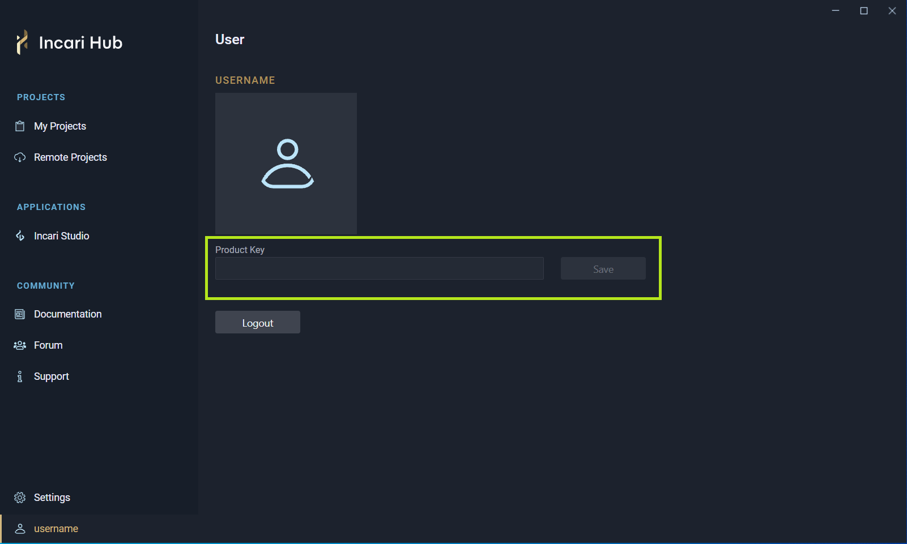

# Installation

At the moment **Incari** relies on the Windows SDK that comes with [Visual Studio](https://visualstudio.microsoft.com/downloads/) (free version).
Then, the first step is to install the Visual Studio 2022 Community Edition (Desktop Development C++ setup), start it once and create a profile.

For installation and licensing of **Incari Studio**, please follow these steps:

* Register in the **Incari** [website](https://www.incari.com/my-account/) and then activate your account from your e-mail.

* After activating your account, log-in and go to Downloads. Here you can download **Incari Hub**.

* Install and then start **Incari Hub**. 

* Log-in into **Incari Hub** with your **Incari** credentials.

* In **Incari Hub**, go to the **Incari Studio** tab, under _Applications_. Here you can manage your installed versions of **Incari Studio** and install new ones.

* Press on "Install". Then you will see the available versions of **Incari Studio** to install.

* To install **Incari Studio** 2022.1, press on the "Install" button and the following message will appear:

* Choose the Install Location, accept the terms in the license agreement and click on "Install", then the installation will start.

* After the installation is completed, **Incari Studio** 2022.1 will appear in "Incari Studio installed versions":

<!-- * After the download is finished, the install window for **Incari Studio** 2022.1 will open. Click "Next" to proceed and go through the installation process.

 -->

*  Go to the **Incari** [website](https://www.incari.com/my-account/), where you can manage your subscriptions and obtain the license key.

* Use the license key to activate your subscription in **Incari Hub**.

* After installation, the first step to start using **Incari Studio** is to [create a **Project**](first-steps/creating-a-project.md).

