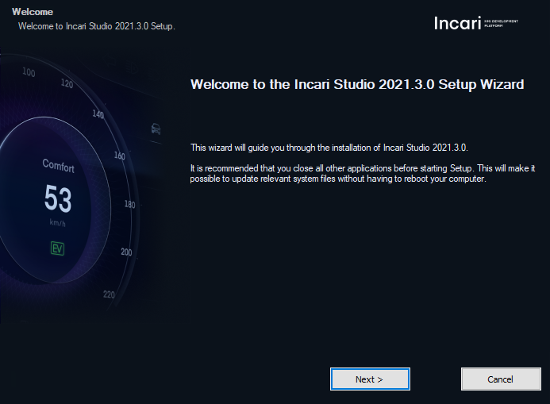
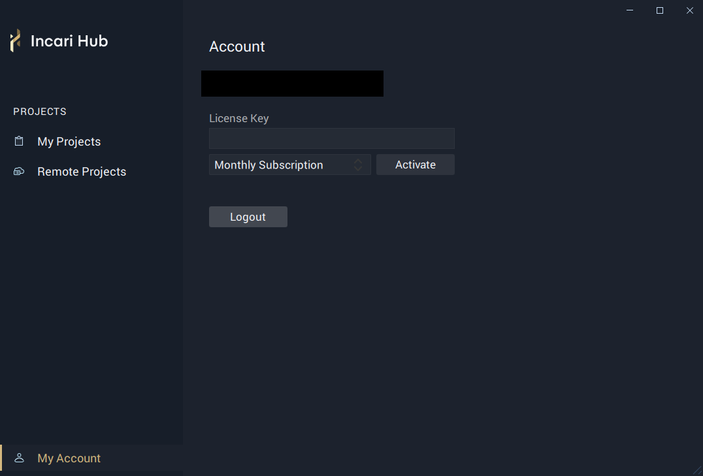

# Installation

Installation and licensing:

1. Download the **Incari Studio** installer `Incari Studio-2021.3.0-installer.exe` from the **Incari** [website](https://www.incari.com/).
2. Execute `Incari Studio-2021.3.0-installer.exe` and follow the instructions.
3. Click "Next" to proceed and go through the installation process.

   4. After installation, start **Incari Hub**, which can be found in the folder where **Incari** was installed. 

5. Log-in into **Incari Hub** with your **Incari** credentials.

6.  Go to the **Incari** [website](https://www.incari.com/my-account/) and log-in, here you can manage your subscriptions and obtain the license key.

7. Use the license key to activate your subscription in **Incari Hub**.

