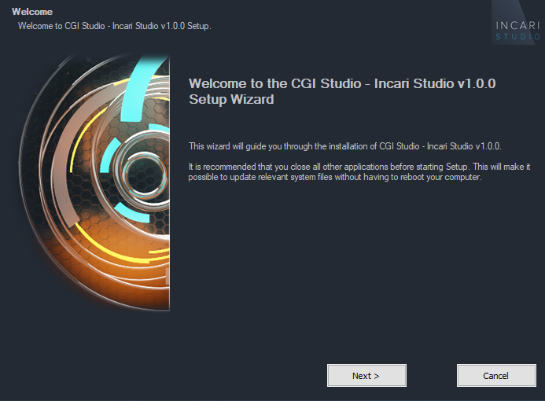
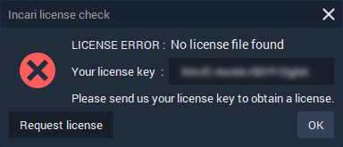

# Installation and License \*

Installation and licensing:

1. Download the **Incari Studio** installer \(Incari Studio v1.0.exe\) from the CGI-Studio website.
2. Execute the Incari Studio v1.0.exe and follow the instructions.
3. Click "Next" to proceed or "Cancel" to stop the current installation. 

1. After installation, start **Incari Studio** by double-clicking the shortcut icon on your desktop.  
2. On the first startup, there is a license dialog. Copy the license request key, send it to the vendor and apply for a valid license.

Install License:

After receiving the license file, please copy the provided **incaristudio.lic** into the installation folder of INCARI Studio. The default installation path is C**:\Program Files\CGI Studio\INCARI Studio**

After copying the license file to the installation folder you can start using INCARI Studio.

