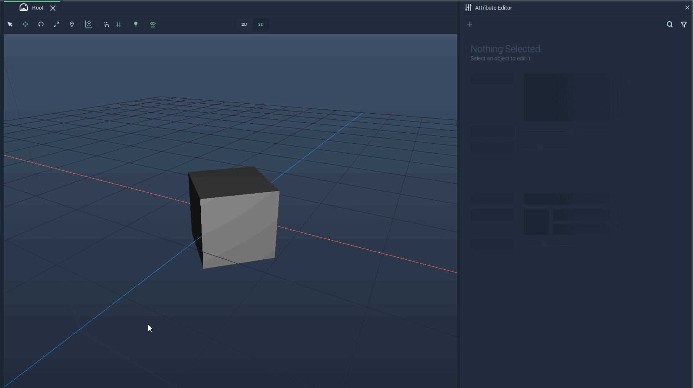
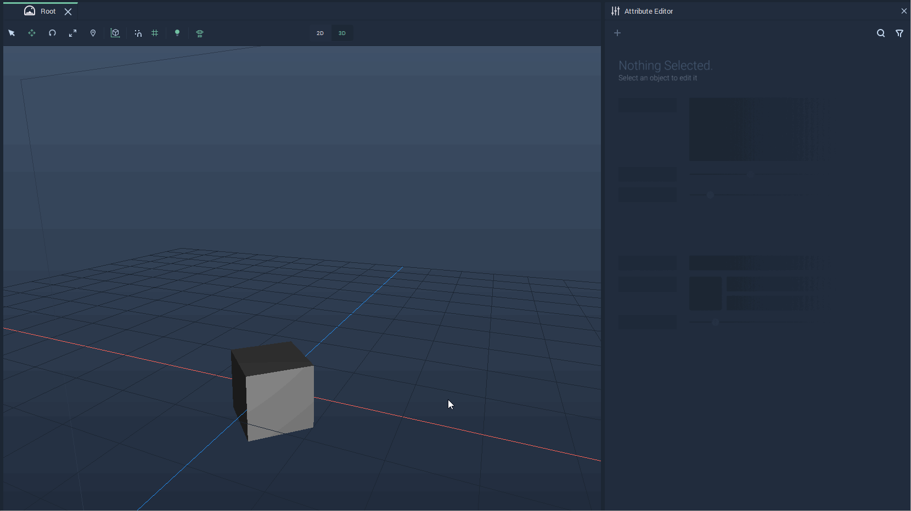
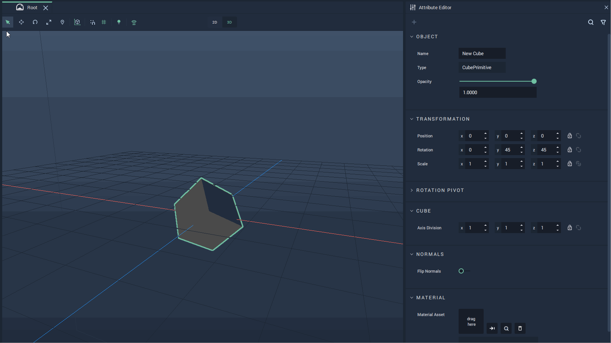
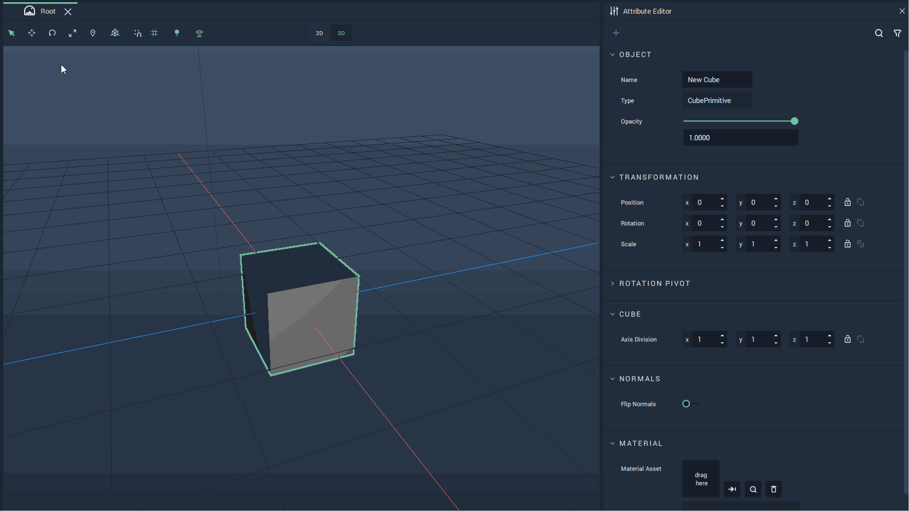
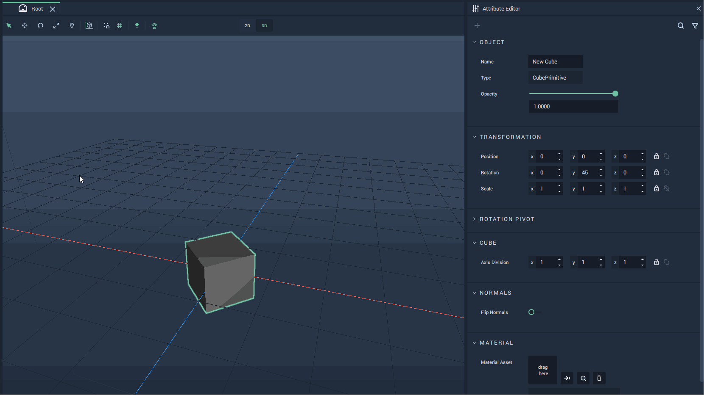

# Local and Global Transformations

All **Objects** in **Incari** have a set of **Transformation** **Attributes** that define their location in *3D* space. For any **Object**, these **Attributes** can be modified either in the **Attribute Editor** or directly on the **Viewport**. This entry covers how **Transformation** **Attributes** can be controlled in the **Viewport** and particularly how to work with **Global** and **Local** **Transformations**.

## Local and Global

The difference between **Global** and **Local** **Transformations** is the set of axes along which the **Transformation** is performed. **Global** **Transformations** are done along the **Scene** axes and **Local** **Transformations** are done along the *principal axes* of the **Object**.

To switch between **Local** and **Global** simply click on the `Local Global` icon on the top Menu of the **Viewport**.

In the example below, the sets of axes used for **Global** and **Local** transformations can be seen. The cube is rotated 45° along the Y axis, thus making the **Local** axes also rotated 45° along the Y axis with respect to the **Global** axes. Further rotations of the cube would rotate its **Local** axes keeping them in the *principal axes* of the **Object**.

## Position

To modify an **Object's** **Position**, click on the `Translate` icon, second from left to right on the top Menu. This will show the axes along which the **Object's** **Position** can be modified. To switch between the **Local** and **Global** axes, click on the `Local Global` icon on the top Menu.

To move an **Object** along an axis, click on the preferred axis and drag the **Object**.

The example below shows an **Object** being moved along the **Global** axes first and then along its **Local** axes.

## Rotation

To be able to rotate an **Object**, click on the `Rotate` icon, third from left to right on the top Menu. This will make appear the *rotation gizmo* for the **Object**. Each circle represents an axis along which a rotation can be performed. For rotating the **Object**, click on a circle of the gizmo and drag towards the direction in which to perform the rotation. Clicking on the `Local Global` icon on the top Menu switches the axes along which the **Object** is rotated between the **Global** and **Local** axes.

**Rotation Pivot**

The **Rotation Pivot** is the point with respect to all rotations are performed. It is by default set at the center of the **Object**. To visualize it, click on the `Pivot` icon on the top Menu, which is the fifth from left to right. Then, it is possible to move the **Pivot Widget** and set a different **Rotation** **Pivot**.

## Scale

## Several **Objects**

It is also possible to perform **Local** and **Global** **Transformations** on several **Objects** at once. For this, simply select the **Objects** to modify either in the **Scene View** or in the **Scene Outliner**. It will show the gizmo positioned in the center of all the selected **Objects** and in the case of **Local Transformations**, the axes direction of the last selected **Object**.

**Transformations** will then apply to all selected **Objects**.

The example below shows first the **Transformation** gizmo of each individual **Object** and then how it looks when they are all selected.

The example below shows a **Transform** on the position of two rotated cubes.

The example below shows a rotation performed over two cilinders.

## Groups

It is also possible to perform **Transformations** over several **Objects** by putting them into a **Group**. Then, performing **Transformations** over the **Group** will **Transform** the **Objects** that compose it as if they all were just parts of only one **Object**.

