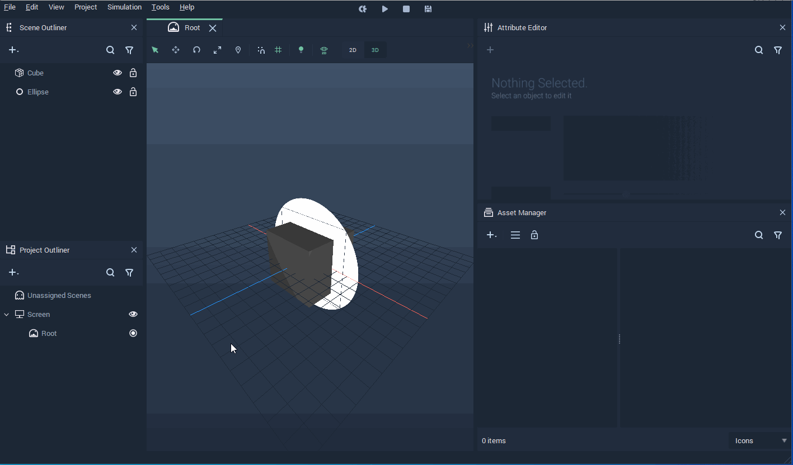
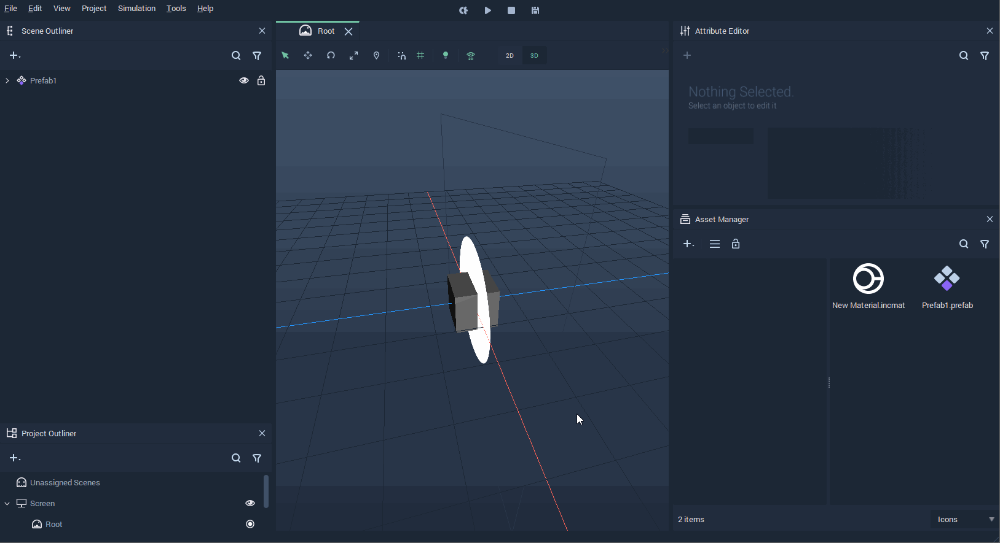
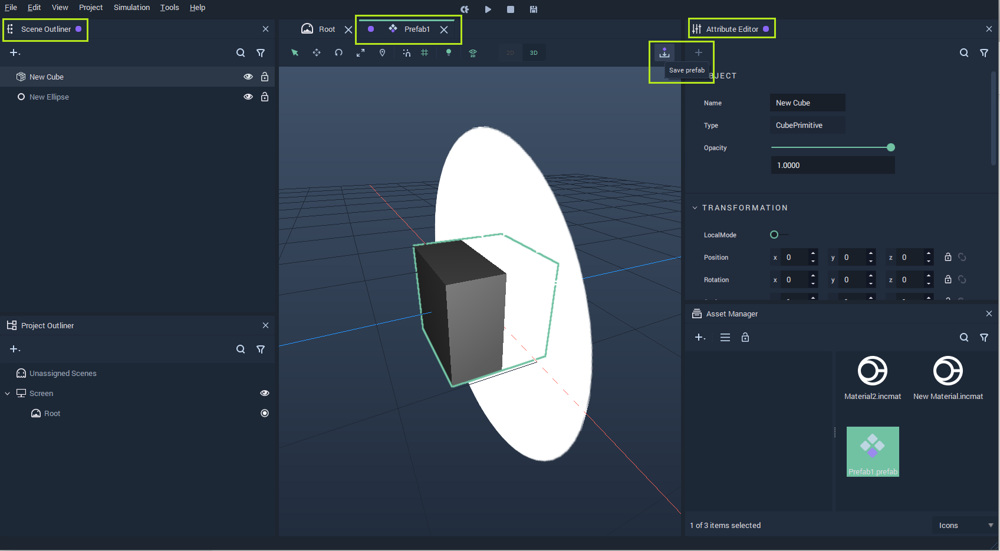
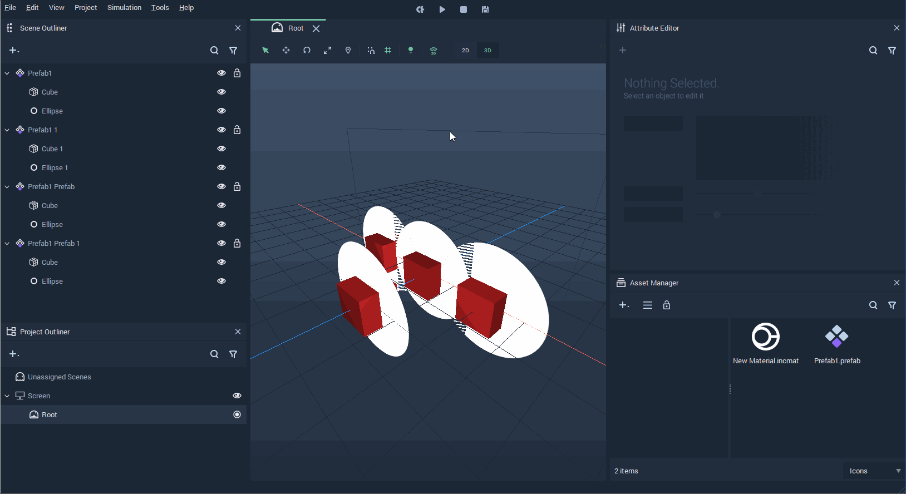

# Creating and Using Prefabs

A **Prefab** consists of a collection of **Objects** that can be instantiated several times. Each of these **Instances** acts like a single **Object** and can retain unique properties via overrides. The characteristics that are shared through all **Instances** of a **Prefab** are managed from the **Prefab Asset** which is generated whenever a **Prefab** is created. Changes made in the **Prefab Asset** are enacted across all **Instances**.

This section shows how to get started with **Prefabs**. It first describes how **Prefabs** can be created and next it shows how to edit the **Prefab Asset**, thus modifying all **Instances** of the **Prefab**. Finally, it describes how to edit one single **Prefab Instance**.

## Creating Prefabs

For creating a **Prefab**, go to the **Scene Outliner** and select the **Objects** that will compose the **Prefab**, then right-click and click on `Make Prefab`. This will create a **Prefab** consisting of the selected **Objects** and a new **Prefab** **Asset** will be generated in the **Asset Manager**.

New instances of the **Prefab** can be created by either duplicating the existing **Prefab** in the **Scene Outliner** or by dragging the **Prefab Asset** from the **Asset Manager** to the **Scene Outliner** or the **Scene**.

## Editing the Prefab Asset

To edit the **Prefab** **Asset**, double-click the **Prefab** in the **Asset Manager**. This will open the **Prefab View** in both the **Scene Outliner** and **Attribute Editor**. The **Prefab** view is indicated by a purple circle. Changes made here affect all instances of the **Prefab**. 

For the changes made in the **Prefab Asset** to take effect, it is necessary to save them by pressing the `Save prefab` button on the top right corner of the **Viewport**.

## Editing a Prefab Instance

Each **Instance** of a **Prefab** can be modified on its own and this overrides the **Attributes** from the **Prefab Asset**. To do this, simply edit the **Object** in the **Prefab** instance.

 