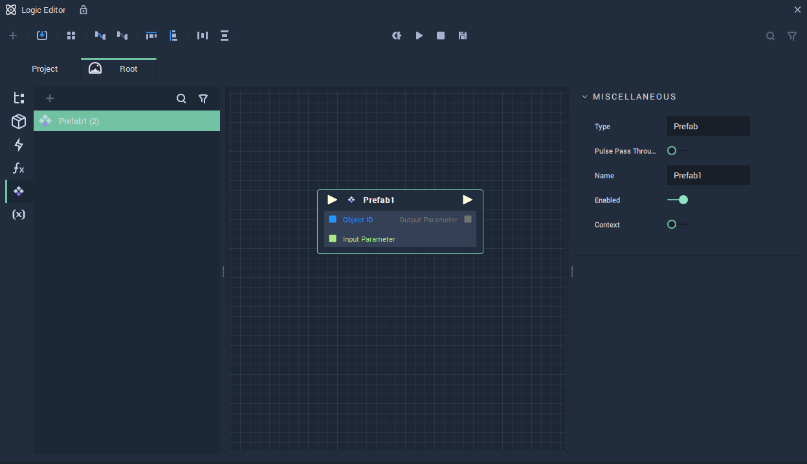
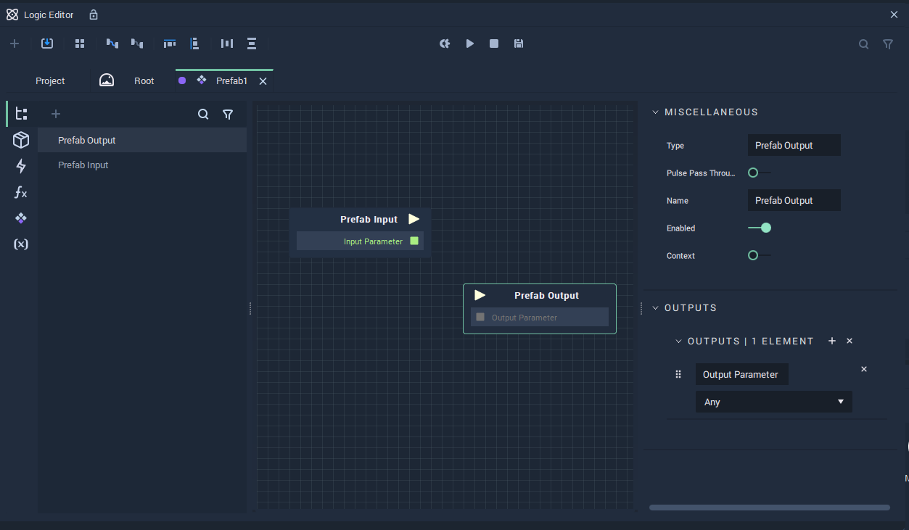

## Logic

**Prefabs** have their own **Logic** encapsulated within them and it applies to all instances of the **Prefab**. The **Prefab** **Logic** can be incorporated into the **Scene Logic** via a **Prefab Node**.

To open the **Prefab Logic** graph in the **Logic Editor** either double click the **Prefab Node** in the **Logic Editor** or the **Prefab Asset** in the **Asset Manager**.

The **Prefab Logic** has two **Nodes** by default: **Prefab Input** and **Prefab Output**. These represent the **Input** and **Output** of the **Prefab Node**.

These two **Nodes** can have their **Attributes** customized: **Input Sockets** can be added to the **Prefab Input** **Node** and **Output Sockets** to the **Prefab Output** **Node**. These changes will then be reflected in the **Prefab Node**.