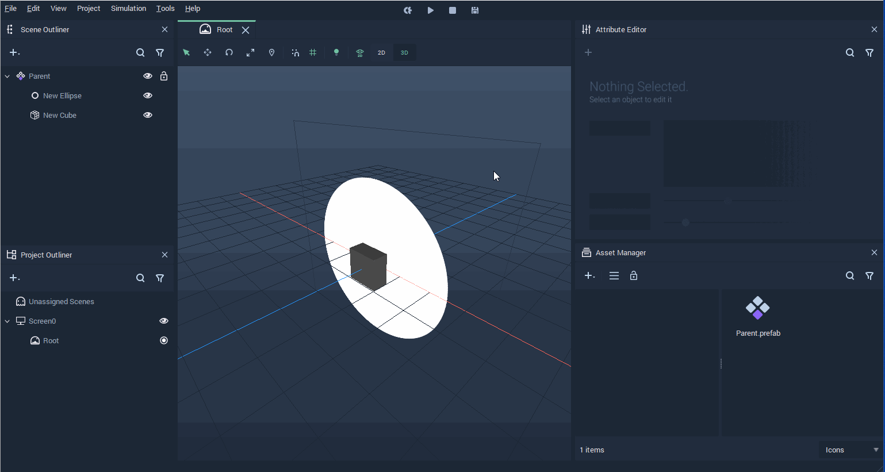
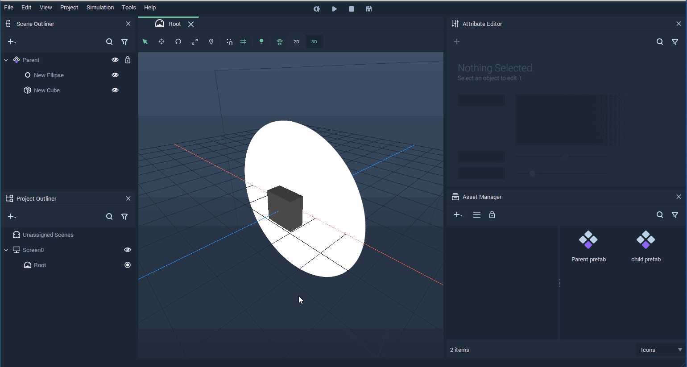

# Nested Prefabs

It is possible to include **Prefabs** within other **Prefabs**. These are called **Nested Prefabs**.

To create a **Nested Prefab**, go to the **Prefab View** of the **Prefab** in which you wish to include another **Prefab** and add in it a **Prefab** by either creating a new one or using an existent one.

