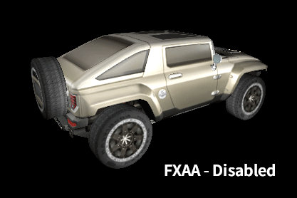
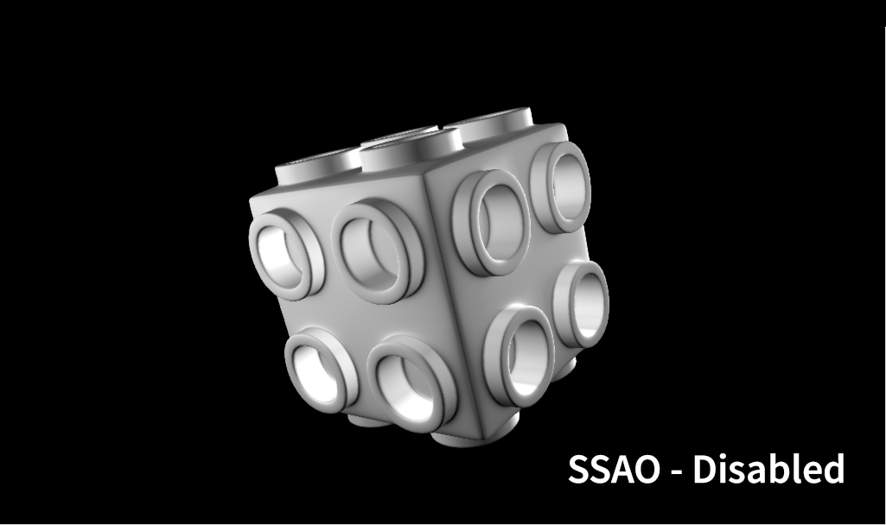

# Screen

The **Screen Object** in **INCARI** contains the technical specifications of the physical display that the **Project** will ultimately displayed on. In addition, it also has **Attributes** relating to the virtual **Camera** and rendering.

## Attributes

A **Screen's Attributes** can be edited by selecting it in the **Project Outliner** and adjusting them in the **Attribute Editor**, like you would with **Scene Objects**.

### Transformation

Each **Scene** has the standard **Transformation Attributes**, however it is worth noting that, in order to have two-dimensional **Objects**, such as **Text** and **Sprites**, be displayed correctly, they should have the same **Transformation** as the **Screen** and sit on the same plane.

### Camera

Each **Screen** has a built-in **Camera Object**, with the same **Attributes**. For more information, take a look at the **Camera** page.

### Simulation Window

`Position` defines the offset position, in pixels, that the **Simulation** will be displayed on your monitor. This means that when you are working on a multi-display system, you can preview **Screens** on separate parts of your monitor.

By default, the **Simulation** will be shown in the left-hand corner of your monitor \(0, 0\), with `x` representing the amount of pixels between the left-hand side of the **Simulation** window and the left hand side of your monitor, and `y` representing the amount between the top of the window and top of your monitor.

### Background

The `Color` **Attribute** defines the background colour of the **Simulation** and is solid black by default.

### FXAA

**Fast Approximate Anti-Aliasing** \(**FXAA**\) is a post-processing effect, which detects edges in an image and smooths them. This _may_ help improve how 2D and 3D **Objects** are displayed. _After_ each frame has been rendered, the effect is applied per-pixel and doesn't consider 3D geometry or know what should be smoothed and what shouldn't. As a result, it may unintentionally smooth the wrong parts of the image and may not be the best option. It is often a trade-off between improved smoothness of jagged areas of geometry at the loss of some crispness of textures.

In terms of options, `Mode` changes the way the effect is calculated, with `fast` being more performant than `accurate`, which may give better results at the expense of some calculation speed.

`Enabled` enables/disables the effect entirely. Turning the effect off is of course the most performant option, and should be considered if it isn't necessary or you are having performance issues. Another point worth noting is that **FXAA** doesn't consider movement at all, and may produce undesirable results in cases where you have fast moving objects.

### SSAO

**Screen Space Ambient Occlusion** \(**SSAO**\) is a post-processing effect, which takes both the _depth_, and _normal_ information of 3D geometry within a **Scene**, to approximate areas of occlusion and exposure to ambient light. What this means is that areas such as corners and cavities are darker, creating a more realistic representation of the way light behaves in the real world.

Like **FXAA**, the effect can be disabled/enabled by toggling the `Enabled` option, but it also has a few extra **Attributes** to consider.

`Radius` defines the spread of darkened areas, with a lower value resulting in smaller, crisper occluded areas, and bigger values producing a darker, but softer result.

`Samples` defines the amount of samples to be used in the calculation, with lower values being cheaper in terms of processing time required, at the expense of quality. Higher samples invariably give a better result, but you also sacrifice performance. It often comes down to tweaking the `Radius` and `Samples` values to find the sweet spot between quality and performance.

