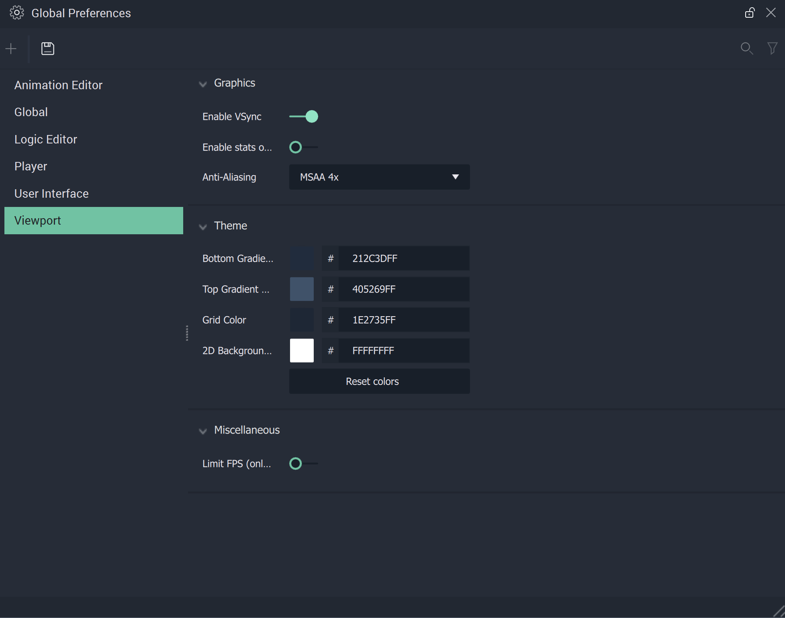

# Requirements

| Category | Requirement |
| :--- | :--- |
| CPU | X86\_64 CPU Quadcore with 2Ghz |
| RAM | Minimum of 4GB |
| GPU | Graphics Card: Support of OpenGL 3.3 or higher, min 1 GB Video-RAM |
| HDD | Minimum of 2GB free space |
| OS | min Windows 7 or Debian based Linux Derivate |
| Compile | MS Visual Studio 2022 (Desktop Development C++ setup)|

Disclaimer: 

It is not unheard of to sometimes have problems with high *GPU* usage when using **Incari Studio**. There are a couple of workarounds, one which requires access to the *Nvidia Control Panel*.

One can start off by clicking through `Global Preferences --> Viewport --> Enable VSync` and making sure it is toggled on. If this remedies the issue, the next steps are not necessary to investigate. 

 

However, if the high *GPU* usage of **Incari Studio** has not been fixed, it is suggested to open up *Nvidia Control Panel*. It could be that the settings here are overriding those in **Incari Studio**, which
leads to high FPS (up to 500) and high GPU usage (up to 90%). 

The user can either set `Vertical Sync` (located under `Manage 3D Settings`) to `On` or `Use the 3D application setting`. This will result in the framerate being locked to the native display framerate; the GPU 
usage should drop to around ~20% for a small **Project**. Results may vary for large and robust **Projects**. 