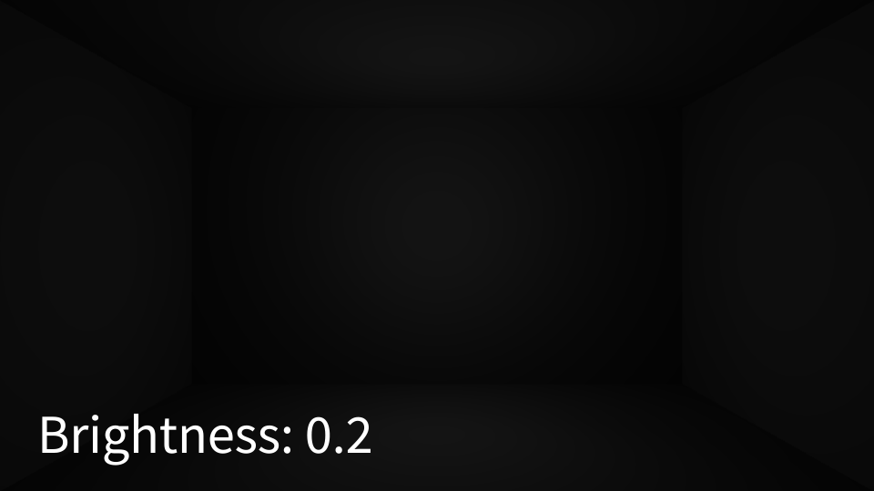
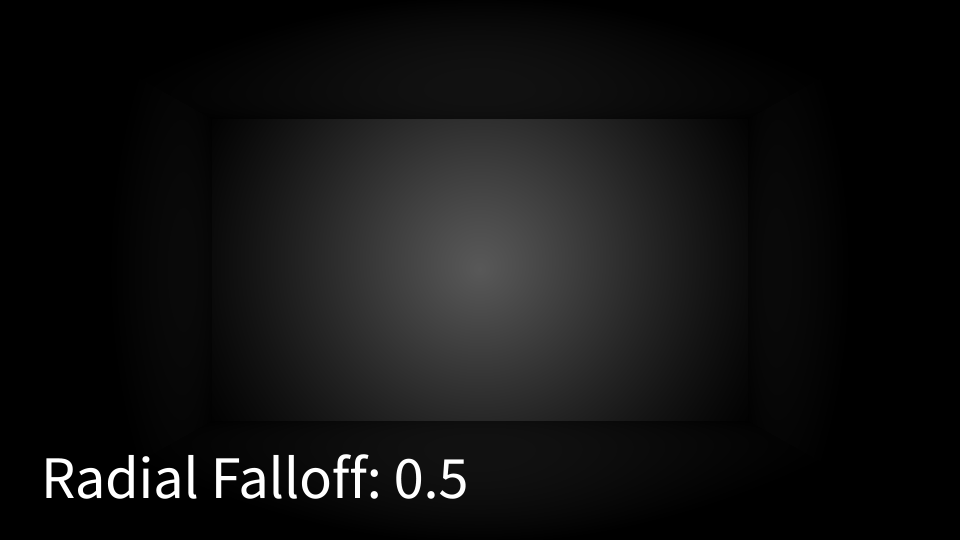
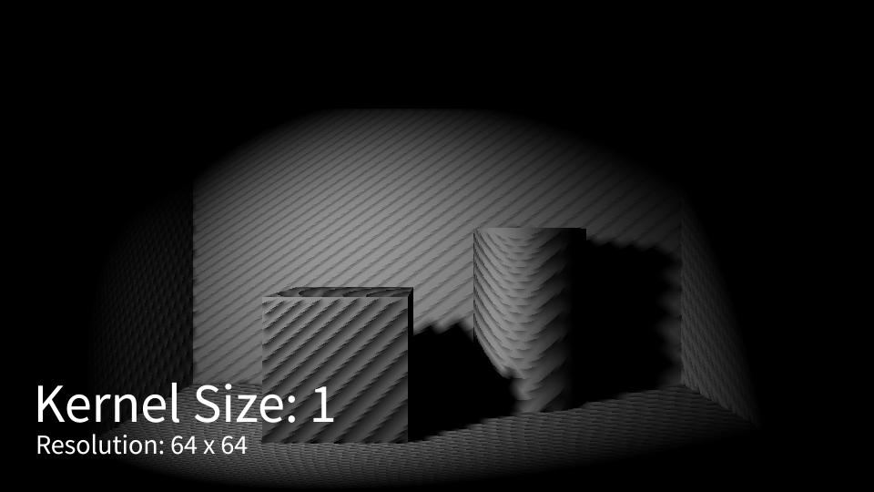
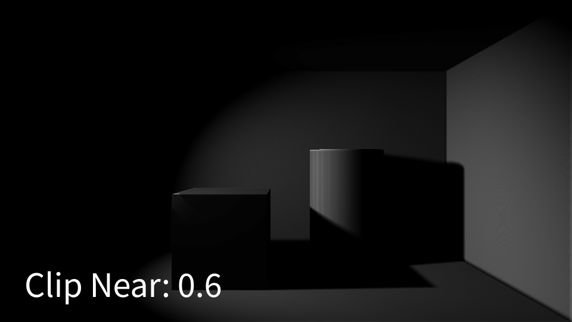
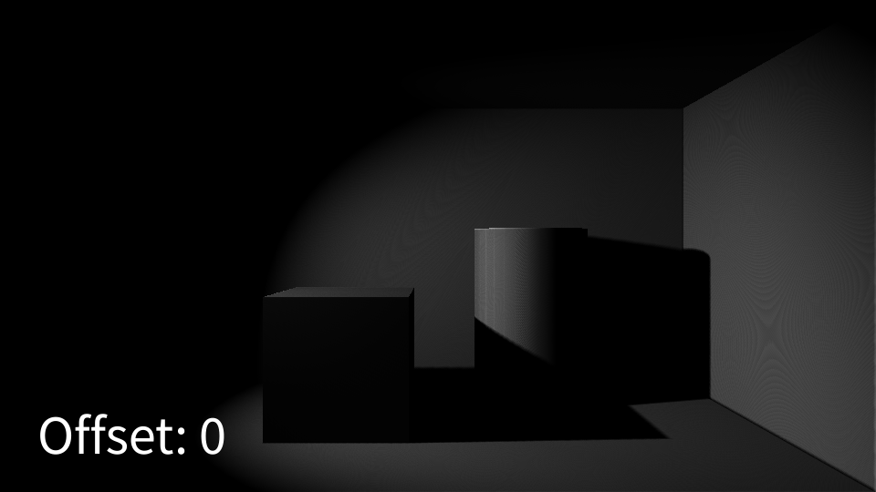

# Lights

**Incari** has two types of **Light Objects**: the **Spot Light** and the **Point Light**.

The **Point** **Light** is _omnidirectional_, meaning that light is emitted equally in all directions; while the **Spot Light** is _directional_ and will only light the area that it is rotated towards. Additionally, unlike **Point Light**, **Spot Light** supports shadow mapping and has an extra set of **Attributes** for that purpose.

| Attribute | Spot Light | Point Light |
| :--- | :--- | :--- |
| `Color` | ✔ | ✔ |
| `Brightness` | ✔ | ✔ |
| `Attenuation` | ✔ | ✔ |
| `Radial Falloff` | ✔ | ✘ |

## Light

### Color

`Color` determines the color of the light being emitted.

Please note that the `Color` **Attribute's** _brightness_ level will affect the brightness of the light itself. It is recommended that you always have the brightness level set to 1 and use the actual `Brightness` **Attribute** to alter the intensity of the light.

`Color's` _alpha_ level has no effect.

### Brightness

`Brightness` governs the intensity of the light, with lower values giving less intense light emission and vice versa.

### Attenuation

`Attenuation` relates to the spread, or reach, of the light. Lower levels only illuminate close **Objects**, whereas high levels allow the light to reach **Objects** that are further away.

### Radial Falloff

`Radial Falloff` is used to change the smoothness of the light falloff. Lower levels will give a smoother transition between light and dark areas, but will be darker overall. Higher levels give a more contrasting light-to-dark transition and will appear comparatively brighter.

This **Attribute** is only available on the **Spot Light Object**.

## Shadow Mapping

**Shadow Mapping** is a performant method of approximating shadows in real-time. Without getting too technical, **Shadow Mapping** takes the depth and normal passes of the **Scene** from the perspective of the **Spot Light**, calculates which areas are occluded, and projects the shadow map onto the **Scene**.

There is no 'one size fits all' setup for **Shadow Mapping**. It is invariably a matter of tweaking and adjusting to achieve the desired visual result for your **Scene**, as well as meeting the _performance_ requirements of your **Project**.

### Enable

**Shadow Mapping** can be turned off/on using the `Enable` switch. Whether or not you use this effect often comes down to performance. If you are having performance issues, then you should consider removing the effect, or adjusting the other settings.

### Resolution

`Resolution` alters the size of the shadow map. Just like with normal *2D* textures, higher resolutions produce better quality, at the cost of increasing processing time and file size.

### Kernel Size

`Kernel Size` relates to the size of each sampled area during the calculation. It is a fairly complex subject, but it basically affects the smoothness of the shadow map. Lower levels give crisp, but jagged, shadows; higher levels give smoother, but less defined results.

Increased `Kernel Size` may help improve results that suffer from _shadow acne_ or reduce artifacts in cases where the shadow map `Resolution` is low.

### Clip Near

As stated above, **Shadow Mapping** takes passes from the **Light's** perspective. Like the `Clip Near` **Attribute** of **Camera**, everything within the defined distance isn't rendered and is therefore excluded from those passes and the **Shadow Mapping** algorithm.

### Offset

`Offset` offsets the depth of the shadow map and can massively improve its appearance by reducing _shadow acne_. It is recommended that you increase this value by very small increments \(0.0001\), until you get an acceptable reduction in artifacts.

Due to the effect `Offset` has on the **Shadow Mapping** algorithm, higher values can cause shadows to appear to become disconnected from the geometry that casts them.

