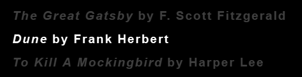
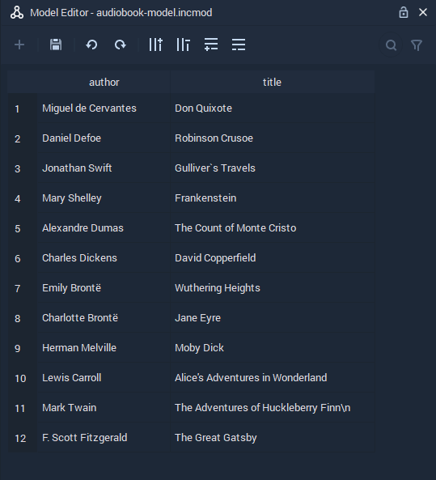
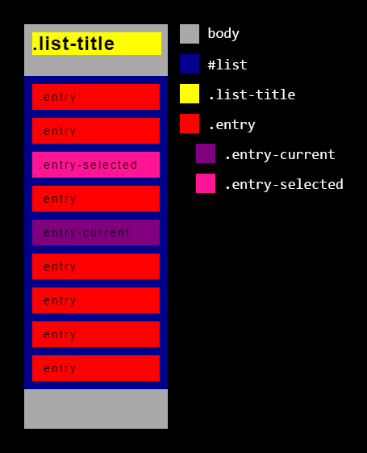
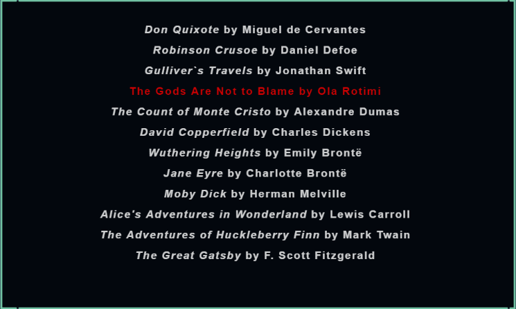

# List

## Overview

**List Objects** model data as single-level list items in a **Scene**. It utilizes a _model/view_ architecture whereby data added to an **Incari Model File** is presented as a **List** in the **Scene**.

Like any other **Scene Object**, we can manipulate its **Transformation Attributes** and adjust its **Rotation Pivot**.

## List

### Title

This is the optional text that you wish to appear as a header for your list. It works like an `<h1>` tag in HTML.

### Font Family

`Font Family` allows you to select a generic font family \(`monospace`, `serif`, `sans-serif`\) or add your custom font.

### List Entry File

This takes a local `.html` file, which defines a template for how each list item is displayed. You can create one by right-clicking in the **Asset Manager** and selecting `Create asset` &gt; `List Entry`. This method will create a new `.html` file, containing some example HTML text.

The way that we populate our list with content from our **Model** file is by creating placeholders, with the name of the corresponding **Field**, surrounded by double curly braces.

For example, let's say that we have a list of audio-books, with two fields: `title` and `author`.

In our **List Entry File**, we would have the following:

```markup
<h2><i>{{ title }}</i> by {{ author }}</h2>
```

This would make our list items look something like this:



To read more about basic HTML, take a look at [_HTML basics_](https://developer.mozilla.org/en-US/docs/Learn/Getting_started_with_the_web/HTML_basics) by Mozilla.

### Incari Model File

A **Model File** is where you define all the data for your list. Physically, a book has many different properties. It has weight, size, number of pages etc., but when thinking in terms of a **Model**, we are thinking of what properties we need to represent in our data. Going back to the audio-book example above, if we want to display two properties; the author and title of each audio-book, we create **Fields** for `title` and `author`.



**Fields** define a single aspect of each **Record** in a table and are displayed in columns. By _double-clicking_ on the **Field**'s _header / label_ we can define the name that will be used as a placeholder in the **List Entry File**.

**Records** are entries in the table and contain the data itself. By adding **Records**, we add more rows to the **Model**, and therefore, the **List**.

### Style File

`Style File` references a `.css` file, which contains style data for our **List**. The best way to create this file is by _right-clicking_ in the **Asset Manager** and selecting `Create asset` &gt; `List Style`. This creates a file with all of the relevant IDs and classes already inside and ready to edit.

How to write CSS won't be discussed here, but there is an abundance of information online, such as [_Learn to style HTML using CSS_](https://developer.mozilla.org/en-US/docs/Learn/CSS) by Mozilla.

Here are the pre-defined classes and IDs, to be used for styling **Lists** in **Incari**. As with all CSS, style attributes follow the "box model" principle, meaning that each element can be thought of as a box, in a box, in a box etc.

* `body` - The tag which encompasses all of the elements.
* `#list` - The ID for the container that contains the list elements, excluding the title.
* `.list-title` - The class for the list's title.
* `.list-not-active` - Like `#list`, except that it adjusts the styling if the **List** is set to inactive.
* `.entry` - Individual rows generated from each of the **Model**'s **Records**.
  * `.entry-current` - Adds or overwrites attributes of the standard `.entry` class if it is the _current_ list item.
  * `.entry-selected` - Adds or overwrites attributes of the standard `.entry` class if it is the _selected_ list item.



By adding a few CSS attributes, we can easily customize the appearance of the audio-book example.







```css
body {
    color: white;    
    text-align: center;
}

.entry {
    opacity: 0.8;
}

.entry-selected, .entry-current {
    color: black;
    opacity: 1;
    text-shadow: 1px 1px 1px rgba(255, 255, 255, 0.25), -1px -1px 1px rgba(0, 0, 0, 0.25);
}

.entry-current {
    background-color: rgb(189, 7, 7); 
}

.entry-selected {
    background-color: rgb(136, 136, 136); 
}

* {
    transition-property: none !important;
}
```



### Js File

The `Js File` **Attribute** is a _JavaScript programming language_ file that allows us to add complex features and create dynamic experiences for **List** **Objects**.

The `Js File` can be created by right-clicking in the **Asset Manager** and selecting `Create asset` &gt; `JavaScript File`. For more information about JavaScript, please visit the following website: [_JavaScript programming language_](https://developer.mozilla.org/en-US/docs/Web/JavaScript).

In the illustration below, we replace a book in our audio-book **List** example using the `Js File` **Attribute**.







```javascript
function replaceBook(index){
    const item = document.getElementById('list').children[index];
    const newItem = "<h2> The Gods Are Not to Blame by Ola Rotimi </h2>";

    if (item) {
      item.innerHTML = newItem;
      item.style.color = "#FF0000";
    }
} 

replaceBook(3);
```



In the _JavaScript_ code above, the `replaceBook` function allows us to replace any book in the audio-book **List** example by using its index. Furthermore, the color of the new audio-book entry is changed to _red_.

### Generate List

`Generate List` button automatically creates all internal `.html`, `.css`, `.js` needed to render a **List** in a **Scene**. The rendered **List** can then be updated with a **List Entry File**, **Model File**, **Style File** and **JavaScript File** in the **Attribute Editor**.

Also, clicking the `Generate List` button renders any update made to the **Attribute** files to the **Scene**.

## Simulation

### Prev

`Prev` highlights the previous item in the **List**.

### Next

`Next` highlights the next item in the **List**.

### Select

`Select` selects an item highlighted in the **List**.

## Style

### Background color

The `Background color` can be set by if you manually adjust the **HSB** / **RGBA** values or input a **Hex Code**, using their corresponding [**Color Attribute**](../attributes/attribute-types/color-attribute.md).

## Effects

### Tint

The `Tint` **Attribute** applies a _color overlay_ to the **List Object**, thereby changing its appearance. The _color overlay_ can be set by manually adjusting the the **HSB** / **RGBA** values or inserting a **Hex Code**, using their corresponding [**Color Attribute**](../attributes/attribute-types/color-attribute.md).

## Web Resource

### Size

`Size` determines the dimensions of the rendered **List** in the **Scene**. **List** are two-dimensional, therefore, the `z` **Value** doesn't have any effect.

## Sprite

**Sprite** **Attributes** are documented in [**Sprite Object**](../attributes/common-attributes/sprite.md).

## Advanced

### Link resolution to size

The value of the `Resolution` **Attribute** would be updated to be equal to that of the `size` **Attribute** if the _toggle_ is activated.

### Resolution

The _resolution_ of the displayed **List**.

