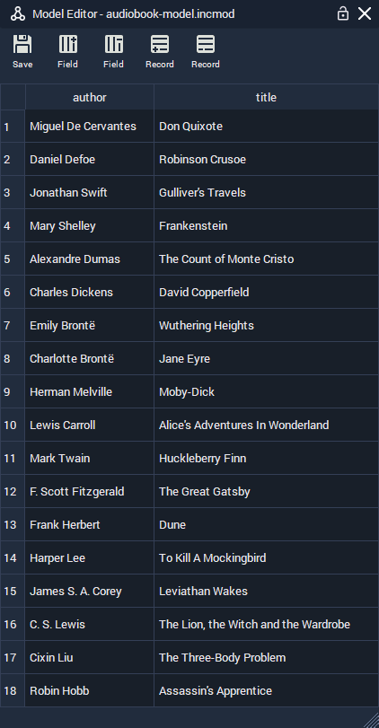

# List Widget

## List Widget

* genetate list to apply

### Title

This is the optional text that you wish to appear as a header for your list. It works like a `<h1>` tag in HTML.

### Font Family

`Font Family` allows you to select a generic font family \(`monospace`, `serif`, `sans-serif`\) or add your own custom font.

### List Entry File

This takes a local .html file, which defines a template for how each list item is displayed. You can create one by right-clicking in the **Asset Manager** and selecting `Create asset` &gt; `List Entry`. This method will create a new .html file, containing some example code.

The way that we populate our list with content from our **Model** file, is by creating placeholders, with the name of the corresponding **Field**, surrounded by double curly braces.

For example, let's say that we have a list of audiobooks, with two fields: `title` and `author`.

In our **List Entry File**, we would have the following:

```markup
<h2><i>{{ title }}</i> by {{ author }}</h2>
```

This would make our list items look something like this:


To read more about basic HTML, take a look at [_HTML basics_](https://developer.mozilla.org/en-US/docs/Learn/Getting_started_with_the_web/HTML_basics) by Mozilla.

### INCARI Model File

A **Model File** is where you define all the data for your list. Physically, a book has many different properties. It has weight, size, number of pages etc., but when thinking in terms of a **Model**, we are thinking of what properties we need to represent in our data. If, going back to the audiobook example above, we just want to display two properties; the author and title of each audiobook, we create **Fields** for `title` and `author`.



**Fields** define a single aspect of each **Record** in a table and are displayed in columns. By double-clicking on the **Field**'s _header / label_ we can define the name that will be used as a placeholder in the **List Entry File**.

**Records** are entries in the table and contain the data itself. By adding **Records**, we add more rows to the **Model**, and therefore, the **List**.

### Style File

`Style File` references a .css file, which contains style data for our **List**. The best way to create this file is by right-clicking in the **Asset Manager** and selecting `Create asset` &gt; `List Style`. This creates a file, with all of the relevant IDs and classes already inside and ready to edit.

How to write CSS won't be discussed here, but there is an abundance of information online, such as [_Learn to style HTML using CSS_](https://developer.mozilla.org/en-US/docs/Learn/CSS) by Mozilla.

Here are the pre-defined classes and ID, to be used for styling **Lists** in INCARI. As with all CSS, style attributes follow the "box model" principle, meaning that each element can be thought of as a box, in a box, in a box etc.

* `body` - The tag which ecompasses all of the elements.
* `#list` - The ID for the container that contains the list elements, excluding the title.
* `.list-title` - The class for the list's title.
* `.list-not-active` - Like `#list`, except that it adjusts the styling if the **List** is set to inactive.
* `.entry` - Individual row generated from each of the **Model**'s **Records**.
  * `.entry-current` - Adds or overwrites attributes of the standard `.entry` class if it is the _current_ list item.
  * `.entry-selected` - Adds or overwrites attributes of the standard `.entry` class if it is the _selected_ list item.


By adding a few CSS attributes, we can easily customise the appearence of our lists.



```css
body {
    color: white;    
    text-align: center;
}

.entry {
    opacity: 0.8;
}

.entry-selected, .entry-current {
    color: black;
    opacity: 1;
    text-shadow: 1px 1px 1px rgba(255, 255, 255, 0.25), -1px -1px 1px rgba(0, 0, 0, 0.25);
}

.entry-current {
    background-color: rgb(189, 7, 7); 
}

.entry-selected {
    background-color: rgb(136, 136, 136); 
}

* {
    transition-property: none !important;
}
```







### Generate List

## Simulation

## Common Attributes

* **Object** \(All\)
* **Transformation** \(All\)
* **Rotation Pivot** \(All\)
* **Effects**:
  * `Tint`
* **Web Resource**:
  * `Size (unit)`
  * `Show dev tools`
  * `Resolution (px)`
* **Sprite**:
  * `Alpha`
  * `Flip U`
  * `Flip V`
  * `Sort Index`

